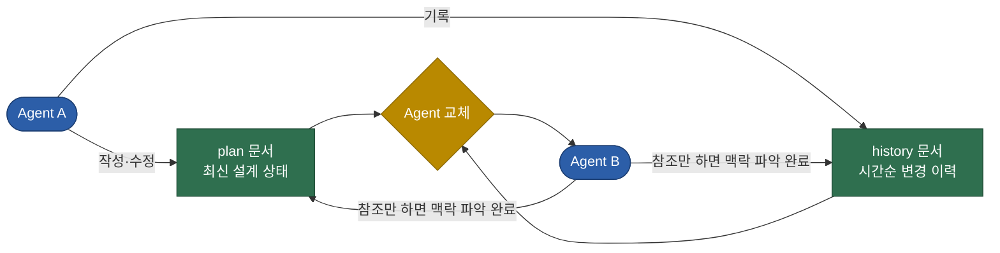
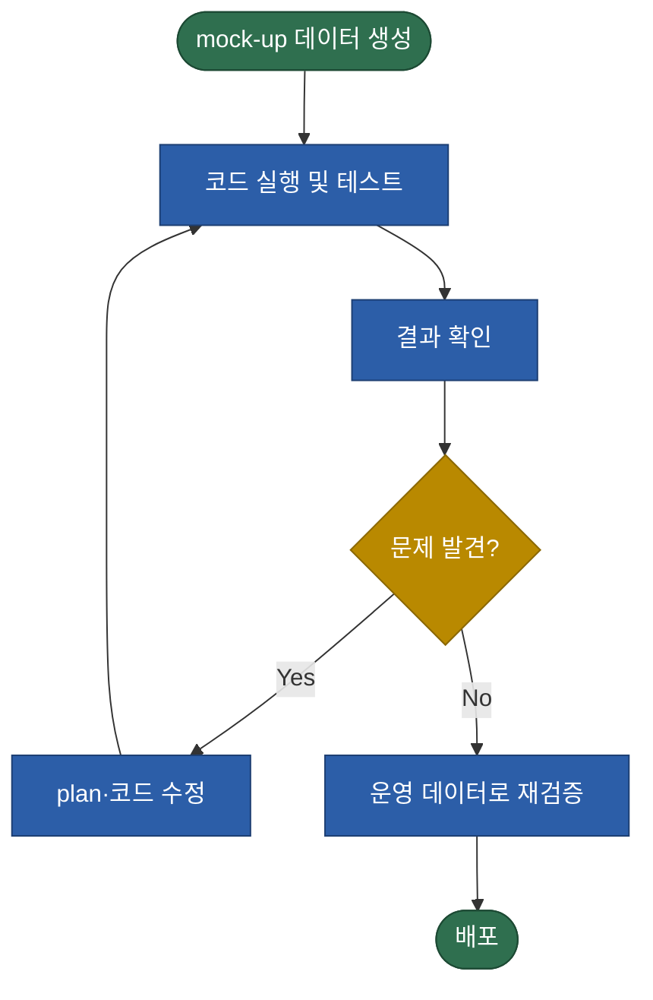

# AI Agent를 활용한 프로젝트 진행 방법 및 유형 정리

## Executive Summary

| 구분 | 핵심 원칙 | 실무 적용 |
|---|---|---|
| Plan-History | plan은 "지금 어떤 모습이어야 하는가"를 담은 최신 설계, history는 "어떻게 여기까지 왔는가"를 담은 변경 기록 | Agent가 바뀌어도 이 두 문서만 전달하면 별도 설명 없이 인수인계 가능 |
| 보조 LLM | plan·문서·TODO 작성만 모든 프로젝트에 해당하는 필수 기능. intent parsing과 자연어 output 생성은 자연어 처리가 필요한 프로젝트에만 해당. LLM-as-judge, routing, 보안 검증은 선택 기능 | 자연어 입출력이 없는 프로젝트라면 보조 LLM 없이 plan·문서·TODO 작성 기능만으로 충분 |
| 실행 유형 | 로컬은 반복 개발 속도, 서버는 상시 가용성과 확장성, 플랫폼은 인프라·인증 관리를 위임 | 서버는 자원 확보 자체가 병목이고, 플랫폼은 notebook 중심 구조라 모듈화 배포에 추가 절차가 필요 |

## 배경 및 목적

Claude Code, Codex 등 AI Agent를 프로젝트 개발에 활용하는 사례가 늘고 있다. Agent는 언제든 다른 Agent나 새 버전으로 교체될 수 있다는 특성을 가지므로, Agent 교체와 무관하게 프로젝트 맥락을 유지하는 진행 방법이 필요하다. 이 문서는 세 부분으로 구성한다. 첫째는 plan 문서와 history 문서를 축으로 한 진행 방법, 둘째는 프로젝트 진행 중 보조 LLM이 별도로 필요한 경우, 셋째는 로컬·서버·플랫폼이라는 세 가지 실행 유형의 비교다.

## 1. Plan-History 기반 진행 방법

### 진행 순서

AI Agent에게 곧바로 코드 작성을 맡기기보다, plan 문서를 먼저 충분한 완성도로 작성하는 편이 낫다. plan 문서에는 프로젝트 목표, 구현 범위, 데이터 흐름, 단계별 작업 순서를 담는다. Agent는 이 plan 문서를 기준으로 코드를 작성하고, 작성 과정에서 발생하는 세부 수정 사항(설계 변경, 함수 시그니처 조정, 버그 수정 등)은 plan 문서에 바로 반영하지 않고 history 문서에 별도로 기록한다.

두 문서를 분리하는 목적은 다음과 같다.

| 문서 구성 | 문제점 |
|---|---|
| plan만 있는 경우 | 왜 지금 이 설계에 도달했는지 근거가 사라져, 같은 시행착오를 반복하기 쉽다 |
| history만 있는 경우 | 지금 시점의 최종 설계가 무엇인지 매번 변경 기록을 처음부터 다시 읽어 재구성해야 한다 |
| plan·history 둘 다 있는 경우 | 최신 상태(plan)와 그 상태에 도달한 근거(history)를 동시에, 빠르게 파악할 수 있다 |

이렇게 역할을 나누면 plan 문서는 "현재 시점에서 프로젝트가 어떤 모습이어야 하는가"를 보여주는 최신 상태로 유지되고, history 문서는 "어떤 경로로 지금 상태에 도달했는가"를 시간순으로 보여준다. 이 구조의 실질적인 이점은 Agent 교체 시점에 드러난다. 다른 Agent나 다른 버전으로 바꾸더라도 plan·history 두 문서만 전달하면 별도의 구두 설명 없이 맥락 파악이 끝난다. 이 관계를 도식화하면 다음과 같다.

### 프로젝트 설계 시 고려 항목

plan 문서를 작성할 때는 최소한 다음 다섯 가지를 함께 결정해 둔다.

언어 선택은 프로젝트 목적에 맞춰 결정한다. 데이터 처리·분석 중심 프로젝트라면 Python이 기본값에 가깝지만, 성능이 중요한 구간이 있다면 해당 구간만 다른 언어로 분리하는 방안도 검토 대상이다.

데이터 input은 파일 업로드, API 호출, DB 조회 중 어떤 경로로 데이터가 들어오는지를 정하는 항목이다. 이 결정은 이후 에러 처리 방식과 스키마 검증을 어느 지점에서 수행할지를 함께 좌우한다.

데이터 처리 방식은 전처리, 변환, 중간 결과 저장 구조를 어떻게 둘지 정하는 항목이다. 데이터 규모와 재실행 빈도에 따라 in-memory 처리와 파일 기반 저장 중 하나를 고른다.

데이터 output은 파일, API 응답, 대시보드 등 최종 결과의 전달 형태를 정하는 항목이다. output이 자연어 형태인지 여부는 2장에서 다루는 보조 LLM 필요 여부와 직결된다.

보안 방침은 API 키, 비밀번호, 개인정보 같은 민감정보를 코드에 직접 넣지 않고 별도 파일(.env 등)로 분리한 뒤, 이 파일을 .gitignore에 등록해 github 같은 버전관리 저장소에 올라가지 않도록 관리하는 방식을 기본으로 한다. logging 방침은 디버깅을 위해 어느 시점에 어떤 정보를 남길지를 정의하는 항목이며, 이때도 로그에 민감정보가 그대로 남지 않도록 마스킹 여부를 함께 정한다.

### 평가 방법

코드가 의도대로 동작하는지 확인하는 방법도 plan 단계에서 정해 둔다. 실제 운영 데이터를 확보하기 전에는 mock-up 데이터를 만들어 반복적으로 테스트하고 디버깅하는 방식이 유효하다. mock-up 데이터는 실제 데이터의 분포, 이상치, 결측 패턴 같은 통계적 특성을 최대한 재현하도록 구성한다. 이 반복 구조는 다음 순서도로 나타낼 수 있다.

### 프로젝트 종료 시점 문서화

코드 작성이 마무리될 무렵에는 프로젝트가 무엇을 하는지, 어떻게 구현했는지를 별도 문서로 정리한다. plan·history 문서가 진행 중 실무자를 위한 문서라면, 이 종료 시점 문서는 프로젝트를 모르는 제3자나 이후 시점의 담당자를 위한 문서다.

이 문서는 프로젝트 완료 보고 목적을 겸한다. 프로젝트를 발주했거나 결과를 보고받아야 하는 대상에게 무엇을 만들었고 어떤 결과를 얻었는지 전달하는 용도로 쓴다.

프로젝트 진행 중 사용한 아이디어나 로직 중에는 해당 프로젝트를 넘어 다른 프로젝트에서도 재사용할 만한 것들이 있다. 이런 아이디어나 로직은 배경, 방법론, 결과, 한계로 이어지는 논문 형태로 별도 정리해 두면, 추후 유사한 문제를 만났을 때 다시 꺼내 쓸 수 있다.

## 2. LLM이 필요한 경우

하나의 Agent가 plan 수립부터 코드 작성까지 전 과정을 담당하더라도, 프로젝트 구조에 따라 별도의 LLM 호출이 추가로 필요한 지점이 있다. 이 지점은 크게 생성을 목적으로 하는 경우와, 생성된 결과를 검증하거나 흐름을 제어하는 경우로 나뉜다.

### 생성 목적의 보조 LLM

아래 세 가지 중 필수 기능은 첫 번째 하나뿐이다. 두 번째와 세 번째는 프로젝트에 자연어 처리가 필요한 경우에만 해당하며, 그렇지 않은 프로젝트라면 없어도 된다.

1. plan 작성, 문서 작성, TODO 작성 — Agent의 기본 기능이며, 모든 프로젝트에 해당한다.
2. 자연어 input의 의도 파악(intent parsing) — 사용자가 자연어로 입력한 요청의 의도를 검색 쿼리나 함수 호출 인자 같은 구조화된 형태로 변환해야 하는 프로젝트에만 해당한다.
3. 자연어 형태의 output 생성 — 처리 결과가 표나 수치로 나오더라도, 최종 사용자에게는 자연어 문장으로 요약·설명해 전달해야 하는 프로젝트에만 해당한다.

### 검증·제어 목적의 보조 LLM

이 외에 생성 결과 검증(LLM-as-judge), 여러 sub-agent·tool 중 무엇을 호출할지 정하는 routing, 보안 검증(prompt injection 탐지, 민감정보 마스킹)에도 보조 LLM을 쓸 수 있다. 다만 이 용도는 프로젝트 구조가 복잡해질 때 추가로 검토하는 선택 사항에 가깝고, 위 세 가지 생성 목적만큼 필수적이지는 않다.

### 보조 LLM 수반 여부 판단

프로젝트에 위 사례를 전부 적용할 필요는 없다. 아래 기준으로 필요 여부를 판단한다.

| 사례 | 수반 여부 | 판단 기준 |
|---|---|---|
| plan·문서·TODO 작성 | 필수 | Agent를 쓰는 이상 항상 포함되는 기본 기능 |
| 자연어 input 의도 파악 | 해당 시에만 (필수 아님) | 사용자가 자연어로 요청을 입력하는 서비스일 때만 해당, 그 외에는 불필요 |
| 자연어 output 생성 | 해당 시에만 (필수 아님) | 최종 결과를 자연어 문장으로 전달해야 할 때만 해당, 그 외에는 불필요 |
| 결과 검증(LLM-as-judge) | 선택 | 오류 시 영향이 커서 별도 검증이 필요한 경우에만 검토 |
| sub-agent·tool routing | 선택 | 호출 후보가 되는 sub-agent·tool이 여러 개일 때만 필요 |
| 보안 검증 | 선택 | 외부 입력이나 검색 결과를 그대로 신뢰할 수 없는 경우에만 검토 |

## 3. 프로젝트 실행 유형 비교

### 실행 유형 개론

프로젝트가 완성된 이후 어디서 구동할지는 로컬, 서버, 플랫폼 세 가지로 나눌 수 있다.

로컬 실행은 개발자 PC에서 직접 구동하는 방식이다. 별도 인프라 구축이나 계약 없이 지금 쓰는 컴퓨터 자원만으로 바로 실행할 수 있고, 코드를 고치고 바로 결과를 보는 반복 주기가 짧다. 다만 실행 환경이 그 PC 하나에 묶여 있어서, PC를 끄거나 재부팅하면 실행 중이던 프로세스도 함께 멈춘다.

서버 실행은 on-premise 서버나 cloud VM에 배포해 상시 구동하는 방식이다. 코드가 특정 개인의 PC가 아니라 별도로 확보한 서버에서 돌아가므로, 담당자의 PC 상태와 무관하게 24시간 서비스를 유지할 수 있고 필요할 때 CPU·메모리 같은 자원을 늘릴 수 있다. 다만 그 서버 자체를 확보·구축·운영하는 과정이 별도로 필요하다.

플랫폼 활용은 watsonx, Dataiku 등 관리형 AI/데이터 플랫폼이 제공하는 환경 위에서 구동하는 방식이다. 서버 확보, 배포 파이프라인 구성 같은 인프라 작업을 플랫폼이 대신 맡아 주고, 사용자는 플랫폼이 정해 둔 notebook이나 recipe 같은 작업 단위 안에서 코드를 실행한다.

### 실행 유형별 장단점

로컬 실행은 초기 비용이 거의 들지 않고 반복 개발과 디버깅 속도가 빠르다는 점이 강점이다. 다만 단일 머신 자원에 묶여 있어 확장성이 없고, PC 전원이 꺼지면 서비스도 함께 중단된다는 한계가 있다.

서버 실행은 24시간 상시 가동이 가능하고 필요에 따라 자원을 늘릴 수 있다는 점이 강점이다. 다만 그 전에 실제로 쓸 수 있는 서버 자원을 확보하는 것 자체가 큰 제약이다. 회사 내부에 여유 서버가 없거나 cloud 예산 승인이 늦어지면, 코드가 준비되어도 구동할 곳이 없어 진행이 막힌다. 서버를 확보한 이후에도 배포 파이프라인과 모니터링을 직접 구축하고 운영해야 하는 부담이 남는다.

플랫폼 활용은 인프라 관리 부담이 낮다는 점이 강점이다. 사용자 인증(authentication) 측면에서도 별도 로그인 시스템을 만들 필요 없이 플랫폼이 제공하는 계정·권한 체계를 그대로 쓸 수 있어 유리하다. 다만 플랫폼이 제공하는 API 범위 안에서만 커스터마이징이 가능해, 세 유형 중 vendor lock-in 위험이 가장 크다.

| 기준 | 로컬 | 서버 | 플랫폼(watsonx, Dataiku 등) |
|---|:---:|:---:|:---:|
| 초기 구축 비용 | 낮음 | 중~높음 | 중~높음 |
| 확장성 | 낮음 | 높음 | 높음 |
| 상시 가용성 | ❌ | ✅ | ✅ |
| 유지보수 부담 | 낮음 | 높음 | 낮음 |
| 사용자 인증 | 직접 구현 | 직접 구현 | 플랫폼 계정·권한 체계 활용 |
| 커스터마이징 자유도 | 높음 | 높음 | 낮음 |
| vendor lock-in 위험 | 없음 | 낮음 | 높음 |
| **가장 큰 제약** | PC 종료 시 서비스 중단 | 쓸 수 있는 서버 자원 확보 | notebook 중심 구조로 모듈화 배포에 추가 절차 필요 |

### 모듈화된 Python 코드 실행 방식 비교: notebook vs .py 프로젝트

로컬이나 서버에서는 여러 파일로 나뉜 .py 프로젝트를 notebook으로 실행할지 일반 스크립트로 실행할지 자유롭게 고를 수 있다. 반면 watsonx나 Dataiku 같은 플랫폼에서는 기본 코드 작성 단위가 notebook이거나 notebook과 비슷한 형태(Dataiku의 code recipe)이고, 로컬에서 흔히 쓰는 "여러 폴더로 나뉜 .py 패키지를 pip install로 설치해 쓰는" 방식은 그대로 옮기기 어렵다.

- Dataiku: 프로젝트 단위로 "Libraries"라는 공용 코드 폴더를 제공하고, 폴더를 나눠 recipe·notebook에서 import할 수 있다. 다만 dataiku 패키지를 직접 호출하는 코드는 이 library 안에 넣지 말라는 것이 공식 권장 사항이라, 순수 로직과 플랫폼 연동 로직을 나눠 관리해야 한다. VS Code로 직접 편집하려면 Code Studios라는 별도 기능을 켜야 하며, 이는 기본 워크플로가 아니라 추가로 설정해야 하는 옵션이다.
- watsonx.ai: Git-integrated project를 쓰면 JupyterLab·VS Code에서 git 기반으로 개발할 수 있어 코드 작성 자체는 유연하다. 문제는 배포 단계다. 커스텀 패키지를 모델·함수 배포에 쓰려면 source distribution(sdist)으로만 패키징해야 하고 wheel·egg는 지원하지 않으며, watsonx.ai Runtime repository에 패키지를 별도로 등록하는 절차를 거쳐야 한다. 로컬에서 흔히 쓰는 pip install 기반 배포 흐름을 그대로 옮길 수 없다.

notebook 자체의 일반적인 특성도 이 제약을 거든다. 셀 단위 실행이라 중간 결과 확인은 쉽지만, 여러 .py 모듈을 import하면 새 코드를 반영하기 위해 kernel을 재시작해야 하고, 실행 순서가 코드 순서와 어긋나도 오류 없이 넘어가(out-of-order execution) 재현성이 떨어진다. 출력 셀 내용까지 파일에 저장되므로 git diff에서 코드 변경과 출력 변경이 섞여 가독성도 낮다.

실무에서 notebook 형태를 그대로 쓰는 경우가 많은 데는 또 다른 이유가 있다. 두 플랫폼 모두 notebook을 코드 수정 없이 그대로 예약 실행하는 기능을 기본 제공하기 때문이다. watsonx.ai Studio의 Jobs 기능은 notebook·script·code package를 등록해 수동 또는 주기적으로 실행할 수 있고, Dataiku의 scenario도 notebook을 실행·재발행하는 단계를 지원한다. 모델이나 함수를 정식 엔드포인트로 배포하려는 게 아니라 배치 작업을 자동화하는 목적이라면, 코드를 .py로 모듈화해서 sdist나 project library로 이식하는 절차 없이 notebook 하나에 로직을 담아 그대로 예약 실행하는 쪽이 더 간단하다. 이 경로가 있기 때문에, 앞서 설명한 모듈화 방법(Dataiku의 project library, watsonx.ai의 Git-integrated project와 sdist 배포)이 있음에도 실제로는 잘 쓰이지 않고, notebook 하나에 코드를 몰아 쓰는 관행이 굳어지는 경우가 흔하다.

### 패키징 이식 실무 정리

플랫폼에서 파이썬 코드는 notebook 형태로 넣는 것이 기본값이지만, 모듈화된 프로젝트는 패키징을 거쳐 그대로 이식할 수도 있다. 이 방식을 실무에 적용할 때 확인할 점은 세 가지다.

패키징해서 이식할 때는 input·output 형식을 플랫폼이 요구하는 규격에 맞춰 조정하는 작업이 별도로 필요하다. watsonx.ai는 `{"input_data": [{"fields": [...], "values": [[...]]}]}` 형태로 입력을 받고 `{"predictions": [...]}` 형태로 출력을 감싸야 하는 고정 스키마를 쓴다. Dataiku의 Python function endpoint는 JSON으로 직렬화 가능한 형태면 되고 고정 스키마를 강제하지 않는다. 실무에서는 핵심 로직은 그대로 두고, 입출력 형식만 변환하는 얇은 wrapper 함수를 플랫폼별로 추가하는 방식으로 처리한다.

패키징 방식 자체(watsonx.ai의 sdist 패키징과 Runtime repository 등록, Dataiku의 project library 등록)는 플랫폼마다 다르지만, 이 작업은 대부분 AI Agent가 대신 처리할 수 있다. wrapper 함수 작성, 패키징 스크립트 작성, 플랫폼 SDK 호출 코드 작성은 모두 코드 생성 작업이기 때문이다.

다만 플랫폼 거버넌스에 해당하는 부분(라이선스 범위, 배포 승인 절차, 조직의 보안 정책 등)은 AI Agent가 대신 판단할 수 없고 사용자가 직접 확인해야 한다. 이 영역은 코드 작성이 아니라 조직의 정책과 권한에 관한 문제이기 때문이다.

### 실행 유형별 권장 조합

로컬 환경에서는 프로토타이핑 단계에 notebook을 쓰고, 모듈 구조가 자리 잡으면 .py 프로젝트로 전환하는 방식이 무난하다. 서버 환경은 배포 자동화와 서비스화가 목적이므로 .py 프로젝트 방식이 사실상 필수에 가깝다.

플랫폼 환경은 모듈화 기능 자체는 있지만, notebook을 그대로 예약 실행하는 경로가 더 간단해서 실무에서는 잘 쓰이지 않는다는 점을 감안해야 한다. 단순 배치 자동화 수준이라면 notebook 하나에 로직을 담아 Jobs·scenario로 예약 실행하는 편이 현실적이다. 다만 이 경우 코드가 여러 사람이 유지보수하기 어려운 단일 notebook으로 굳어지기 쉬우므로, 핵심 로직만이라도 함수 단위로 분리해 notebook 안에서 정의하고 재사용하는 최소한의 구조는 유지하는 편이 낫다. 모델·함수를 정식 엔드포인트로 배포해야 하는 경우에만, 로컬이나 서버에서 검증된 코드를 각 플랫폼이 요구하는 형식(Dataiku는 project library 폴더, watsonx.ai는 sdist 패키지와 Runtime repository 등록)에 맞춰 옮기는 절차를 밟는다.

목적별 권장 워크플로를 정리하면 다음과 같다.

| 목적 | 권장 워크플로 |
|---|---|
| 프로토타이핑 | 로컬, notebook |
| 모듈화 개발 완료 후 서비스화 | 로컬 또는 서버, .py 프로젝트 |
| 상시 서비스 운영 | 서버, .py 프로젝트 — 자원 확보 여부를 가장 먼저 확인 |
| 플랫폼에서 단순 배치 자동화 | notebook + Jobs·scenario 예약 실행, 핵심 로직만 함수 단위 분리 |
| 플랫폼에서 정식 엔드포인트 배포 | 로컬·서버에서 개발·검증 후 플랫폼 형식(Dataiku library, watsonx sdist)으로 이식 |

## 결론

plan·history 문서를 축으로 진행하는 방법은 Agent가 바뀌는 상황에서 맥락을 다시 설명하는 비용을 줄이는 방법이다. 실행 유형 선택은 상시 가용성과 관리 편의성을 커스터마이징 자유도와 맞바꾸는 trade-off 판단이며, 프로젝트 단계와 조직 상황에 따라 달라지는 결정이다.
