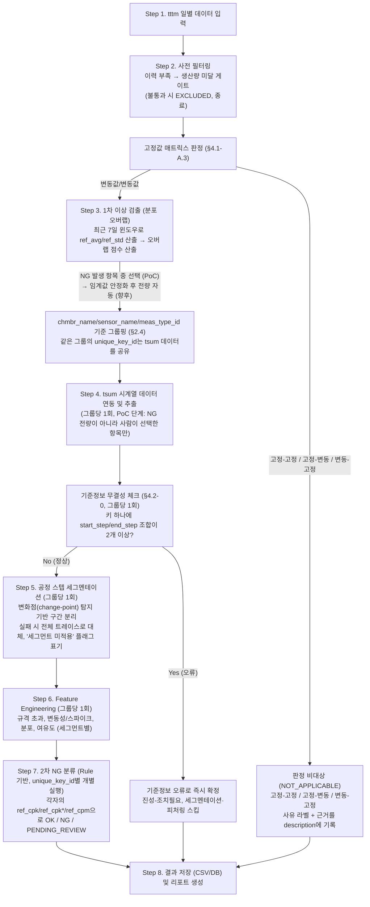
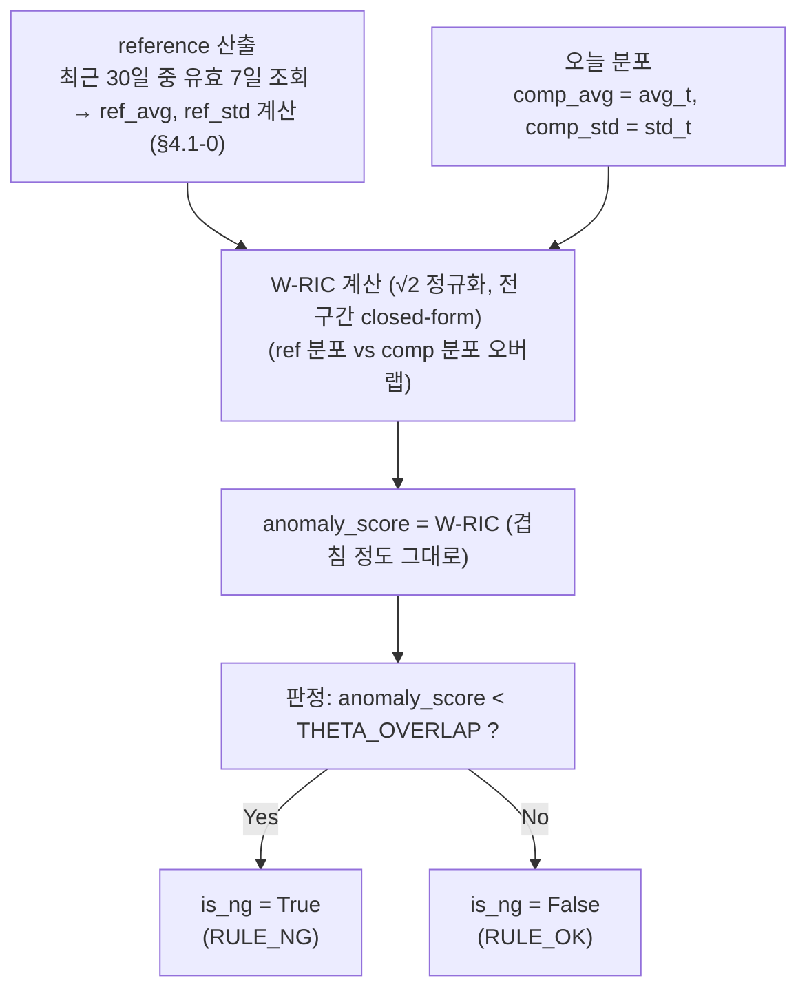
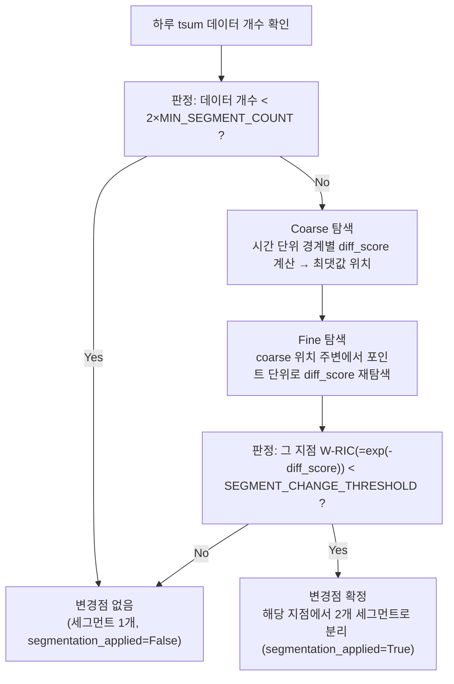
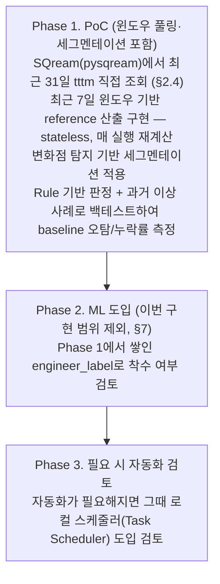

# 센서/품질 데이터 이상 감지 및 분류 시스템 구체화 실행 방안

## 1. 개요 및 시스템 아키텍처

### 1.1 목적

`tttm`(요약 통계)과 `tsum`(시계열 raw 센서) 데이터를 연계해 제조/설비 프로세스의 이상을 탐지(Anomaly Detection)하고, 원인을 분류(Root Cause Classification)하는 로컬 Python 기반 에이전트 시스템.

**이 시스템이 판단하는 것은 "절대적으로 좋다/나쁘다"가 아니라, 그 파라미터 자신의 평소(과거 이력) 대비 벗어났는가이다.** 예를 들어 원래 산포가 큰 설비가 계속 같은 수준의 산포를 유지한다면, 그건 이 시스템 기준으로 이상이 아니다 — 그 설비의 절대적 성능을 개선할지는 이 시스템이 아니라 별도의 유지보수/개선 프로세스가 판단할 문제다. 이 원칙은 §4.1-B(오늘 vs 이력 분포 비교)부터 §4.4(`ref_cpk`/`ref_cpk*` 자체 보정)까지 시스템 전체에 일관되게 적용된다.

### 1.2 핵심 설계 원칙

- **에이전트는 상시 서버가 아닌 로컬 환경에서 수동으로 구동한다.** 상시 스케줄러/서버를 전제한 설계는 두지 않고, 배치 자동화는 필요해질 때만 선택적으로 검토한다(§5.2).
- **reference(`ref_avg`, `ref_std`)는 상태를 유지하지 않고 매번 재계산한다(stateless).** 최근 `REF_WINDOW_DAYS`(30일) 중 유효한 최근 `TARGET_REF_COUNT`(7일)를 뽑아 그때그때 계산한다 — 위 로컬/수동 구동 원칙과 궁합이 맞고, 상태 파일 손상/유실이나 불규칙한 실행 주기에 대한 걱정이 없다.
- **임계값은 기본적으로 전역 고정값으로 관리하고, 필요한 경우에만 과거 데이터 분포/이력 기반으로 자체 보정(self-calibration)한다.** 대부분의 임계값(`MIN_PROD_CNT`, `SPIKE_TOLERANCE` 등)은 모든 `unique_key_id`에 동일하게 적용되는 전역 상수다. 파라미터별 스케일이나 운영 마진 차이가 실제로 문제되는 경우(`THETA_OVERLAP`의 percentile 보정, §4.4의 `ref_cpk`/`ref_cpk*` 공식 보정)에 한해, 그 키의 과거 데이터에서 뽑은 임계값을 쓴다. 모든 임계값은 §3에서 한곳에 모아 관리한다.

### 1.3 전체 데이터 처리 흐름 (Workflow)



Step 4~5가 기존 안 대비 추가된 부분입니다. 세그멘테이션 없이 6번으로 건너뛰는 것은 "임시방편"이지 정상 경로가 아니며, 리포트에 그 사실이 드러나야 합니다. 고정값 매트릭스가 `NOT_APPLICABLE`로 바로 처리되는 이유는 §4.1-A.3, 이때 필드값이 어떻게 채워지는지는 §2.3 참고. OK/NG/PENDING_REVIEW 판정은 변동값/변동값 케이스에만 적용된다.

**Step 3 → Step 4는 PoC 단계에서 전량 자동 연계가 아니다** — 사람이 GUI(§5.3 Tab 2)에서 체크박스로 선택한 항목만 진행한다. 상세 이유와 전환 조건은 §5.3 참고.

---

## 2. 데이터 구조 및 인터페이스 설계

### 2.1 입력 데이터 사양

1. **`tttm` 데이터 (일별 요약 통계)**
   - `rpt_day` (**STRING**, `YYYYMMDD` 형식, 예: `20260901`): 집계 일자. DATE 타입이 아니므로 조회/비교 시 `date` 객체를 이 문자열 형식으로 변환해서 써야 한다(§2.4).
   - `line` / `part` / `area` / `eqpid` / `tttm_property` / `param_name` / `tsum_type` / `grade` / `recipe`: 아래 `unique_key_id`를 구성하는 9개 컬럼
   - `tttm_model`: 참고용 컬럼 — `unique_key_id` 구성에는 포함되지 않는다
   - `avg` / `std` (FLOAT): 당일 측정값 평균/표준편차
   - `prod_cnt` (INT): 당일 총 생산/측정 건수
   - `unique_key_id`: `line` + `part` + `area` + `eqpid` + `tttm_property` + `param_name` + `tsum_type` + `grade` + `recipe` 9개 컬럼의 조합으로 만들어지는, **독립적인 센서를 구분하는 기본 단위**. **SQL(DB) 쪽에서 미리 합성 컬럼으로 만들어두지 않고, 9개 컬럼을 그대로 조회한 뒤 에이전트(Python) 쪽에서 조합해서 사용한다** — DB 전처리 의존을 줄이고 조합 규칙(구분자 등)을 코드에서 한곳에 관리하기 위한 선택. `anomaly_agent/src/data_loader.py`의 `load_tttm_window`가 이 조합을 수행한다.
   - 위 컬럼 외에 다른 컬럼이 더 있을 수 있으나, 이 로직에서는 사용하지 않는다.
   - §5.3 Tab 2/3의 `LINE`/`PART`/`GRADE` 필터는 위 `line`/`part`/`grade` 컬럼을 그대로 쓴다 — §6에 있던 "실제 컬럼 대응 확인 필요" 항목은 해결됨.

2. **`tsum` 데이터 (시계열 Raw 파라미터)**
   - `chmbr_name` (STRING): tttm의 `eqpid` + `'_'` + `tttm_property`에 대응하는 값
   - `sensor_name` (STRING): tttm의 `param_name`에 대응
   - `meas_type_id` (STRING): tttm의 `tsum_type`에 대응
   - `eq` (STRING): tttm의 `eqpid`에 대응. `chmbr_name`과 정보가 겹치므로 조회 키로는 `chmbr_name`을 쓴다
   - **`start_time`이 이 로직에서 쓰는 시계열 타임스탬프다.** 이전 버전 문서/코드의 `param_act_time`은 이 실제 컬럼명(`start_time`)으로 전량 치환한다. `end_time`은 참고용이며 분석에는 쓰지 않는다(같은 값만 본다).
   - `param_value` (FLOAT): 측정값. 이전 버전 문서/코드의 `value`를 이 실제 컬럼명(`param_value`)으로 치환한다.
   - `lsl` / `usl` (FLOAT): 규격 하한/상한
   - `target` (FLOAT, 일부 센서만 존재 — 없는 경우가 흔함): 목표값. `cpm`(§4.3) 계산과 Cpk 판정 보조 규칙(§4.4-0/§4.4-A)에 쓰인다
   - `start_step` / `end_step`: `recipe_step_id` 같은 상위 식별자로 쓰지 않는다(아래 참고). tsum 키(`chmbr_name`+`sensor_name`+`meas_type_id`) 하나에 값이 정말 하나만 있는지 확인하는 **기준정보 무결성 체크**(§4.2-0, 신규) 용도로만 쓴다.
   - `lot_id` / `spec_org`: 참고용 컬럼 — 분석 로직에는 사용하지 않는다 (`spec_org`는 규격 출처 확인용, `lot_id`는 분석 단위로 쓸 계획 없음)
   - **`unique_key_id` 컬럼은 tsum에 존재하지 않는다.** tttm의 9개 key와 달리 tsum 쪽 조회 키는 `chmbr_name`+`sensor_name`+`meas_type_id`(tttm의 `eqpid`+`tttm_property`, `param_name`, `tsum_type`에 대응) 뿐이다 — tttm의 `part`/`area`/`grade`/`recipe`는 tsum 조회에 관여하지 않는다. 즉 이 4개 컬럼만 다른 tttm NG 항목들은 같은 tsum 데이터를 공유해서 조회하게 된다. 정확한 조회 SQL(WHERE 절 구성)은 §2.4에서 별도로 구체화한다(TBD, §6).

> `tttm`/`tsum` 두 데이터 외 추가 데이터 소스는 없다 — 주어진 데이터만으로 판정한다. 그래서 `run_id`/`recipe_step_id` 등 상위 식별자를 전제로 한 로직은 쓰지 않으며, 세그멘테이션은 §4.2의 변화점(change-point) 탐지 단독 방식으로 고정한다.
> `maint_log`(설비 정비/보정 이력)는 사용하지 않는다. 이에 의존하던 가성 판정 규칙은 §4.4에서 제외했다.

### 2.2 캐시 저장소 (선택)

`ref_avg`/`ref_std`는 §4.1-0의 윈도우 풀링 방식으로 매번 재계산하므로(stateless) 별도 상태 저장소가 필요 없다. 아래는 순수 성능 최적화를 위한 선택적 캐시이며, 없어도 정합성에는 문제가 없다.

- **`state/key_thresholds.db`**: 자체 보정이 필요한 임계값(현재는 `THETA_OVERLAP`)의 `unique_key_id`별 퍼센타일 기반 산출값을 캐싱. 재계산 주기(예: 30일마다)를 설정 파일에 명시.

### 2.3 결과 데이터 인터페이스

1. **결과 Raw 데이터 (`tb_anomaly_detection_raw`)**

   **저장 형식: SQLite** (`anomaly_agent/data/output/results.db`, 테이블명 `tb_anomaly_detection_raw`). CSV가 아니라 SQLite인 이유: ① `PENDING_REVIEW` 건을 나중에 GUI에서 수정하면(§5.3) 기존 행을 갱신해야 하는데 CSV는 특정 행만 갱신하기 어렵고 SQLite는 `UPDATE` 한 번이면 된다. ② §5.3 Tab 3(결과 조회)이 날짜·키·판정으로 필터 조회를 해야 하는데 SQL이 자연스럽다. Primary key는 `(eval_date, unique_key_id)`이고 저장은 **UPSERT**(있으면 갱신, 없으면 삽입)로 한다 — `RULE_NG`인데 아직 tsum 분석 전인 상태로 먼저 저장해둬도, 나중에 분석이 끝나거나 사람이 `PENDING_REVIEW`를 수정했을 때 같은 키로 다시 UPSERT하면 되므로 저장 시점을 여러 번 나눠 눌러도 안전하다.

   | 필드 | 타입 | 비고 |
   |---|---|---|
   | `eval_date` | DATE | 판정 기준일 |
   | `unique_key_id` | STRING | |
   | `line` / `part` / `area` / `eqpid` / `tttm_property` / `param_name` / `tsum_type` / `grade` / `recipe` | STRING | `unique_key_id`를 구성하는 9개 컬럼(§2.1)을 그대로 각각 저장. `unique_key_id`를 다시 분해하지 않고도 Tab 2/3(§5.3)의 `LINE`/`PART`/`GRADE`/`JUDGE` 필터나 임의의 SQL 조건으로 바로 조회할 수 있게 하기 위함 |
   | `stage` | STRING | `EXCLUDED` / `NOT_APPLICABLE` / `RULE_OK` / `RULE_NG` / `ML_CLASSIFIED` — 어느 단계에서 최종 판정이 났는지 명시. `NOT_APPLICABLE`은 고정값 매트릭스(§4.1-A.3)에서 고정-고정/고정-변동/변동-고정으로 판정 비대상 처리된 경우. **tsum 기준정보 오류로 즉시 `final_class=TRUE_ACTION_REQUIRED` 확정된 경우**(§4.2-0)도 `stage=RULE_NG`를 그대로 유지한다 — Step 3(§4.1-B)에서 이미 `RULE_NG`로 분류돼 tsum 분석 단계로 넘어온 항목이 그 안에서 조기 확정되는 경로일 뿐, tttm 단계의 판정 자체가 바뀌는 게 아니기 때문이다. `ML_CLASSIFIED`는 스키마상 예약값이며 이번 구현 범위에서는 쓰이지 않는다(§7) |
   | `is_ng` | BOOLEAN | `stage='EXCLUDED'` 또는 `'NOT_APPLICABLE'`일 때는 NULL (OK/NG 판정 자체를 안 했다는 뜻, False와 구분) |
   | `anomaly_score` | FLOAT, nullable | avg/std 분포의 겹침 정도(`W-RIC`, §4.1-B)를 그대로 기록 — 1에 가까울수록 평소와 동일, 0에 가까울수록 다름. **값이 낮을수록 이상**하다는 뜻이니 주의(일반적인 "점수가 높을수록 나쁨" 관례와 반대 방향). `THETA_OVERLAP`(키별 자체 보정) 미만이면 NG. 고정값 매트릭스(§4.1-A.3, `stage=NOT_APPLICABLE`)는 §4.1-B~§4.4를 거치지 않으므로 NULL |
   | `ref_avg` / `ref_std` | FLOAT, nullable | §4.1-0에서 산출된 reference(과거) avg/std — `anomaly_score`(W-RIC) 계산에 실제로 쓰인 값 그대로. `anomaly_score`와 마찬가지로 §4.1-B를 거치지 않은 행은 NULL(신규 필드, GUI 상세 팝업 정보 패널에서 재사용) |
   | `avg` / `std` | FLOAT, nullable | comp(당일) avg/std — `ref_avg`/`ref_std`와 짝을 이루는 당일 실측값(신규 필드) |
   | `final_class` | STRING | `OK` / `FALSE_ALARM` / `TRUE_NO_ACTION` / `TRUE_ACTION_REQUIRED` / `PENDING_REVIEW` / `EXCLUDED_INSUFFICIENT_HISTORY` / `EXCLUDED_LOW_PROD_CNT` / `MATRIX_CONST_STABLE` / `MATRIX_CONST_TO_VARIABLE` / `MATRIX_VARIABLE_TO_CONST`. 뒤 3개는 고정값 매트릭스 전용이며 OK/NG/PENDING_REVIEW와 별개 그룹이다(§4.1-A.3). **`EXCLUDED_*` 두 값은 §4.1-A.1/A.2의 제외 사유별로 구분해 저장한다** — `EXCLUDED_INSUFFICIENT_HISTORY`(reference 데이터 부족)와 `EXCLUDED_LOW_PROD_CNT`(당일 생산량 미달)를 `final_class`만 보고도 구분할 수 있다. 그렇더라도 정확한 개수/임계값은 `description`에 계속 남긴다(§4.1-A.1/A.2, §2.3 description 행 참고) |
   | `confidence` | FLOAT, nullable | **원칙**: Rule 단계 판정은 NULL(정의상 확률이 아님).<br/>**예외 (`PENDING_REVIEW`)**: `confidence = clip((worst_segment_cpk - ref_cpk*) / (ref_cpk - ref_cpk*), 0.0, 1.0)`로 채움(§4.4-0) — 0에 가까울수록 `ref_cpk*`(NG 경계)에, 1에 가까울수록 `ref_cpk`(OK 경계)에 가깝다는 뜻. 사람이 검토 우선순위를 정하는 데 쓴다.<br/>**단, `PENDING_REVIEW`라도 `lsl`/`usl`이 모두 없어서 확정된 경우**(§4.4-A "규격 없음")는 Cpk 경계 자체가 없어 위 공식을 쓸 수 없으므로 `NULL`로 둔다.<br/>reference 표본 수(`ref_count`)가 `MIN_REF_COUNT` 이상이면 `TARGET_REF_COUNT`에 못 미쳐도 추가 페널티 없이 동일하게 취급한다(§4.1-A.1) — `confidence`를 표본 수로 깎지 않는다.<br/>ML 단계는 모델 예측 확률(0.0~1.0)을 그대로 채움 — 이번 구현 범위에서는 해당 없음(§7) |
   | `segmentation_applied` | BOOLEAN | 스텝 세그멘테이션이 실제 적용됐는지 |
   | `chart_path` | STRING, nullable | §2.3 트레이스 차트 PNG의 상대경로(`data/output/charts/...`). NG/`PENDING_REVIEW`만 값이 있고 나머지는 NULL. Tab 2/3 팝업이 이 경로로 이미지를 표시 |
   | `description` | STRING | 판정 근거를 사람이 읽을 수 있는 문장으로 기록. **`stage=EXCLUDED`**(§4.1-A.1/A.2)는 feature를 아예 계산하지 않는 단계라 feature 조합이 아니라 **제외 사유만** 담는다(예: `"ref_count=3 < MIN_REF_COUNT=5"`, `"prod_cnt=2 < MIN_PROD_CNT=10"`). **`stage=NOT_APPLICABLE`**(고정값 매트릭스)는 판정에 쓰인 실측값을 기록한다(예: `hist_const_ratio=0.86, today_std=0.15`). **`stage=RULE_NG`인데 아직 tsum 분석을 하지 않은 경우**(§5.3 Tab 2에서 사람이 체크박스로 선택하지 않은 `RULE_NG` 항목, "분석 대기" 상태로 저장됨)는 `"tsum 분석 미진행"`으로 고정 기록한다 — `final_class`/`anomaly_score` 등 나머지 판정 필드는 아직 비어 있는 상태다. **tsum 기준정보 오류로 즉시 `TRUE_ACTION_REQUIRED` 확정된 경우**(§4.2-0)도 feature를 계산하지 않고 오류 사유만 담는다(예: `"tsum 기준정보 오류 (start_step/end_step 조합 2개 발견)"`). **그 외(실제로 tsum 분석을 마친 OK/NG/PENDING_REVIEW)** 만 §4.3에서 계산된 feature 값들을 §4.4-B 규칙으로 조합해 생성한다(예: "중심치가 규격 중앙에서 벗어남(Cp 정상, Cpk 저하) + 세그먼트 전후 중심 변경점 발생(60→50)") |
   | `created_at` | TIMESTAMP | |
   | `modified_at` | TIMESTAMP, nullable | `final_class=PENDING_REVIEW` 건을 사람이 GUI 팝업(§5.3 Tab 2)에서 직접 수정했을 때만 그 시각을 기록. 나머지는 NULL |

   `confidence`를 모든 행에 강제로 채우지 않는 이유: Rule 기반 판정에 임의로 1.0/0.0을 넣으면 이후 ML 단계와 지표를 섞어 볼 때 의미가 왜곡됩니다.

2. **일별 Report (`daily_report_YYYYMMDD.md`)**
   - Summary, Top Critical Issues, Detail Table
   - **판정 비대상 섹션**: `stage=NOT_APPLICABLE`(고정값 매트릭스, §4.1-A.3) 건은 NG 통계·Top Critical Issues에 섞지 않고 별도 섹션으로 노출한다 — `final_class`(`MATRIX_CONST_TO_VARIABLE` 등)와 `description` 근거를 함께 표시해 엔지니어가 놓치지 않게 한다.
   - **트레이스 차트 (신규, 잠정)**: NG(진성-조치필요/조치불필요) 및 `PENDING_REVIEW` 건에 한해 `matplotlib`로 정적 PNG를 생성해 `data/output/charts/{eval_date}_{unique_key_id}.png`에 저장하고, Detail Table에서 상대경로로 링크한다. `OK`와 `NOT_APPLICABLE`(tsum 자체를 조회하지 않음, §2.4)은 그릴 데이터가 없거나 볼 필요가 없어 생성하지 않는다.
     - 표시 내용: raw tsum 트레이스, `lsl`/`usl`/`target`(있으면) 수평선, 세그먼트 경계 수직선(`segmentation_applied=True`일 때) + worst 세그먼트 강조, 이상점(`OUTLIER_MAD_K` 기준으로 걸러진 점) 마커, `ref_avg ± ref_std` 대역 — `description`(§4.4-B)의 문구를 시각적으로 대응 확인할 수 있게 한다.
     - 정적 PNG로 시작하는 이유: 로컬/수동 구동 원칙(§1.2, 서버 없음)과 맞고 인터랙티브 HTML보다 의존성이 가볍다. **일단 이대로 시도해보고 부족하면 다시 조정한다.**

### 2.4 데이터 조회 방식 (SQream 접속)

- 원본 `tttm` 데이터는 사내 SQream DB에서 **`pysqream`** 드라이버로 직접 조회한다(`load_tttm_window`) — Tab 1 [조회]의 기본 경로다. **PoC 초기에는 DB 접속이 준비되기 전까지 CSV 파일로 대신 제공받았고**(`load_tttm_window_from_csv`), 이 함수는 오프라인 테스트/로컬 개발용으로 코드에 그대로 남아 있다 — 아래 "PoC 단계: tttm CSV 입력" 참고. tsum은 처음부터 계속 SQream에서 조회한다.
- 매 실행마다 판정 대상일(`eval_date`) 기준 최근 31일(`REF_WINDOW_DAYS` 30일 + 당일 1일)치를 가져온다. DB 조회 시에는 **한 번의 쿼리**로, CSV 조회 시에는 `rpt_day` 기준 필터링으로 가져온다. reference/당일 분리는 조회 이후 애플리케이션 쪽에서 `rpt_day == eval_date` 기준으로 나눈다 (`anomaly_agent/src/data_loader.py`의 `load_tttm_window`/`load_tttm_window_from_csv`).
- `rpt_day`는 `YYYYMMDD` 형식의 STRING이므로, `eval_date`(Python `date` 객체)는 쿼리에 넘기기 전에 같은 형식의 문자열로 변환한다 (`date.strftime("%Y%m%d")`). 고정 자릿수 `YYYYMMDD` 문자열은 사전식(lexicographic) 비교 순서가 날짜 순서와 동일하므로 `BETWEEN` 범위 조회에 그대로 써도 안전하다.
- **`?` 파라미터 바인딩은 지원되지 않는다 (실측 확인).** 저장 안 된(unsaved) 쿼리에서 `?`를 쓰면 SQream이 `"Unsupported use of a placeholder (usage of '?') ... use 'select save_query(...)'"` 에러를 낸다. 그래서 모든 쿼리는 값을 미리 SQL 리터럴로 문자열에 직접 채워 넣은 뒤 파라미터 없이 실행한다(`data_loader.py`의 `_sql_literal` — 작은따옴표만 최소 이스케이프). `build_tttm_query_preview()`가 Tab1 확인 팝업에 보여주는 쿼리 문자열은 실제로 실행되는 쿼리와 완전히 동일하다(§5.3).
- **DB 접속 정보(host/port/database/username/password)는 코드나 문서에 직접 넣지 않고, 별도 파일 `anomaly_agent/config/credentials.yaml`로 관리한다.** 이 파일은 `.gitignore`에 등록되어 **git에 커밋·푸쉬되지 않는다.** 필드 구조만 담은 템플릿 `credentials.example.yaml`만 git에 남겨, 다른 환경에서는 이걸 복사해 실제 값을 채워 넣는다.
- **접속 계정은 테이블마다 다르다 (확정, 사용자 확인).** `tttm`과 tsum의 각 테이블(spec/no-spec x line 그룹, 아래 참고)이 서로 다른 username/password를 쓴다 — 그래서 `credentials.yaml`은 `sqream:` 밑에 **nickname을 키로 하는 블록**을 테이블 수만큼 둔다(`tttm`, 그리고 아래 `line_table_nicknames`에 나온 tsum 테이블 nickname 각각). 각 블록에는 접속 정보와 함께 **실제 "스키마.테이블" 이름(`table` 필드)도 같이 들어 있다** — 스키마-한정 테이블명은 어차피 특정 계정/스키마에 묶여 있으므로 접속 정보와 분리해서 관리할 이유가 없다는 판단이다(이전엔 `tsum_tables.yaml`에 별도 `table_names` 딕셔너리로 뒀으나, 실제 테이블명이 어차피 두 gitignore 파일 중 하나에만 있으면 되고 nickname↔실제이름 대응이 한 파일 안에서만 유지돼야 동기화가 깨지지 않아 credentials.yaml로 합쳤다). `data_loader.py`의 `get_connection(nickname, credentials_path)`가 nickname을 받아 그 테이블 전용 커넥션을 새로 연다 — 그래서 여러 테이블을 한 번에 조회할 때도 커넥션을 공유하지 않고 테이블마다 새로 열고 닫는다.
- **조회한 raw tttm/tsum 데이터는 로컬 디스크에 저장하지 않고 메모리에서 바로 처리한다.** stateless로 매번 재조회하는 구조(§4.1-0)라 캐싱해 둘 이유가 없고, tsum도 NG 후보로 뽑힌 `(unique_key_id, eval_date)`에 대해서만 그때그때 조회해 세그멘테이션~분류까지 처리하고 끝낸다. `PENDING_REVIEW` 건을 사람이 나중에 다시 봐야 할 때도 같은 키·날짜로 재조회하면 되므로 미리 저장해 둘 필요가 없다. 디스크에 남는 건 §2.3의 결과 테이블(`tb_anomaly_detection_raw`)과 일별 리포트뿐이다(§2.2의 선택적 임계값 캐시를 사용하는 경우는 제외).

**PoC 단계: tttm CSV 입력 (지금은 DB로 전환 완료, 함수는 유지)**: 초기 PoC 검증 때는 SQream 접속 대신 `anomaly_agent/data/input/VW_H_RTTTM_FDC_RSLT_CLS.csv` 파일에서 tttm을 읽었다 — §5.1에서 이미 "DB 접속 없이 오프라인 테스트할 때만 사용"으로 예약해둔 `data/input/` 디렉터리의 용도다. 파일에는 기간이 넉넉하게(31일보다 훨씬 많이) 들어 있으므로, 파일 전체를 다 쓰지 않고 `rpt_day` 기준으로 최근 31일(`REF_WINDOW_DAYS` 30일 + 당일 1일)치만 잘라 쓴다 — DB 쿼리의 `WHERE rpt_day BETWEEN ? AND ?`와 동일한 필터링을 CSV를 읽은 뒤 pandas로 수행한다(`load_tttm_window_from_csv`). 두 함수(`load_tttm_window`/`load_tttm_window_from_csv`) 모두 같은 형태(TTTM_COLUMNS + `unique_key_id`)의 DataFrame을 반환하도록 맞춰뒀기 때문에, **`load_tttm_window_from_csv`는 지우지 않고 오프라인 개발/테스트용으로 코드에 그대로 남겨둔다** — Tab 1은 이제 `load_tttm_window`(DB 버전)를 기본으로 호출하고, DB 조회가 실패하면(접속 미설정, 네트워크 등 사유 무관) 데모 데이터로 자동 대체한다(`gui/tab1.py`). `load_tttm_window`의 실제 테이블명은 tsum과 같은 방식으로 `credentials.yaml`의 `sqream.tttm.table` 필드에서 가져온다(`data_loader.py`의 `_table_name("tttm", ...)`). tttm 컬럼 타입(사용자 확인): `avg`/`std`는 FLOAT, `prod_cnt`는 INT, 나머지(`rpt_day` + 9개 key + `tttm_model`)는 전부 TEXT — `load_tttm_window`가 조회 후 이 타입으로 명시 변환한다.

**tsum 조회 시 주의 — `rpt_day`와 실제 시각 구간이 하루 어긋난다.** `tttm`의 `rpt_day=eval_date`는 실제로는 **`(eval_date-1일 00:00 ~ eval_date 00:00)`** 구간의 tsum을 집계한 것이다. 예를 들어 9/1에 에이전트를 실행하면 tttm은 8/2~9/1을 조회하고(ref: 8/2~8/31, comp: 9/1), 9/1이 NG로 뜬 키의 tsum은 **`8/31 00:00 ~ 9/1 00:00`** 구간으로 `start_time` 기준 조회해야 한다. 이 오프셋을 놓치면 하루 밀린 엉뚱한 tsum을 가져오게 된다.

**tttm NG 목록을 tsum 조회 키로 묶는 방식**: `(chmbr_name, sensor_name, meas_type_id)` 튜플 IN은 SQream을 포함한 여러 DB에서 지원이 불확실하므로, 대신 조합별 `(chmbr_name = '...' AND sensor_name = '...' AND meas_type_id = '...')`를 `OR`로 이어붙이는 방식을 쓴다(값은 위에서 설명한 대로 리터럴로 직접 채워 넣는다). `unique_key_id`가 다르더라도(`part`/`area`/`grade`/`recipe`만 다름) `eqpid`+`tttm_property`+`param_name`+`tsum_type` 조합이 같으면 중복 제거해 한 번만 묶는다(§2.4 그룹핑 정책) — `anomaly_agent/src/data_loader.py`의 `tsum_key_tuples`가 이 중복 제거를 수행한다.

**tsum은 테이블 하나가 아니다 — spec 유무 × line 그룹에 따라 여러 테이블에 나뉘어 있다 (확정, 사용자 확인).** tttm에는 규격(`lsl`/`usl`) 정보가 없어서, 조회하기 전에는 대상 센서가 "spec 있는 테이블"에 있는지 "spec 없는 테이블"에 있는지 알 수 없다. 게다가 `line` 값에 따라서도 실제 물리 테이블이 달라진다 — 예: `line in ('A','B')`는 `use_a.tsum_spec_a`/`use_a.tsum_no_spec_a`, `line='C'`는 `use_c.tsum_spec_c`/`use_c.tsum_no_spec_c`를 봐야 한다. 테이블명은 SQream에서 `스키마.테이블` 형태로 조회하는 방식이라(예: `SELECT * FROM use_a.tsum_spec_a`) 스키마까지 포함한 완전한 이름을 그대로 쓴다.

**이 매핑은 코드가 아니라 `anomaly_agent/config/tsum_tables.yaml`(신규)과 `credentials.yaml`에서 관리하고, 코드에는 nickname만 등장한다.** 실제 테이블명은 사내 인프라 정보라 두 파일 다 `.gitignore` 대상이고, 필드 구조만 담은 `.example.yaml` 템플릿만 git에 커밋한다. 역할이 분리되어 있다:
- `tsum_tables.yaml`의 `line_table_nicknames`: `{line: [spec_nickname, no_spec_nickname]}` — 예: `A: [tsum_A_spec, tsum_A_nospec]`. **line이 어떤 nickname 조합을 쓰는지 라우팅만** 담당한다.
- `credentials.yaml`의 `sqream.<nickname>.table`: 그 nickname의 실제 "스키마.테이블" 이름 — 예: `sqream.tsum_A_spec.table: use_a.tsum_spec_a`. 접속 정보(host/username/password 등)와 같은 블록에 둔다 — 스키마-한정 테이블명은 어차피 특정 계정/스키마에 묶인 정보라 접속 정보와 분리해서 관리할 이유가 없고, 둘로 나누면 nickname↔실제이름 대응이 두 gitignore 파일에 걸쳐 중복돼 리네이밍 시 동기화가 깨지기 쉽다(사용자 지적으로 v1의 `tsum_tables.yaml` 단독 `table_names` 딕셔너리에서 이 구조로 변경, §6).

`data_loader.py`의 `load_tsum_table_config()`가 `tsum_tables.yaml`(라우팅)을, `_table_name(nickname, credentials_path)`가 `credentials.yaml`(실제 테이블명)을 각각 읽는다. 실제 테이블명이 바뀌어도 `credentials.yaml`의 `table` 필드만 고치면 되고, line 매핑이 바뀌어도 `tsum_tables.yaml`의 `line_table_nicknames`만 고치면 된다 — 코드는 nickname이라는 안정적인 이름으로만 동작해서 실제 인프라 이름 변경에 영향을 안 받는다. 지금은 둘 다 placeholder이고, 확정되는 대로 각 파일만 갱신하면 된다(§6).

**테이블마다 접속 계정도 다르다.** `tttm`과 tsum의 각 테이블이 서로 다른 username/password를 쓰므로(위 "DB 접속 정보" 항목 참고), 커넥션을 하나 열어 여러 테이블에 재사용할 수 없다 — `data_loader.py`의 `get_connection(nickname, credentials_path)`가 nickname을 받아 `credentials.yaml`의 `sqream.<nickname>` 블록으로 그 테이블 전용 커넥션을 새로 열고, 조회가 끝나면 바로 닫는다. 아래 spec/no-spec 두 쿼리도 각각 별도 커넥션으로 실행된다.

- **조회 순서 — spec을 먼저, no-spec은 spec에 없던 조합만**: 모든 조합을 두 테이블에 전부 조회해서 합치면(그리고 겹치는 행을 나중에 골라내면) 무엇을 "같은 레코드"로 볼지가 애매해진다. 대신:
  1. `line` → `line_table_nicknames`로 (spec nickname, no_spec nickname)을 구하고, `credentials.yaml`의 `table` 필드로 실제 테이블명을 구한다. **같은 nickname 쌍을 쓰는 line은 합쳐서** 한 번에 조회한다(예: line A/B가 섞여 있어도 `tsum_A_spec`은 한 번만 조회).
  2. 그 그룹의 `(chmbr_name, sensor_name, meas_type_id)` 조합(`tsum_key_tuples`, 중복 제거)으로 spec 테이블을 OR-체인 쿼리.
  3. 쿼리 결과에 실제로 나타난 조합을 "찾음"으로 표시하고, 나머지(spec에 전혀 없던 조합)만 골라 no-spec 테이블에 같은 방식으로 다시 쿼리.
  4. 두 결과를 그대로 이어붙인다(concat) — 조합이 애초에 겹치지 않게 나눴으므로 중복 제거 로직이 필요 없다.
- **왜 "조합 단위"로 충분한지**: 같은 `(chmbr_name, sensor_name, meas_type_id)` 조합이 step에 따라 두 테이블에 걸쳐 있을 수도 있지만, 이건 순전히 tttm에 spec 정보가 없어서 생기는 문제일 뿐 실제로 구분해야 할 의미가 있는 게 아니다(사용자 확인) — 그래서 spec 쪽에 그 조합의 데이터가 하나라도 있으면 그걸로 충분하고, step 단위로 더 정교하게 "일부는 spec, 일부는 no-spec"을 가려낼 필요는 없다.

```sql
-- 1) spec 테이블 먼저 (line -> tsum_tables.yaml의 line_table_nicknames -> credentials.yaml의 table로 결정된 실제 "스키마.테이블")
-- '?' 바인딩 미지원(위 §2.4 참고)이라 값은 전부 리터럴로 직접 채운다.
SELECT chmbr_name, sensor_name, meas_type_id, start_step, end_step, start_time, param_value, lsl, usl, target
FROM use_a.tsum_spec_a
WHERE (
    (chmbr_name = 'EQP001_PROP1' AND sensor_name = 'TEMP' AND meas_type_id = 'TYPE1')
    OR (chmbr_name = 'EQP002_PROP1' AND sensor_name = 'PRESSURE' AND meas_type_id = 'TYPE1')
    -- ... 이 테이블 쌍을 쓰는 그룹의 조합 수만큼 반복
  )
  AND start_time >= '2026-08-31 00:00:00'   -- eval_date - 1일, 00:00:00
  AND start_time <  '2026-09-01 00:00:00'   -- eval_date, 00:00:00
ORDER BY chmbr_name, sensor_name, meas_type_id, start_time

-- 2) spec 결과에 없던 조합만 no-spec 테이블에서 추가 조회 (같은 형태, 접속 계정도 별도, WHERE의 조합 목록만 다름)
SELECT chmbr_name, sensor_name, meas_type_id, start_step, end_step, start_time, param_value, lsl, usl, target
FROM use_a.tsum_no_spec_a
WHERE (...) AND start_time >= '2026-08-31 00:00:00' AND start_time < '2026-09-01 00:00:00'
```

```python
# anomaly_agent/src/data_loader.py : load_tsum_for_ng(ng_tttm, eval_date)
day_start = eval_date - timedelta(days=1)   # 예: eval_date=9/1 -> 8/31 00:00
day_end = eval_date                         # 9/1 00:00
table_config = load_tsum_table_config()     # config/tsum_tables.yaml (라우팅만)
line_nicknames = table_config["line_table_nicknames"]  # line -> [spec_nickname, no_spec_nickname]
nickname_pairs = ng_tttm["line"].map(lambda line: tuple(line_nicknames[line]))

for (spec_nick, no_spec_nick), group in ng_tttm.groupby(nickname_pairs):
    key_tuples = tsum_key_tuples(group)                     # 이 nickname 쌍을 쓰는 라인들의 조합만, 중복 제거
    spec_result = _query_tsum_table(spec_nick, key_tuples, day_start, day_end)  # 실제 테이블명은 내부에서 credentials.yaml의 table 필드로 조회
    found = set(zip(spec_result.chmbr_name, spec_result.sensor_name, spec_result.meas_type_id))
    missing = [t for t in key_tuples if t not in found]      # spec에 없던 조합만
    no_spec_result = _query_tsum_table(no_spec_nick, missing, day_start, day_end)
    # -> pd.concat([spec_result, no_spec_result])
```

**여러 `unique_key_id`가 같은 tsum 데이터를 공유하는 경우 (그룹핑 정책)**: §2.1에서 밝혔듯 `part`/`area`/`grade`/`recipe`만 다른 `unique_key_id`들은 tsum 조회 키(`chmbr_name`+`sensor_name`+`meas_type_id`)가 같아 물리적으로 동일한 tsum 원본 데이터를 공유한다. 이때 "그룹당 1회 계산 후 결과를 그룹 내 모든 `unique_key_id`에 그대로 복사"하는 방식은 **쓰지 않는다** — `ref_avg`/`ref_std`(그리고 `ref_cpk`/`ref_cpk*`/`ref_cpm`)는 각 `unique_key_id`마다 tttm에서 따로 산출되는 값이라, 같은 tsum을 봐도 `unique_key_id`별로 평소 기준(baseline)이 다를 수 있다 — 최종 `final_class`까지 그대로 복사하면 그 차이를 무시하게 되어 오판정으로 이어진다. 대신 계산을 두 단계로 나눠 캐시 범위를 명확히 한다.

- **그룹당 1회만 계산 (캐시/공유)**: tsum 조회, §4.2-0 기준정보 무결성 체크, §4.2 세그멘테이션(경계 위치), §4.3의 tsum 원시 통계(세그먼트별 `avg`/`std`, `lsl_violations`/`usl_violations`/`max_out_magnitude`, `spike_count`, `step_change_flag`, `data_drift_slope`, `skewness`/`kurtosis`) — 이 값들은 tsum 데이터 자체에서만 나오므로 그룹의 어떤 `unique_key_id`를 계산하든 결과가 동일하다.
- **`unique_key_id`별로 각자 계산**: `cp`/`cpk`/`cpm`(각자의 `lsl`/`usl`/`target`과 그룹 공유 `avg`/`std`로 계산 — `lsl`/`usl`/`target`은 tsum 컬럼이라 그룹 내에서도 값이 같을 수 있지만, `ref_cpk`/`ref_cpk*`/`ref_cpm`은 각자의 tttm 이력에서 나오므로 다를 수 있다), §4.4-0/A의 최종 Rule 판정(`final_class`), §4.4-B의 `description`, `confidence`. 즉 tsum을 다시 조회하거나 세그멘테이션을 다시 돌리지는 않지만, "OK냐 NG냐"는 반드시 `unique_key_id`마다 따로 확정한다.

이 그룹핑은 §5.3 Tab 2에서 사용자가 체크박스로 어떤 `unique_key_id`를 골랐는지와 무관하게 내부적으로 적용된다 — 그룹 내 하나라도 선택되면 그 그룹의 tsum 조회·세그멘테이션은 1회만 수행되고, 그룹 내 다른 선택된 `unique_key_id`들은 이미 구해둔 원시 통계를 재사용해 자신의 Rule 판정만 계산한다.

---

## 3. 임계값 및 기준정보 (Threshold Reference)

로직 전체에서 쓰이는 모든 설정값은 이 문서에 직접 넣지 않고 별도 파일로 관리합니다.

> **기준정보 파일: [`threshold_reference.csv`](../anomaly_agent/config/threshold_reference.csv)**
> Excel/스프레드시트로 열어 `값`/`상태` 열을 직접 갱신하면 됩니다. 값이 확정될 때마다 이 CSV만 고치면 되고, 본 계획 문서는 파라미터 이름(`REF_WINDOW_DAYS`, `THETA_OVERLAP` 등)으로만 참조합니다 — 값이 바뀌어도 이 문서를 다시 고칠 필요가 없도록 분리했습니다.
> 추후 구현 단계에서는 이 CSV의 "확정" 상태 행들을 `config/settings.yaml`로 옮겨 담습니다 (§5.1).

CV(변동계수, `std/avg`) 방식은 채택하지 않는다 — `avg`가 0에 가까운 파라미터에서 값이 불안정해지기 때문 (§4.1-A.3 참고).

---

## 4. 데이터 로직 (단계별 세부 알고리즘)

### 4.1 1단계: tttm 기반 이상 검출

#### 0. ref_avg / ref_std 산출 로직

매일 판정에 쓰이는 reference(`ref_avg`, `ref_std`)를 어떻게 만드는지 정의한다. 이 값은 아래 §4.1-A(사전 필터링)와 §4.1-B(분포 오버랩) 양쪽에서 공통으로 쓰인다.

- **방식: 상태 없이 매번 재계산(stateless, 윈도우 풀링)**. 상태 저장소에 이력을 누적하는 EWMA 방식 대신, 매 실행마다 `REF_WINDOW_DAYS`(30일) 중 §4.1-A의 사전 필터링을 통과한(즉 `EXCLUDED`로 제외되지 않은) 가장 최근 `TARGET_REF_COUNT`(7일)를 뽑아 그 자리에서 계산한다.

- **이 "최근 7일"은 달력상 연속 7일이 아니라 최근 30일 중 유효했던 날짜만 골라 최신순으로 7개를 채운 것이다 — 중간에 며칠씩 비어 있을 수 있다.** 예를 들어 30일 구간 중 특정 날짜가 `EXCLUDED`(reference 부족·생산량 미달, §4.1-A.1/A.2)로 걸러졌거나 애초에 그날 tttm 데이터 자체가 없었다면 그 날짜는 건너뛰고, 그 이전 날짜까지 거슬러 올라가서 유효 7일을 채운다. `ref_avg`/`ref_std`는 날짜 간격이 아니라 "유효했던 날의 값"만 가중 평균하므로 계산 자체에는 영향이 없지만, 최근 7일이 실제로는 예를 들어 지난 10~12일 구간에 걸쳐 있을 수 있다는 뜻이다.

  ```
  ref_avg = sum(prod_cnt_i * avg_i) / sum(prod_cnt_i)              # 생산량 가중 평균
  ref_std = sqrt( sum(prod_cnt_i * std_i^2) / sum(prod_cnt_i) )    # 분산의 생산량 가중 평균의 제곱근
  ```
  (i는 뽑힌 최근 7일 각각. 날짜 간 avg 흔들림은 포함하지 않음 — 아래 참고)

- **왜 상태 저장(EWMA) 대신 이 방식인지**: §1.2의 로컬/수동 구동 원칙과 더 잘 맞는다. EWMA 갱신식은 "매번 일정 간격으로 실행된다"는 걸 암묵적으로 전제하는데, 수동/불규칙 실행에서는 실행 사이 공백을 반영하지 못해 왜곡될 수 있다. 반면 윈도우 풀링은 실행 시점 기준으로 그때그때 "최근 유효 7일"을 다시 뽑으므로 실행 주기와 무관하게 항상 같은 결과를 낸다. 또한 상태 파일(`ewma_state.db`) 관리·콜드스타트 초기화·손상 복구 같은 운영 부담이 아예 없어지고, 튜닝이 필요한 `EWMA_ALPHA` 파라미터도 없어진다.

- **`ref_std`에 중심 이동(day-to-day 평균 흔들림)을 포함하지 않는 이유**: `ref_std`는 순수하게 "하루 안에서의 산포"만 담당하고, "날짜 간 평균이 흔들리는 정도"는 담지 않는다. 날짜 간 평균의 흔들림(추세 포함)은 `ref_avg`가 매번 최근 7일 윈도우로 다시 계산되면서 자연스럽게 반영되므로, `ref_std`에까지 섞으면 같은 현상을 두 군데서 중복 처리하게 되고 §4.1-B의 W-RIC이 확보하려던 "중심 이동 감도"가 희석된다.

- **`ref_std*` (§4.4 전용, 중심 이동 포함 버전)**: 위 `ref_std`와는 별도로, §4.4의 Cpk 자체 보정에서만 쓰는 "관대한" 버전을 하나 더 계산한다. 같은 reference 윈도우(최근 7일)를 쓰되, 날짜 간 avg 흔들림까지 포함한다(law of total variance):
  ```
  ref_std*^2 = sum(prod_cnt_i * std_i^2)/sum(prod_cnt_i) + sum(prod_cnt_i * (avg_i - ref_avg)^2)/sum(prod_cnt_i)
  ```
  `ref_std`를 이렇게 바꾸지 않고 별도로 추가하는 이유는, §4.1-B의 W-RIC은 "중심 이동 감도"를 살리기 위해 일부러 좁은 `ref_std`가 필요한 반면, §4.4의 Cpk 자체 보정은 반대로 "이 파라미터가 원래 얼마나 흔들려도 정상이었는지"를 반영해야 해서 용도가 정반대이기 때문이다.

- **왜 7개인지 (확정 아님)**: 이 개수는 median/IQR 기반 robust 통계를 쓰던 이전 설계에서 나온 값이라, 지금의 평균/분산 pooling 방식에는 원래 근거가 그대로 적용되지 않는다. 표본이 적을수록 `ref_avg`/`ref_std` 자체가 흔들리고, 많을수록 정당한 공정 변경(레시피/셋포인트 변경 등)이 반영되는 데 오래 걸린다 — 정확한 균형점은 실제 데이터의 변동 패턴을 봐야 알 수 있다. **일단 7개로 시작하고, 실제 적용하면서 기간을 늘리는 방향을 검토한다.**

- **§4.1-A.1(reference 개수 게이트)와의 관계**: §4.1-A.1의 `MIN_REF_COUNT`/`TARGET_REF_COUNT`는 "raw tttm 이력이 몇 개나 있는지"를 확인하는 게이트이고, 여기서 다루는 `ref_avg`/`ref_std`는 게이트를 통과했을 때 그 이력으로 계산하는 실제 값이다.

#### A. 사전 필터링 (아래 순서대로 적용)

1. **Reference 데이터 부족**: 당일을 제외한 과거 `REF_WINDOW_DAYS`일 중 그 `unique_key_id`의 유효 데이터 개수가 `MIN_REF_COUNT`(**2**) 미만이면 `final_class=EXCLUDED_INSUFFICIENT_HISTORY`로 제외한다. 신규 키(콜드스타트)와 이력이 끊긴 키(중간에 데이터가 빠진 경우)를 하나의 규칙으로 통합해서 처리한다 — 둘 다 "reference 표본이 부족하다"는 동일한 문제이기 때문이다. `MIN_REF_COUNT=2`이므로, 신규로 생산을 시작한 키는 최소 2일치 이력만 쌓이면(1~2일차를 ref로) 3일차부터 바로 comp 판정을 받을 수 있다 — 유효 이력이 1일뿐이면 ref 계산 자체가 불가능하므로 여전히 제외된다. `MIN_REF_COUNT` 이상이면 `TARGET_REF_COUNT`(7)에 못 미치더라도 추가 페널티 없이 동일하게 판정한다(§2.3 참고) — `MIN_REF_COUNT` 게이트를 통과했다는 것 자체가 ref 계산에 충분하다고 본 것이므로, 표본 수만으로 `confidence`를 깎지 않는다. 제외 시 `description`에 `"ref_count=N < MIN_REF_COUNT=M"`처럼 실제 개수와 임계값을 기록한다.
2. **당일 생산량 미달**: `prod_cnt < MIN_PROD_CNT`(**50**)면 `final_class=EXCLUDED_LOW_PROD_CNT`로 제외한다 — 위 1번과 `final_class` 값 자체가 다르므로 별도 조회 없이 바로 구분된다. `description`에는 `"prod_cnt=N < MIN_PROD_CNT=M"`을 기록한다.
3. **고정값(Constant) 판정 — 이력 타입 vs 당일 타입 매트릭스**:
   - **일별 판정**: 그날의 `std ≤ CONST_STD_THRESHOLD`이면 그날은 "고정값"으로 표시한다.
   - **`CONST_STD_THRESHOLD`를 전역 고정값으로 유지하는 이유**: §1.2 원칙("파라미터별 스케일 차이가 문제되는 경우에만 자체 보정")의 예외처럼 보이지만, 실제로는 예외가 아니다. 이 값은 "이 파라미터가 통계적으로 얼마나 안 흔들리는가"를 재는 게 아니라, tttm 소스 시스템이 고정값 타입 파라미터에 **일괄적으로 붙이는 sentinel 값**(예: `std=0.00001`)을 그대로 탐지하는 것이다(§3 CSV 비고 참고). sentinel은 파라미터의 실제 측정 스케일과 무관하게 소스 시스템이 정하는 고정 코드값이므로, 키별로 다르게 자체 보정하면 오히려 잘못된 설계가 된다 — 그래서 전역 고정값을 의도적으로 유지한다.
   - **이력 타입 판정**: reference 기간 중 "고정값"으로 표시된 날의 비율이 `CONST_HISTORY_RATIO`(**0.5, 절반 이상**) 이상이면, 이 키의 이력 타입을 "고정값 타입"으로 분류한다. 개수/비율 기반으로 판정하는 이유는, 이력 중 단 하루의 급변(중심치 변경 등)이 전체 판정을 뒤집지 않도록 하기 위함이다 — 물량가중 pooled std처럼 값 자체를 평균 내는 방식은 그 하루의 값에 전체가 휘둘릴 수 있어 채택하지 않는다. 이 판정은 **이력(ref) 쪽에만 적용**되며, 당일(comp)은 아래처럼 별도의 일별 기준으로 판정한다. 비율은 `TARGET_REF_COUNT`(7일) 고정 분모가 아니라 **실제 `ref_count`에 대한 비율**이다 — `ref_count`가 7 미만인 콜드스타트 키(§4.1-A.1, `MIN_REF_COUNT=2`)에도 같은 비율(0.5)로 적용하기 위함이며, `ref_count`가 몇 개든 그중 절반 이상(`ceil(ref_count/2)`일 이상)이 "고정값"으로 표시된 날이면 이력 타입 = 고정값이다(예: `ref_count=2`면 1일 이상, `ref_count=7`이면 4일 이상).
   - **콜드스타트 키의 판정 불안정성 (컷오프 값은 확인 필요)**: `MIN_REF_COUNT=2`와 `CONST_HISTORY_RATIO=0.5` 조합에서는 `ref_count`가 최소치(2)에 가까운 키의 이력 타입 판정이 **하루 차이로 뒤집힐 수 있다.** 예를 들어 `ref_count=2`면 `ceil(2/2)=1`일만 "고정값"으로 표시돼도 이력 타입=고정값이 되므로, 이틀 중 하루가 우연히 `CONST_STD_THRESHOLD` 근처로 찍히기만 해도 판정이 뒤집힌다 — 표본이 이렇게 적을 때는 이 이력 타입 판정 자체의 신뢰도가 낮다는 뜻이다. **대응 방침**: `ref_count`가 `MIN_REF_COUNT_FOR_MATRIX`(신규 파라미터, 값은 확인 필요) 미만인 키는 이력 타입 매트릭스 판정 자체를 보류하고, 고정/변동 구분 없이 바로 §4.1-B(분포 오버랩)로 보낸다 — 표본 2~3개짜리 이진(고정/변동) 판정보다, §4.1-B의 W-RIC이 avg/std 수치를 직접 비교하는 쪽이 더 신뢰할 수 있는 근거이기 때문이다. `MIN_REF_COUNT_FOR_MATRIX`의 정확한 값과, 실제로 이력 타입 판정이 얼마나 자주 뒤집히는지는 Phase 1 백테스트로 확인 필요(§6).
   - **"reference 기간"의 정의**: `REF_WINDOW_DAYS`(30일) 원본 전체가 아니라 **§4.1-0에서 이미 선정한 최근 유효 `TARGET_REF_COUNT`(7일)** 를 그대로 재사용한다. 별도로 "이 매트릭스만을 위한" 유효일 선정 로직을 새로 만들면 §4.1-0의 ref_avg/ref_std 산출에 쓰인 7일과 다른 날짜 집합이 되어 같은 이름의 "reference 기간"이 로직마다 다른 걸 가리키게 되고, 생산량 미달 등으로 걸러졌어야 할 저품질 표본이 섞여 들어갈 위험도 있다.
   - 당일도 동일한 일별 기준으로 "고정값/변동값"을 판정한다.
   - 최종 판정 매트릭스:

     | 이력 타입 | 당일 타입 | 판정 |
     |---|---|---|
     | 고정값 | 고정값 | **판정 비대상** — `final_class=MATRIX_CONST_STABLE` (둘 다 고정값, 안정 상태) |
     | 고정값 | 변동값 | **판정 비대상** — `final_class=MATRIX_CONST_TO_VARIABLE` (고정값이던 파라미터가 오늘 변동값이 됨 — 중심치 변경 등 신호일 수 있음) |
     | 변동값 | 변동값 | §4.1-B의 분포 오버랩 정상 루트로 진행 (OK/NG/PENDING_REVIEW 판정 대상) |
     | 변동값 | 고정값 | **판정 비대상** — `final_class=MATRIX_VARIABLE_TO_CONST` (평소 변동하던 파라미터가 오늘 고정값이 됨 — 센서 고착/flat-line 의심) |

   - **세 케이스 모두 OK/NG 판정 자체를 하지 않는다(`stage=NOT_APPLICABLE`)**. tsum 조회·세그멘테이션·피처링·Rule 분류를 전부 건너뛰고, 위 `final_class` 라벨과 판정 근거(`description`, 예: `hist_const_ratio`, `today_std`, 적용된 임계값)만 기록한다. OK/NG로 강제 분류하지 않는 이유는, "패턴 타입 자체가 바뀌었다"는 사실과 "그 안에서 값이 규격을 벗어났는가"는 서로 다른 질문이라 같은 판정 체계로 섞으면 이후 NG 건수·오탐률 같은 통계가 오염되기 때문이다. 다만 리포트에는 별도 섹션으로 노출해 엔지니어가 놓치지 않게 한다(§2.3 참고).

#### B. 분포 오버랩 (위 매트릭스에서 "변동값/변동값"으로 판정된 경우에만 적용)

avg 이탈과 std 이탈을 따로 계산해서 나중에 합치지 않고, **처음부터 avg/std를 하나의 정규분포로 묶어서 reference와 오늘을 통째로 비교**합니다. reference는 매번 최근 7일 윈도우로 다시 계산되는 값이라(§4.1-0), 창이 하루씩 슬라이딩하면서 recency(최근 추세)가 자연스럽게 반영되므로 별도의 추세 전용 지표가 필요 없습니다.

**수식 정의** (LaTeX 렌더링 문제를 피하기 위해 일반 텍스트 수식으로 표기)

| 단계 | 지표 | 계산식 | 의미 |
|---|---|---|---|
| 1. reference 분포 (윈도우 풀링) | `ref_avg`, `ref_std` | 산출 로직은 위 §4.1-0 참고 | 최근 7일 윈도우에서 매번 다시 계산한 "평소 수준"과 "평소 변동 폭" |
| 2. 오늘 분포 | `comp_avg`, `comp_std` | `avg_t`, `std_t` | 오늘 하루를 그 자체로 하나의 분포로 취급 |
| 3. 분포 오버랩 | `W-RIC` | `sqrt(2) * (ref_std/sqrt(ref_std^2+comp_std^2)) * exp(-(ref_avg-comp_avg)^2 / (2*(ref_std^2+comp_std^2)))` | `w(x)=exp(-(x-ref_avg)^2/(2*ref_std^2))`로 가중한 `comp` 분포의 확률질량(Weighted Reference Interval Coverage)을 전 구간(−∞~∞)에서 적분한 closed-form. `√2`는 `ref=comp`일 때 정확히 1이 되도록 하는 정규화 상수 (1=완전 동일, 0에 가까울수록 다름) |
| 4. **최종 점수** | `anomaly_score` | `W-RIC` 값을 그대로 사용 | 겹침 정도 자체를 점수로 기록한다 — 1에 가까울수록 평소와 동일, 0에 가까울수록 다름. 결과 스키마의 `anomaly_score`(§2.3)에 그대로 기록하며, "겹침 X% 미만이면 NG" 식으로 사람이 그대로 해석 가능하다 |
| 5. 최종 판정 | `is_ng` | `anomaly_score < THETA_OVERLAP` | 겹침이 그 키의 평소 기준(`THETA_OVERLAP`, 키별 자체 보정) **미만**이면 NG(값이 **낮을수록** 이상) |

- avg 이탈(레벨 변화)과 std 이탈(변동성 변화)이 `W-RIC` 공식 하나에 이미 함께 들어있다 — `μ` 차이 항(`ref_avg - comp_avg`)이 avg 쪽을, `σ` 항(`ref_std`, `comp_std`)이 std 쪽을 담당한다. 그래서 avg/std를 따로 계산해 가중합할 필요가 없다.
- Bhattacharyya 계수(대칭형) 대신 **`ref` 분포 모양으로 가중한 비대칭 오버랩(W-RIC)**을 채택했다: `comp_std`가 `ref_std`보다 작아지는 방향에서 발산하지 않고 부드럽게 0으로 수렴하는 성질이 있어, 대칭형보다 이 설계의 실제 데이터 특성(추후 §5.2 백테스트로 확인)에 더 안전하다.
- 적분 구간은 원래 검토안(`ref_avg ± 3*ref_std`인 유한 구간)이 아니라 **전 구간(−∞~∞)으로 확정**했다 — 실측상 3σ 이내에서는 두 방식의 값 차이가 2% 미만이고, 3σ를 넘어가는 영역은 가중치 `w(x)` 자체가 이미 지수적으로 감쇠시켜 결과가 미미해지므로, 굳이 유한 구간으로 잘라 erf 계산을 추가할 이유가 없다. 전 구간을 쓰면 평균/표준편차만으로 바로 계산되는 closed-form이 된다.
- `ref_avg`/`ref_std`가 **매번 최근 7일 윈도우로 다시 계산**되기 때문에(§4.1-0), 창이 하루씩 밀리면서 최근 추세가 자연스럽게 reference에 반영된다 — 예전에 `z_ewma`가 하던 일을 reference 구성 자체가 대신한다.
- 급격한 스파이크에 대한 강건성(예전 `z_robust`의 역할)은 7일치를 평균 내는 pooling 자체가 어느 정도 대신한다 — 하루짜리 튐이 있어도 7개 중 하나로 희석된다. 이 정도로 충분한지, 그리고 7이라는 개수 자체가 적절한지는 Phase 1 백테스트에서 검증 필요(§4.1-0 참고).
- `THETA_OVERLAP`: **W-RIC 자체의 NG 판정 기준선**이다 — 그 키의 과거 W-RIC 분포에서 `CALIBRATION_PERCENTILE`(§3)에 해당하는 지점을 기본값으로 자동 산출하고, 도메인 지식이 있는 경우에만 수동 override. (예전에는 `-ln(W-RIC)`을 나누는 정규화 분모였으나, `anomaly_score`를 W-RIC 그대로 쓰는 것으로 전환하면서 역할이 "나누는 값"에서 "직접 비교하는 컷"으로 바뀌었다. 그에 따라 별도 전역 컷이었던 `ANOMALY_SCORE_THRESHOLD`는 폐기 — `THETA_OVERLAP` 하나로 통합됐다.)
- **`-ln(W-RIC)`(보조 지표, 필요할 때만 계산)**: `THETA_OVERLAP`이 아주 작아지는 구간(예: 0.1, 0.001 수준)에서는 W-RIC 값들이 0 근처로 눌려서 서로 구분하기 어려워진다. 이 구간에서 여러 NG 건의 심각도를 비교/정렬해야 할 때(예: 리포트의 Top Critical Issues 순위)만 `-ln(W-RIC)`을 보조로 계산해 쓴다. **`is_ng` 판정 자체는 항상 원본 W-RIC 기준이며, `-ln`은 판정에 관여하지 않는다** — 순서(랭킹)는 어느 쪽으로 봐도 동일하지만, `-ln`은 0 근처로 눌린 값들을 펼쳐서 사람이 심각도 차이를 더 잘 구분하게 해준다.

**처리 흐름**



#### C. 검증 — BC(Bhattacharyya) vs W-RIC 비교

설계를 확정하기 전, `ref_avg=100, ref_std=2`를 기준으로 5가지 `comp` 시나리오를 대입해 기존 검토안(BC)과 최종안(W-RIC)을 비교했다.

| Case | comp_avg | comp_std | BC | -ln(BC) | W-RIC | -ln(W-RIC) |
|---|---|---|---|---|---|---|
| 0) 기준(변화없음) | 100.0 | 2.0 | 1.0000 | 0.000 | 1.0000 | 0.000 |
| 1) improved spread (std 절반) | 100.0 | 1.0 | 0.8944 | 0.112 | 1.2649 | **-0.235** |
| 2) degraded spread (std 2배) | 100.0 | 4.0 | 0.8944 | 0.112 | 0.6325 | 0.458 |
| 3) mean shift only (2σ) | 104.0 | 2.0 | 0.6065 | 0.500 | 0.3679 | 1.000 |
| 4) 3 + 1 (이동 + 산포 개선) | 104.0 | 1.0 | 0.4019 | 0.912 | 0.2554 | 1.365 |
| 5) 3 + 2 (이동 + 산포 악화) | 104.0 | 4.0 | 0.7323 | 0.312 | 0.4239 | 0.858 |

**발견 1 — W-RIC 채택 근거**: BC는 Case 1(산포 개선)과 Case 2(산포 악화)를 동일하게(0.112) 취급한다 — 대칭 공식이라 "좋아진 것"과 "나빠진 것"을 구분하지 못한다. W-RIC은 Case 1에서 `-ln`이 음수(-0.235)가 나와 "기준보다 더 정상적"이라고 올바르게 판단한다. 산포 개선을 이상으로 잘못 잡지 않는다는 점이 W-RIC을 최종 채택한 핵심 근거다.

**발견 2 — 두 방식 모두 스케일/평행이동에 완전히 불변**: `ref_avg`를 100→1로 바꾸거나, `ref_avg`/`ref_std`/`comp` 편차를 동일 비율로 같이 스케일해도 BC/W-RIC 값은 소수점까지 동일하다(수식이 `avg` 절대값을 쓰지 않고 차이값·비율만 쓰기 때문). 즉 `ref_avg`가 작다고 해서 생기는 문제는 없다.

**발견 3 — `ref_std`가 작을 때의 실제 민감도 문제**: 위 불변성은 comp의 편차가 `ref_std`에 **비례해서** 같이 작아질 때만 성립한다. comp의 절대적 이동/산포(예: 항상 +0.3, std=0.3)를 고정하고 `ref_std`만 줄이면:

| ref_std | 실제 몇 시그마인가 | D(BC) | D(W-RIC) |
|---|---|---|---|
| 2.0 (보통) | 0.15σ | 0.62 | -0.32 (정상) |
| 0.1 | 3σ | 0.48 | 1.25 (경계) |
| 0.03 | 10σ | 1.06 | 2.46 (강한 NG) |
| 0.01 | 30σ | 1.60 | 3.55 (매우 강한 NG) |

절대적 노이즈 크기는 그대로인데, 공정이 더 타이트하게 관리될수록(=`ref_std`가 작을수록) 같은 노이즈가 점점 심각한 이상으로 판정된다. 이건 수식 결함이 아니라 통계적으로 당연한 결과지만(같은 절대 편차라도 기준이 촘촘하면 상대적으로 크게 보임), 실무적으로는 대응이 필요한 지점이다.

**발견 3에 대한 대응 방침 (의사결정)**: `ref_std`가 작을 때 tttm 단계에서 점수를 임의로 완화하지 않기로 했다. 이유는, `ref_std`가 작은 이유가 (a) 원래 안 흔들리는 파라미터라 큰 의미 없는 경우와 (b) 좁게 관리해야만 하는 파라미터라 미세한 이탈도 진짜 중요한 경우, 이 둘을 tttm 데이터(avg/std)만으로는 구분할 정보가 없기 때문이다. 임의로 완화하면 (b) 같은 진짜 중요한 신호까지 함께 둔감해진다. 이 구분에 필요한 정보(LSL/USL 등 실제 규격 여유)는 tsum에 있고, 이미 §4.4가 그 정보로 가성/진성을 가르도록 설계돼 있으므로 — tttm 단계는 일단 NG로 올리고, 실제 진성/가성 구분은 §4.4(및 필요 시 §4.4의 `PENDING_REVIEW`를 통한 사람 확인)로 미룬다. 이 판단이 실제로 타당한지는 Phase 1 백테스트로 검증한다.

**(후속 결정)** 이 (a)/(b) 구분은 §4.4-0의 `ref_cpk`/`ref_cpk*` 자체 보정으로 구체화됐다 — 그 키의 과거 중심 이동 이력(`ref_std*`)까지 반영해 "평소 이 정도는 흔들려도 정상"이라는 기준 자체를 키별로 다르게 잡는다.

### 4.2 2단계: 공정 스텝 세그멘테이션

1차 NG로 선별된 `(unique_key_id, eval_date)`에 대해 `tsum`을 조회한다.

#### 0. tsum 기준정보 무결성 체크 (신규)

세그멘테이션에 들어가기 전에, 오늘 조회된 tsum 데이터를 tsum 자체 키(`chmbr_name`+`sensor_name`+`meas_type_id`, §2.1)로 묶었을 때 `start_step`/`end_step` 조합이 **2개 이상 존재하는지**만 확인한다. 센서 하나(키 하나)에는 보통 스텝 구간 정보가 하나만 붙어 있어야 하므로, 복수로 존재한다는 것은 이 데이터가 여러 스텝 구간의 값이 뒤섞여 조회됐다는(또는 tsum 기준정보 자체가 잘못됐다는) 신호로 본다. `start_step`/`end_step`은 이 무결성 확인 외의 용도(예: 세그멘테이션 식별자)로는 쓰지 않는다 — 세그멘테이션은 여전히 아래 변경점 탐지 단독 방식이다(§2.1 참고).

- **정상 (조합 1개)**: 그대로 아래 세그멘테이션으로 진행.
- **비정상 (조합 2개 이상)**: 세그멘테이션(§4.2-1)·피처 엔지니어링(§4.3)·Rule 판정(§4.4-A)을 전부 건너뛰고 **`final_class=TRUE_ACTION_REQUIRED`(진성-조치필요)로 즉시 확정**한다. `description`(§2.3)에는 feature 조합이 아니라 "tsum 기준정보 오류 (start_step/end_step 조합 N개 발견)"라는 사유만 기록한다 — `EXCLUDED`/`NOT_APPLICABLE`이 feature를 계산하지 않고 사유만 남기는 것과 같은 처리 방식이다. 이 판정은 `ref_cpk` 등 `unique_key_id`별 값과 무관하게 tsum 자체의 문제이므로, §2.4의 그룹핑 정책에 따라 **같은 그룹(`chmbr_name`+`sensor_name`+`meas_type_id`)의 모든 `unique_key_id`에 동일하게 적용**한다 — 이 경로만은 그룹 내 결과를 그대로 복사해도 된다.

실제로 이 케이스가 얼마나 발생하는지는 Phase 1 백테스트로 확인이 필요하다(§6).

#### 1. 알고리즘: 단일 변경점 탐지 (coarse-to-fine)

추가 식별자가 없으므로(§2.1 참고) `recipe_step_id` 기반이 아니라 **변경점 탐지(binary segmentation)** 하나로 구간을 나눈다. 목표는 "정확히 언제 바뀌었는지"가 아니라 **"오늘 하루 안에 조건이 바뀐 지점이 있는가"라는 사실 자체**이므로, 변경점은 최대 1개(세그먼트 최대 2개)만 찾는다 — 여러 개를 재귀적으로 찾는 로직은 만들지 않는다.

**이상점 사전 제거 (강건화)**: 안정적인 구간에 값 1~2개만 튀어도, naive 평균/표준편차가 그 이상치에 끌려가면서 엉뚱한 지점이 변경점으로 잘못 검출될 수 있다. 이를 막기 위해 `diff_score` 계산에 쓰이는 `before`/`after`의 평균·표준편차는 **이상점을 제외하고** 낸다.

- **탐지 기준**: `|x - median| > OUTLIER_MAD_K * scale` (median/MAD는 이상치 자체에 거의 안 흔들리는 강건 통계라 사용한다). 단순 3-sigma(mean/std 기반)를 쓰지 않는 이유는, mean/std 자체가 이미 이상치 때문에 부풀어 있어서 "이상치가 자기 자신을 숨기는" 순환 논리에 빠지기 때문이다.
  - **`scale`은 기본적으로 MAD, 단 MAD가 정확히 0이면 std로 대체한다(사용자 리포트로 수정).** 산포가 작은 센서는 다수의 포인트가 정확히 같은 값(양자화/분해능 한계 등)이라 MAD가 0이 되기 쉬운데, 이러면 `OUTLIER_MAD_K`를 아무리 올려도(`k*0=0`) median과 조금이라도 다른 모든 정상 변동까지 전부 스파이크로 잡혀버린다 — 산포가 작은 값에서 단발 스파이크가 과다검출되던 실제 원인이었다(`OUTLIER_MAD_K`를 올리는 것만으로는 근본적으로 해결이 안 됨). MAD가 0이 아니면(진짜 스파이크가 섞여 있어도) 그대로 MAD를 쓴다 — std로 바꾸면 스파이크 자체가 std를 부풀려 스스로를 숨기는 문제가 재발하므로, MAD=0인 완전히 퇴화된 경우에만 예외적으로 대체한다(`segmenter.py`의 `mad_outlier_mask`).
- **적용 범위**: 이 제외는 `diff_score` 계산(coarse/fine 탐색 모두)에만 적용된다. 이상점 자체를 데이터에서 삭제하는 것이 아니라서, `MIN_SEGMENT_COUNT`(구간 내 데이터 개수 판정)는 이상점을 포함한 전체 개수로 그대로 센다.

**차이 지표**: 후보 분할점 `t`에 대해 `before`(t 이전, 이상점 제외)를 `ref`, `after`(t 이후, 이상점 제외)를 `comp`로 놓고 §4.1-B와 동일한 W-RIC 공식으로 거리를 잰다.

```
diff_score(t) = -ln( W-RIC(ref_avg=mean(before_t_clean), ref_std=std(before_t_clean),
                            comp_avg=mean(after_t_clean),  comp_std=std(after_t_clean)) )
```

평균 차이만 보지 않고 이 지표를 쓰는 이유는 §4.1-B와 같다 — 중심 이동과 산포 변화를 동시에 잡아내기 위함이다 (평균만 비교하면 산포만 바뀌는 변경점을 놓친다).

**탐색 절차 (coarse → fine)**:
1. 하루 전체 데이터 개수가 `MIN_SEGMENT_COUNT`의 2배에도 못 미치면, 애초에 유효한 분할 후보가 없으므로 바로 "변경점 없음"으로 처리한다.
2. **Coarse**: 시간 단위(예: 1시간)로 경계를 나눠 각 경계를 후보 분할점으로 놓고 `diff_score`를 계산, 가장 큰 값을 보이는 시간 경계를 찾는다.
3. **Fine**: 그 경계 주변(앞뒤 각 1시간 정도)에서 개별 데이터 포인트 단위로 `diff_score`를 다시 계산해 정확한 분할 시점을 좁힌다.

**최소 구간 길이 (`MIN_SEGMENT_COUNT`, 개수 기준)**: 분할 후보는 양쪽 모두 데이터 개수가 `MIN_SEGMENT_COUNT` 이상이어야 인정한다. 시간이 아니라 **개수**로 잡는 이유는, 생산량이 적은 날은 시간 단위로 나눠도 특정 구간에 데이터가 거의 없을 수 있고, 그러면 그 구간의 avg/std 자체가 소표본이라 불안정해져서 엉뚱한 곳을 변경점으로 잘못 짚을 위험이 있기 때문이다.

**최종 판정은 `diff_score`가 아니라 W-RIC(겹침도) 자체와 비교한다(사용자 확인).** `diff_score = -ln(W-RIC)`는 fine 탐색에서 후보 지점을 랭킹(가장 다른 지점 찾기)하는 데만 쓰고, 최종 승인 기준은 그 지점의 `W-RIC` 값이 `SEGMENT_CHANGE_THRESHOLD`(현재 0.1, 조정 가능)보다 **작은지**로 판단한다 — `W-RIC`은 §4.1-B의 `anomaly_score`와 같은 0~1 척도(작을수록 많이 다름)라 "겹침도가 몇 미만이면 변경점"으로 직관적으로 해석할 수 있기 때문이다. `-ln` 변환값(`diff_score`) 자체에 임계치를 걸면 값의 스케일이 직관적이지 않아, 처음엔 `0.1`을 `diff_score`에 그대로 적용했다가 변경점이 없는 순수 잡음 트레이스에서도 false positive가 남을 실측으로 확인했다(§6) — `math.exp(-diff_score)`로 W-RIC 값을 복원해 비교하는 지금 방식으로 해결했다. 지점을 넘으면 2개 세그먼트로 분리(`segmentation_applied=True`), 아니면 변경점 없음으로 하루 전체를 단일 세그먼트로 취급한다(`segmentation_applied=False`). 후보 지점이 여러 곳에서 유의미하게 나타나더라도 **가장 다른(W-RIC이 가장 작은) 지점 하나만 채택**한다 — 몇 개의 변경점이 있는지보다 "변경점이 있다는 사실" 자체가 중요하기 때문이다.

**처리 흐름**



세그먼트 단위로 피처를 뽑아야 "정상적인 공정 형태"와 "이상 패턴"이 섞이지 않습니다.

### 4.3 3단계: tsum 기반 피처 엔지니어링 (세그먼트별로 계산)

§4.2와 같은 이유(naive 평균/표준편차가 이상치에 끌려가는 것 방지)로, **규격 초과 그룹을 제외한 나머지 피처는 이상점 제거(§4.2의 `OUTLIER_MAD_K` 기준)를 거친 데이터로 계산한다.** 규격 초과 그룹만 원본(이상점 포함) 데이터를 쓰는 이유는, 스파이크가 실제로 LSL/USL을 벗어났다면 통계적으로는 "이상치"여도 품질 관점에서는 감춰서는 안 되는 진짜 위반이기 때문이다.

| 피처 그룹 | 피처명 | 데이터 기준 | 설명 |
| :--- | :--- | :--- | :--- |
| **규격 초과** | `lsl_violations` / `usl_violations` | **원본** | 위반 횟수·비율 |
| | `max_out_magnitude` | **원본** | 최대 이탈 거리 |
| **변동성/스파이크** | `spike_count` | 이상치 탐지 결과 | 세그먼트 내 이상점으로 걸러진 포인트 개수 (§4.2와 동일 기준: `\|x-median\| > OUTLIER_MAD_K*scale`, `scale`=MAD 또는 MAD=0일 때 std) |
| | `step_change_flag` | 이상점 제거 | 세그먼트 전/후 평균 이동 |
| | `data_drift_slope` | 이상점 제거 | 세그먼트 내 회귀 기울기(단위시간당 변화량) |
| | `drift_total_change` | 이상점 제거 | `data_drift_slope × 관측시간` — 세그먼트 전체 기간에 걸친 총 변화량. "완만한 trend" 판정(§4.4-B, `TREND_REF_STD_RATIO`)에 기울기 대신 이 값을 `ref_std` 대비 비율로 사용한다 — 기울기(단위시간당 변화량)만 보면 값 스케일에 따라 커 보이거나 작아 보여 "육안으로 확인 가능한 수준"과 안 맞을 수 있어서다 |
| **분포** | `skewness` / `kurtosis` | 이상점 제거 | 세그먼트 단위로 계산(전체 하루 단위 아님) |
| **여유도** | `cp` / `cpk` | 이상점 제거 | 정규성 가정 여부와 무관하게 항상 `cp`/`cpk` 공식으로 계산 (`ppk` 대체 없음) |
| | `cpm` (`target` 있는 센서만) | 이상점 제거 | `cpm = (usl-lsl) / (6*sqrt(std² + (avg-target)²))` — target 이탈까지 반영하는 보조 지표. `target`이 없으면 계산하지 않음(NULL) |

**`target` 활용**: tsum에는 `lsl`/`usl`과 별개로 `target`(목표값) 컬럼이 있으나 **일부 센서에만 존재**한다(§2.1). `target`이 있는 센서는 `cpm`(Taguchi 공정능력지수, 아래)도 함께 계산해 §4.4에서 Cpk 판정의 보조 지표로 쓴다. `target`이 없는 센서는 지금처럼 `cp`/`cpk`만으로 판정한다. 계산·활용 방식은 §4.4-0/§4.4-A/§4.4-B 참고.

**`lsl`/`usl`이 모두 없는 경우**: 규격 자체가 없으면 **규격 초과**(`lsl_violations`/`usl_violations`/`max_out_magnitude`)와 **여유도**(`cp`/`cpk`/`cpm`) 그룹은 계산이 애초에 불가능하므로 전부 NULL로 둔다. 나머지 **변동성/스파이크**·**분포** 그룹(`spike_count`/`step_change_flag`/`data_drift_slope`/`skewness`/`kurtosis`)은 규격과 무관하게 계산 가능하므로 그대로 계산해 참고 정보로 남긴다. 최종 판정은 §4.4-A 참고.

### 4.4 4단계: NG 최종 분류

가성(False Alarm) / 진성-조치불필요 / 진성-조치필요 / **PENDING_REVIEW(사람 확인)** 4범주 분류. **이 분류는 §4.1-B(분포 오버랩)를 거친 변동값/변동값 케이스에만 적용된다** — 고정값 매트릭스(§4.1-A.3)에서 나온 3가지 케이스(고정-고정/고정-변동/변동-고정)는 이 Rule 엔진 자체를 거치지 않고 `NOT_APPLICABLE`로 별도 처리된다(§1.3, §4.1-A.3).

#### 0. 최종 판정 사전 정의

**세그먼트 결과 결합**: 세그먼트가 1개(변경점 없음)면 그 세그먼트의 판정이 곧 최종 판정이다. 세그먼트가 2개(변경점 있음)면 각 세그먼트에 아래 A의 Rule을 독립적으로 적용한 뒤, **가장 심각한 결과를 최종 `final_class`로 채택**한다(우선순위: 진성-조치필요 > PENDING_REVIEW > 진성-조치불필요 > 가성). 평균이나 합산이 아니라 worst 하나를 쓰는 이유는, 하루 중 일부 구간에서만 문제가 있어도 나머지 정상 구간이 그 문제를 희석시켜서는 안 되기 때문이다(§4.3의 "규격초과는 원본 데이터로 계산" 결정과 같은 논리). `step_change_flag`(세그먼트 전/후 평균 이동)는 최종 판정을 좌우하지 않고 `description`에 보조 설명으로 남는다(§4.4-B). 아래 `worst_segment_cpk`는 이렇게 채택된 세그먼트의 `cpk`를 가리킨다.

**`ref_cpk` / `ref_cpk*` (Cpk 자체 보정)**: 파라미터마다 LSL/USL 마진 운영 철학이 다르기 때문에, `CPK_SAFE`/`CPK_DANGER` 같은 전역 고정값 대신 그 키 자신의 과거 이력에서 뽑은 상대적 기준을 쓴다.

```
ref_cpk  = min((usl-ref_avg)/(3*ref_std),  (ref_avg-lsl)/(3*ref_std))   # 타이트한 기준 (평소 최상 수준)
ref_cpk* = min((usl-ref_avg)/(3*ref_std*), (ref_avg-lsl)/(3*ref_std*))  # 관대한 기준 (평소 흔들림까지 감안, ref_cpk* ≤ ref_cpk)
```

(`ref_std`/`ref_std*`는 §4.1-0 참고. `lsl`/`usl`은 오늘 tsum 조회 시 함께 받은 값을 그대로 쓴다.)

- `worst_segment_cpk ≥ ref_cpk` → 가성/조치불필요 (평소 최상 수준과 같거나 더 좋음)
- `ref_cpk* ≤ worst_segment_cpk < ref_cpk` → PENDING_REVIEW (애매한 중간)
- `worst_segment_cpk < ref_cpk*` → 조치필요 (평소 가장 관대하게 봐줘도 벗어난 수준)

**`ref_cpm` (Cpm 보조 지표, `target` 있는 센서만)**: Cpk는 LSL/USL 중 더 가까운 쪽까지의 거리만 보기 때문에, 규격이 원래부터 `target` 쪽으로 치우친(=`target ≠ (lsl+usl)/2`) 파라미터라면 값이 규격 중앙으로 이동할수록(=`target`에서는 멀어져도) Cpk는 오히려 좋아지는 것처럼 보일 수 있다. `cpm`(Taguchi 지수)은 어느 쪽 규격에 가까운지가 아니라 `target` 자체로부터의 이탈을 직접 반영하므로, 이 빈틈을 메우는 보조 지표로 쓴다.

```
ref_cpm = (usl-lsl) / (6*sqrt(ref_std² + (ref_avg-target)²))
```

`worst_segment_cpm`도 같은 공식으로 오늘(worst 세그먼트)의 `avg`/`std`/`target`을 넣어 계산한다. `ref_cpk*`처럼 관대한 버전(`ref_cpm*`)은 두지 않는다 — `cpm`은 4범주를 새로 나누는 독립적인 판정 축이 아니라, 아래 §4.4-A에서 Cpk 판정을 보조/구제하는 단일 임계값(`ref_cpm`) 체크로만 쓰기 때문이다.

**절대 하한을 두지 않는 이유**: §1.1의 시스템 목적(절대 품질이 아니라 평소 대비 이탈 판단) 참고.

**tttm 원본 std vs tsum 이상치 제거 std의 비대칭 (의도적 유지)**: `ref_cpk`/`ref_cpk*`는 tttm에 이미 집계된 `std_i`(이상치 제거 없이 원본 그대로)로 계산하고, `worst_segment_cpk`는 tsum에서 이상치를 제거한 뒤의 std로 계산한다 — 비교 기준(ref)과 오늘 값(worst_segment)의 산출 방식이 서로 다르다. reference 기간의 tsum도 똑같이 이상치를 제거해서 `ref_std`를 재계산하는 방안(재집계안)을 검토했으나, 이러려면 최근 7일치 tsum을 매번 추가로 조회해야 해서 §2.4의 "NG 후보로 뽑힌 오늘만 tsum을 조회한다"는 결정과 정면으로 충돌하고 조회 비용도 과도해져 폐기했다. 그래서 이 비대칭은 의도적으로 유지한다. 다만 이상치 제거는 일반적으로 std를 줄이는 방향으로 작용하므로, `worst_segment_cpk`가 `ref_cpk`/`ref_cpk*` 대비 **구조적으로 유리하게(실제보다 더 안전하게)** 나올 수 있다는 편향이 있다. 이 편향의 실제 크기는 Phase 1 백테스트로 확인해야 한다(§6).

#### A. Rule 기반 (Phase 1, 즉시 구동)

아래 순서대로 판정하며, 규칙으로 명확히 못 가르는 구간은 `PENDING_REVIEW`로 사람에게 넘긴다(HITL).

- **진성-조치필요**: 실제 LSL/USL 위반 발생, 또는 `worst_segment_cpk < ref_cpk*`, 또는 `abs(data_drift_slope) > DRIFT_SLOPE_THRESHOLD`(지속적 drift). (규격 위반은 항상 확정적으로 조치필요 — 애매함 없음)
- **가성**: 위반 없고 `worst_segment_cpk ≥ ref_cpk`이며 스파이크 `SPIKE_TOLERANCE` 이하.
- **진성-조치불필요**: 위반 없고 `worst_segment_cpk ≥ ref_cpk`이나 스파이크 등 가성 조건을 완전히 충족하지 못하는 경우.
- **`PENDING_REVIEW`(신규)**: 위반은 없지만 `ref_cpk* ≤ worst_segment_cpk < ref_cpk`인 애매한 중간 구간 — 규칙만으로 가성/진성을 명확히 가를 근거가 부족하므로 사람이 확인한다. §4.1-B 발견 3(작은 `ref_std`로 인한 과민 판정)에서 tttm 단계가 놓친 (a)/(b) 구분이 여기서 `ref_cpk`/`ref_cpk*`의 격차로 자연스럽게 반영된다. 이 구간 안에서 `worst_segment_cpk`가 정확히 어디에 위치하는지를 `confidence`로 수치화해서 같이 기록한다(§2.3 참고) — 사람이 여러 `PENDING_REVIEW` 건을 검토할 때 `confidence`가 낮은(=`ref_cpk*`에 가까운, NG 쪽에 가까운) 것부터 우선순위를 매길 수 있다.
- Rule 판정에는 원칙적으로 `confidence`를 채우지 않으나, `PENDING_REVIEW`는 예외다 (§2.3 참고).
- (설비 정비/보정 시간대 기반 가성 처리 규칙은 `maint_log`가 없으므로 설계에서 제외 — §2.1 참고)

**`PENDING_REVIEW`(규격 없음)**: `lsl`과 `usl`은 항상 둘 다 있거나 둘 다 없다(편측 규격은 없음). 둘 다 없으면(`target` 유무는 무관 — `target`만 없는 경우는 위 §4.3처럼 `cpk`로 정상 판정) 규격 위반 체크·`cp`/`cpk`/`cpm` 계산 자체가 불가능하므로, 위 Cpk 기반 규칙을 적용하지 않고 곧바로 `PENDING_REVIEW`로 확정한다. `confidence`는 Cpk 경계 자체가 없어 계산할 수 없으므로 `NULL`로 둔다 — `PENDING_REVIEW`의 `confidence` 채움 원칙(§2.3)에서 이 케이스만 예외다. `description`에는 "규격(LSL/USL) 없음 — 자동 판정 불가"를 고정 사유로 기록하고, 규격과 무관하게 계산 가능한 feature(§4.3의 변동성/스파이크·분포 그룹)는 그대로 계산해 참고 정보로 함께 남긴다(§4.4-B).

**Cpm 보조(구제) 규칙 (`target` 있는 센서만)**: 위 판정에서 실제 LSL/USL 위반이나 drift 초과 없이 **오직 `worst_segment_cpk < ref_cpk`(=`PENDING_REVIEW` 또는, `cpk < ref_cpk*`로 인한 진성-조치필요)로만 걸린 경우**, `worst_segment_cpm ≥ ref_cpm`이면 그 Cpk 미달을 무시하고 Cpk 게이트를 통과한 것처럼(=`worst_segment_cpk ≥ ref_cpk`인 것처럼) 취급해 스파이크 조건에 따라 가성/진성-조치불필요로 재분류한다. `worst_segment_cpm < ref_cpm`이면(즉 Cpm도 나쁘면) 원래 판정을 그대로 유지한다. **보조 지표로만 쓰는 이유**: `cpk`가 정상인데 `cpm`이 나쁜 경우까지 새로 NG를 만들지는 않는다 — 즉 이 규칙은 오직 "Cpk 기준 NG/PENDING → Cpm 확인 후 구제" 방향으로만 작동하고, 반대 방향(Cpk OK인데 Cpm으로 새로 NG를 만드는 것)으로는 작동하지 않는다. 실제 규격 위반이나 drift로 인한 조치필요는 이 규칙의 구제 대상이 아니다(물리적 한계 위반은 target 위치와 무관하게 확정적이므로). 이 재분류가 일어났다는 사실과 근거 수치는 `description`에 상세히 남긴다(§4.4-B).

**HITL 부담에 대한 참고**: `PENDING_REVIEW`로 넘어가는 건 규칙이 애매하다고 판단한 일부뿐이다 — 대다수는 Rule 엔진이 자동으로 가성/진성-조치불필요/진성-조치필요로 확정한다. 그래서 §4.1-B 발견 3에서처럼 tttm 단계가 다소 과민하게 NG를 많이 올리더라도, 사람이 봐야 하는 실제 검토량은 이 애매한 구간으로 한정되어 감당 가능한 수준으로 유지된다. `PENDING_REVIEW` 건에 대한 사람의 최종 판단은 그대로 `engineer_label`로 남는다 — 지금 당장 쓰이진 않지만, §7(ML 도입, 이번 구현 범위 제외)을 위한 데이터 축적이다.

#### B. 판정 설명(`description`) 생성

OK/NG/PENDING_REVIEW 판정 각각에 "왜 그렇게 판정했는지"를 사람이 읽을 수 있는 문장으로 남긴다. A에서 이미 계산해둔 feature 값·`ref_cpk`/`ref_cpk*`/`ref_cpm`·임계값들을 그대로 재사용하며, 새로 계산하는 값은 없다. 아래 조건에 해당하는 문구를 **전부 이어붙여서** `description`(§2.3)에 기록한다 — 여러 조건이 동시에 해당하는 경우가 흔하기 때문이다(예: 중심 이탈과 스파이크가 같이 발생).

**상세 기입 원칙**: 문구는 정성적 표현(예: "저하됨")으로만 남기지 않고, 판정에 실제로 쓰인 **구체적 수치를 그대로 박아서** 남긴다 — 아래 표의 `X`/`Y`/`N` 자리는 전부 실제 계산값이며 생략하지 않는다(예: 단순히 "Cpk 저하"가 아니라 "Cpk 저하 (worst_segment_cpk=0.92, ref_cpk=1.30, ref_cpk*=1.05)"). 나중에 사람이 `PENDING_REVIEW`를 검토하거나 §7 ML 라벨을 볼 때 문구만으로 판단 근거를 재구성할 수 있어야 하기 때문이다.

| # | 조건 | 문구 |
|---|---|---|
| 1 | `worst_segment_cpk`는 낮은데(`< ref_cpk`) `worst_segment_cp`는 정상 | "산포는 정상이나 중심치가 규격 중앙에서 벗어남 (Cp={worst_segment_cp}, Cpk={worst_segment_cpk} < ref_cpk={ref_cpk})" — Cp는 중심을 안 보고 산포만 보는 지표라, Cp는 멀쩡한데 Cpk만 나쁘면 산포가 아니라 **위치**가 문제라는 뜻이다 |
| 2 | `worst_segment_cp`도 함께 낮음 | "산포 자체가 커져서 여유가 줄어듦 (Cp={worst_segment_cp}, Cpk={worst_segment_cpk}, 평소 ref_cpk={ref_cpk})" |
| 3 | `worst_segment_std / ref_std`(또는 `ref_std*`) 비율이 크게 증가(예: 1.5배 이상) | "산포가 평소 대비 급증 ({worst_segment_std}, 평소 ref_std={ref_std}의 {비율}배)" |
| 4 | `segmentation_applied=True`이고 `step_change_flag`가 유의미한 세그먼트 전/후 평균 이동을 나타냄 | "세그먼트 전후로 중심 변경점 발생 ({세그먼트1_avg} → {세그먼트2_avg}, 변경 시각={변경점 시각})" |
| 5 | `abs(data_drift_slope) > DRIFT_SLOPE_THRESHOLD` | "지속적 drift 진행 중 (기울기={data_drift_slope}, 임계치={DRIFT_SLOPE_THRESHOLD}, 방향=상승/하강)" — 진성-조치필요를 유발한 확정적 신호 |
| 6 | `abs(drift_total_change) > TREND_REF_STD_RATIO * ref_std`, `segmentation_applied=False`(변경점 없이 하루 전체가 서서히 이동) | "완만한 trend 관찰됨 (하루 총 변화량={drift_total_change}, ref_std={ref_std}의 {비율}배 >= 기준 {TREND_REF_STD_RATIO}배, 기울기={data_drift_slope}, 변경점 없이 하루 전체에 걸쳐 서서히 이동)" — drift(5번, 조치필요 확정 신호)와 구분되는 약한 신호. **`data_drift_slope`(기울기) 자체가 아니라 `drift_total_change`(=기울기×관측시간)를 `ref_std` 대비 비율로 비교한다** — 예전엔 기울기가 정확히 0.0이 아니기만 하면 걸려서 사실상 항상 발동했고(미세한 값이 반올림 표시로 "0.0000인데 trend"처럼 모순되게 보이는 버그였음), "육안으로 확인 가능한 수준"만 trend로 보자는 기준으로 교체함(사용자 확인, §3) |
| 7 | `spike_count > SPIKE_TOLERANCE` | "단발성 스파이크 {spike_count}회 발생 (허용치={SPIKE_TOLERANCE}회)" |
| 8 | `lsl_violations`/`usl_violations` > 0 | "실제 규격 이탈 {위반횟수}회 발생 (LSL={lsl}, USL={usl}, 최대 이탈폭={max_out_magnitude})" |
| 9 | Cpm 보조 규칙(§4.4-A)으로 재분류됨 (`target` 있는 센서, Cpk 미달을 Cpm이 구제) | "Cpk 기준으로는 미달(worst_segment_cpk={worst_segment_cpk} < ref_cpk={ref_cpk})이나, target 기준 Cpm은 정상(worst_segment_cpm={worst_segment_cpm} ≥ ref_cpm={ref_cpm}, target={target})으로 확인되어 정상 처리 — target이 규격 중앙((lsl+usl)/2={규격중앙})에서 벗어나 있어 정상적인 목표 추종으로 판단" |
| 10 | `lsl`/`usl` 모두 없음(규격 없음, §4.4-A) | "규격(LSL/USL) 없음 — 자동 판정 불가. 참고 지표: 스파이크 {spike_count}회, drift 기울기={data_drift_slope}, 세그먼트 변경={step_change_flag}, skewness={skewness}, kurtosis={kurtosis}" — `cp`/`cpk`/`cpm`/규격 위반 여부는 계산 불가라 문구에서 제외 |

해당하는 조건이 하나도 없는데도 `PENDING_REVIEW`인 경우(경계선 근처지만 뚜렷한 개별 신호는 없는 경우)는, `worst_segment_cpk`와 `ref_cpk*`~`ref_cpk` 구간 값을 그대로 문구로 남긴다(예: `"worst_segment_cpk=1.15 (ref_cpk*=1.00~ref_cpk=1.33 구간)"`).

---

## 5. 로컬 구동 에이전트 개발 및 단계별 이행 계획

### 5.1 모듈 구조

```
anomaly_agent/
├── config/
│   ├── threshold_reference.csv    # §3 기준정보 (threshold, 재보정 주기) — 값 확정되면 settings.yaml로 이관
│   ├── credentials.example.yaml   # DB 접속정보 템플릿, nickname별 table(실제 스키마.테이블명) 필드 포함 (git 추적)
│   ├── credentials.yaml           # 실제 DB 접속정보 + 실제 테이블명, 테이블(nickname)별 블록 (git 제외, .gitignore)
│   ├── tsum_tables.example.yaml   # §2.4 line -> tsum 테이블 nickname 라우팅 템플릿 (git 추적)
│   ├── tsum_tables.yaml           # 실제 line -> nickname 매핑 (git 제외, .gitignore)
│   └── ui_filters.json            # §5.3 Tab 2/3 필터 선택지 (LINE/PART/GRADE/JUDGE)
├── state/
│   └── key_thresholds.db      # 키별 자체 보정 임계값 캐시 (선택, §2.2)
├── log/                        # §5.4 실행 로그 yyyyMMddHHMMSS.log (git 제외, 48시간 지나면 자동 정리)
├── data/
│   ├── input/                 # tttm CSV(§2.4) — PoC 초기엔 기본 경로였으나 지금은 DB(load_tttm_window)가 기본, 오프라인 개발용으로 유지
│   └── output/
│       ├── charts/            # NG/PENDING_REVIEW 트레이스 PNG (§2.3, 잠정)
│       ├── results.db         # §2.3 tb_anomaly_detection_raw (SQLite, UPSERT)
│       └── ...                # 일별 md 리포트 (디스크에 남는 건 이것뿐)
├── src/
│   ├── app_logging.py         # §5.4: 실행 로그 설정 (main.py 시작 시 1회 init_logging() 호출)
│   ├── data_loader.py         # §2.4: tttm/tsum DB 조회 (load_tttm_window/load_tttm_window_from_csv/load_tsum_for_ng)
│   ├── prefilter.py           # §4.1-A: 이력 부족 → 생산량 → 고정값 매트릭스
│   ├── detector_tttm.py       # §4.1-B: 분포 오버랩 탐지기 (stateless, 매 실행 재계산)
│   ├── segmenter.py           # §4.2: 변화점 기반 세그멘테이션
│   ├── feature_tsum.py        # §4.3: 세그먼트별 피처 추출기
│   ├── classifier.py          # §4.4: Rule 최종 분류 + description 생성 (A~B). ML(§7)은 범위 제외
│   ├── calibration.py         # 키별 임계값 자체 보정 — 함수는 완성/테스트됐으나 CALIBRATION_PERCENTILE 미정이라 아직 GUI에 미연동(Phase 7 대기)
│   ├── visualizer.py          # §2.3: 트레이스/오버랩/일간추이 PNG 생성 (matplotlib, 잠정)
│   ├── result_store.py        # §2.3: results.db 읽기/UPSERT (Tab 2 저장, Tab 3 조회)
│   ├── reporter.py            # §2.3: 일별 리포트(build_daily_report/write_daily_report) — 완성/테스트됐으나 아직 GUI에서 자동 호출되지 않음(수동 호출만 가능)
│   ├── synthetic_data.py      # 테스트/데모용 tttm·tsum 합성 데이터 생성기 (Phase 1, 실측 데이터 아님)
│   └── gui/                   # §5.3: PySide6 3탭 화면
│       ├── main_window.py     # 3탭(QTabWidget) 구성 + AppState 공유
│       ├── common.py          # AppState, CheckableComboBox, ui_filters.json 로딩
│       ├── pipeline.py        # Tab1/2 오케스트레이션 (Qt 비의존) — DatasetARow, run_tab1_pipeline/run_tab2_pipeline
│       ├── tab1.py            # Tab 1: tttm 조회/1차 판정
│       ├── tab2.py            # Tab 2: tsum 분석 대상 선택/2차 판정
│       ├── tab3.py            # Tab 3: 결과 조회
│       ├── detail_dialog.py   # Tab 2/3 공용 상세 팝업
│       └── mock_tsum.py       # tttm이 데모 데이터일 때만 쓰는 tsum mock(§5.3) — 실제 DB 대체 경로
├── scripts/                    # 사람이 직접 실행하는 보조 스크립트 (pytest 대상 아님)
│   ├── check_db_connection.py     # [사내망] credentials.yaml의 테이블마다 SELECT 1로 접속 확인
│   ├── generate_demo_tttm_csv.py  # samples/의 데모 tttm CSV 재생성
│   └── gui_smoke_test.py          # GUI를 실제로 띄워 Tab1→2→3 스크린샷을 남기는 수동 검증
├── samples/                    # 실제 tttm 파일이 없을 때 쓰는 합성 데모 CSV (git 추적)
├── tests/                      # pytest 단위/통합 테스트 (Phase별 test_*.py)
└── main.py                    # 로컬에서 GUI로 수동 실행 (§1.2) — 시작 시 app_logging.init_logging() 호출
```

### 5.2 단계별 실증 로드맵



> 기존 안의 "80% 절감" 같은 근거 없는 목표 대신, Phase 1의 백테스트 baseline이 이후 목표의 기준이 됩니다. 로컬 수동 구동이 기본이므로(§1.2), Airflow 등 서버 오케스트레이션은 고려하지 않습니다.

### 5.3 GUI 화면 설계 (PySide6, 3탭 구성)

Python GUI는 **PySide6**로 만든다 — 탭, 멀티셀렉트 드롭다운, 체크박스 리스트, 더블클릭 팝업, 단계별 progress 표시가 전부 필요한데, 이 정도면 tkinter로 하나하나 직접 구현하기보다 표준 위젯을 제공하는 Qt 계열이 자연스럽다. 탭으로 페이지를 구분하고, 상단 메뉴 영역은 공통 프레임에 둬서 탭이 바뀌어도 위치·구성이 유지되게 한다.

#### Tab 1. tttm 조회 및 1차 판정 (ref vs comp)

- **상단 컨트롤**: 기준 날짜(`eval_date`) 선택(수정 가능) + **[조회]** 버튼.
- **[조회] 클릭 시 실제 조회 전에 확인 팝업을 먼저 띄운다(신규)**: 접속 정보(host/port/database/username/clustered/service — password는 마스킹 처리, `describe_tttm_connection()`)와 실제로 실행될 SQL(리터럴이 채워진 문자열 그대로, `build_tttm_query_preview()`)을 보여주고, 사용자가 확인(Ok)해야만 아래 단계로 진행한다. 취소하면 아무것도 하지 않는다. 팝업 텍스트는 마우스로 선택해 복사할 수 있고, 같은 내용이 로그(§5.4)에도 그대로 남아 복사가 더 편한 쪽을 쓰면 된다.
- 확인 후 아래를 순서대로 실행하며, 단계별 진행 상태를 표시한다:
  ```
  ① DB(TTTM) 조회
  ② REF 계산 (##/### 건)
  ③ COMP 비교 (##/### 건)
  ```
  - ①은 §2.4 `load_tttm_window` 1회 호출(전체 키 일괄 조회라 건수 카운터 없음).
  - **판정 대상 `unique_key_id` 목록은 조회 결과 전체(31일치)가 아니라 `rpt_day == eval_date`(기준일자) 행에서만 뽑는다.** 과거 이력에만 존재하고 당일에는 없는 조합(예: 이력 중 `recipe`/`grade`가 바뀐 경우)까지 union으로 합치면 실제 당일 판정 대상보다 훨씬 많은 `unique_key_id`가 만들어져 건수가 어긋난다.
  - **키별 서브프레임은 `tttm_window.groupby("unique_key_id")`를 한 번만 직접 순회해서 얻는다(실측 성능 이슈로 확정, `gui/pipeline.py`의 `run_tab1_pipeline`).** 처음엔 키마다 `tttm_window[tttm_window["unique_key_id"]==key_id]`로 전체 프레임을 다시 스캔했는데, 실사용(1,000,000행/3~4만 키)에서 30분 이상 걸리는 문제가 실측됐다(O(키 수 x 전체 행 수)). `groupby(...).get_group(key_id)`를 키마다 반복 호출하는 방식도 시도했지만 똑같이 느렸다(실측: 3000키/24,000행에서 86초) — `get_group()`은 호출마다 다시 찾는 구조라 반복 호출하면 여전히 거의 O(N*K)다. **groupby 객체를 한 번만 직접 순회**(`for key_id, window in tttm_window.groupby(...)`)하는 것만이 실제로 빨랐다(같은 데이터에서 0.56초, 약 150배) — O(N+K)로 줄어든다. `ProcessPoolExecutor`로 키 단위를 여러 프로세스에 병렬 처리하는 것도 시도했으나, 작은 서브프레임을 프로세스 간에 직렬화(pickle)하는 비용이 실제 연산 비용(키당 ~3ms)보다 훨씬 커서 워커 수를 늘려도 더 느려졌다(같은 3000키 기준 90~100초) — 채택하지 않았다. 키당 실제 판정 연산은 ~3ms 정도라, 3~4만 키 기준으로는 groupby(수십 초) + 연산(1~2분) 정도가 예상된다(추정치, 실제 100만 행 규모 재측정 필요).
  - ②는 §4.1-0(`ref_avg`/`ref_std`/`ref_std*` 산출) + §4.1-A(사전 필터링, `EXCLUDED` 게이트) — 위에서 정한 키 단위로 순회한다.
  - ③은 §4.1-A.3(고정값 매트릭스) + §4.1-B(분포 오버랩) — 키별 1차 판정(`NOT_APPLICABLE` / `RULE_OK` / `RULE_NG`(tsum 대기)).
  - 이 진행률을 실제로 표시하려면 `prefilter.py`/`detector_tttm.py`가 키 단위 콜백(또는 제너레이터)을 지원해야 한다 — 구현 시 반영.
  - **DB 조회가 실패하면(접속 미설정/네트워크 등 사유 무관) 데모 데이터로 자동 대체한다** — 실패 사유(예외 타입+메시지)를 화면 상태줄과 로그(§5.4)에 그대로 남긴다.
- **조회 결과 건수를 화면에 바로 보여준다(신규)**: DB(또는 데모) 조회 직후 "전체 N행 / 당일(`rpt_day=...`) M행, `unique_key_id` K개"를 표시하고, ①~③ 처리가 끝나면 "→ 판정 테이블 R행"을 이어붙인다 — 당일 행이 0건이라 화면에 아무것도 안 뜨는 것인지, 화면 렌더링 쪽 문제인지 바로 구분할 수 있게 하기 위함이다.
- **산출물 — 데이터셋 A(1차 판정 데이터셋)**: `unique_key_id`별 ref/comp 값과 §2.3 스키마 필드를 그대로 담는다. GUI 세션 메모리에 보관하며, `RULE_NG`(tsum 대기)만 Tab 2로 넘어간다 — `EXCLUDED`/`NOT_APPLICABLE`/`RULE_OK`는 이미 최종 판정이라 Tab 2를 거치지 않는다.
- **화면 표시 컬럼**: 맨 앞에 `rpt_day`(=이 판정의 기준일자 `eval_date`, 신규 — 사용자 요청으로 Tab 1/2/3 공통으로 맨 앞에 추가)를 두고, 이어서 `unique_key_id`를 합성된 문자열 그대로 노출하지 않고 이를 구성하는 9개 컬럼(`line`/`part`/`area`/`eqpid`/`tttm_property`/`param_name`/`tsum_type`/`grade`/`recipe`, §2.1)을 각각 컬럼으로 펼쳐서 보여준다. 그 뒤로 당일 값(`avg`/`std`/`prod_cnt`)과 reference 값(`ref_avg`/`ref_std`), 마지막으로 1차 판정 결과(`stage`/`final_class`/`anomaly_score`)를 순서대로 표시한다. `is_ng`는 `stage`(`RULE_OK`/`RULE_NG`/`EXCLUDED`/`NOT_APPLICABLE`)만 봐도 그대로 읽히는 값이라 화면에는 표시하지 않는다 — 필드 자체는 §2.3 스키마대로 데이터셋 A/DB에 계속 남는다(Tab2에서 `final_class`가 갈려도 `is_ng`는 1차 판정 스냅샷으로 유지).

#### Tab 2. tsum 분석 대상 선택 및 2차 판정

- **상단 메뉴 영역**(Tab 1과 같은 위치에 고정): `LINE` / `PART` / `GRADE` / `STAGE` 4개 필터, 전부 "ALL" 포함 멀티셀렉트 드롭다운.
  - `LINE`/`PART`/`GRADE` 선택지는 코드에 하드코딩하지 않고 별도 config 파일 `anomaly_agent/config/ui_filters.json`에서 읽는다 — tttm의 실제 컬럼값이라 사이트/환경마다 달라지기 때문이다(형식 예시):
    ```json
    {
      "line": ["LINE1", "LINE2", "LINE3"],
      "part": ["PART_A", "PART_B"],
      "grade": ["GRADE1", "GRADE2"]
    }
    ```
  - `STAGE`는 §2.3 `stage` 필드로 필터링하는 용도이며, 선택지는 config가 아니라 코드에 고정값으로 둔다 — `stage`는 사이트마다 달라지는 데이터가 아니라 고정된 스키마 enum이기 때문이다. 목록은 실제로 쓰이는 값만 담는다: `EXCLUDED` / `NOT_APPLICABLE` / `RULE_OK` / `RULE_NG` (`ML_CLASSIFIED`는 예약값이라 이번 구현 범위에서 쓰이지 않으므로 제외, §7). **`STAGE`만 기본값이 `RULE_NG`로 미리 체크돼 있다(신규, 사용자 요청)** — Tab2는 애초에 tsum 분석 대상(`RULE_NG`)을 고르는 화면이라, 매번 직접 체크하지 않아도 바로 그 대상만 보이게 했다. `LINE`/`PART`/`GRADE`는 여전히 기본 "ALL"이다.
- **목록**: 데이터셋 A 전체를 위 4개 필터로 좁혀서 표시하고, 각 행 맨 앞에 체크박스를 둔다. 체크 후 [분석]을 눌러도 `stage != RULE_NG`인 행은 tsum 분석 대상에서 자동으로 제외된다(`run_tab2_pipeline`, §2.4) — 화면에서 굳이 `RULE_NG`로 미리 걸러두지 않아도 안전하다. 목록 위에 **"전체 선택" 체크박스(신규)**가 있어, 한 번에 화면에 보이는 모든 행을 체크/해제할 수 있다 — [필터 적용]으로 목록이 바뀌면 이 체크박스도 자동으로 해제 상태로 초기화된다(실제 행별 체크 상태와 표시가 어긋나지 않게).
- **표(Tab 1/2/3 공통, 신규, 사용자 요청)는 전부 읽기 전용이다** — 체크박스 칸(Tab 2)만 예외고, 나머지 셀은 더블클릭해도 상세 팝업만 뜰 뿐 텍스트를 직접 고칠 수 없다. `final_class` 등 값 수정은 상세 팝업(아래, `PENDING_REVIEW` 한정)에서만 하도록 통일했다 — 예전엔 Qt 기본 동작상 셀 더블클릭이 상세 팝업을 띄우는 동시에 셀 자체도 편집 모드로 들어갈 수 있어서(수정해도 어디에도 반영되지 않는 죽은 편집), 명시적으로 막았다.
  - **화면 표시 컬럼**: 체크박스 다음으로 `rpt_day`(신규, Tab 1/2/3 공통), 그 다음 `unique_key_id`를 구성하는 9개 컬럼(`line`/`part`/`area`/`eqpid`/`tttm_property`/`param_name`/`tsum_type`/`grade`/`recipe`)을 그대로 펼쳐서 보여주고, 이어서 §4.1-B 1차 판정에 쓰인 값(`avg`/`std`/`ref_avg`/`ref_std`/`anomaly_score`)을 표시해 사람이 어떤 항목을 체크해 tsum 분석까지 돌릴지 판단할 근거로 삼게 한다. 마지막으로 `stage`/`final_class`/`confidence`/`description`을 표시한다.
- **[분석] 버튼**: 체크된 항목만 골라 아래를 순서대로 실행하고, 마찬가지로 단계별 진행 상태를 표시한다:
  ```
  ① DB(TSUM) 조회 (##/### 건)  ※ 건수는 unique_key_id가 아니라 tsum 그룹 기준
  ② 세그멘테이션 분류 (##/### 건)  ※ 그룹 기준
  ③ feature 엔지니어링 (##/### 건)  ※ 그룹 기준
  ④ 판정 (##/### 건)  ※ unique_key_id 기준 (선택 건수 그대로)
  ```
  §2.4 `load_tsum_for_ng` → §4.2(세그멘테이션) → §4.3(피처, 이상치 제거 포함)까지는 **선택된 항목들을 tsum 그룹으로 묶어 그룹당 1회만** 실행하고, §4.4(Rule 판정 + `description` 생성)는 **그룹 공유 결과를 재사용해 체크된 `unique_key_id`마다 개별로** 실행한다(§2.4 그룹핑 정책 참고). 예를 들어 같은 그룹의 `unique_key_id` 3개를 모두 체크해도 ①~③은 1건으로, ④는 3건으로 진행률이 표시된다.
  - **①의 데이터 소스는 Tab1이 tttm을 어디서 가져왔는지(`AppState.tttm_is_demo`)를 그대로 따른다.** Tab1이 실제 DB로 tttm을 조회했다면 tsum도 반드시 실제 DB(`data_loader.load_tsum_for_ng`)만 조회하며, 접속 실패 등으로 조회가 안 되면 **mock으로 대신 진행하지 않고** 실패 사유(예외 타입+메시지)를 로그(§5.4)와 상태줄에 남긴 뒤 분석을 중단한다 — 실제 tttm 데이터에 가짜 tsum을 섞어 판정하면 안 되기 때문이다. Tab1이 DB 접속 실패로 데모 데이터를 쓴 세션에서만(`tttm_is_demo=True`) tsum도 `mock_load_tsum_for_ng`(`gui/mock_tsum.py`, 그룹 키로 시드 고정한 합성 데이터)로 조회한다 — 데모 tttm 키는 실제 DB에 없는 게 당연하므로 화면 확인 목적으로만 일관되게 mock을 쓴다.
- **PoC 단계 한정 설계임을 명시**: 지금 체크박스로 사람이 골라서 분석하는 이유는, 1차 판정 NG가 실제로 몇 건이나 나올지 아직 감이 없기 때문이다. Phase 1에서 임계값들이 어느 정도 안정되고 "감당 가능한 수량"이라는 확신이 서면, 이 선택 단계를 없애고 NG 전량을 자동으로 tsum 분석하는 방식으로 전환한다.
- **결과 리스트 & 상세 팝업**: 판정이 끝나면 메인 영역에 결과 리스트를 표시한다. 행(센서)을 더블클릭하면 큰 팝업(가로 1300px 기준)이 뜨며, 위에서부터 아래 순서로 구성된다:
  1. 상단: `unique_key_id`.
  2. 요약 줄: `tsum 분석 진행여부`(`stage != RULE_NG`면 "해당없음", `RULE_NG`인데 아직 미분석이면 "분석 대기", 분석 완료면 "분석 완료") / `stage` / `final_class` / `confidence`.
  3. **두 차트를 같은 크기로 나란히 표시(왼쪽: 일간 추이, 오른쪽: 분포 오버랩)**:
     - **(왼쪽) 일간 avg±std 추이 차트(§4.1-0)**: `ref_avg`/`ref_std` 계산에 실제로 쓰인 ref 집계 기간(유효 `TARGET_REF_COUNT`일)의 날짜별 `avg`/`std`를 하루당 박스 하나로, 당일(comp)까지 이어서 보여준다. 박스는 `avg ± std` 범위를 표시하는 것으로 — tttm에는 원시 분포가 없어 사분위수 기반 통계 box plot이 아니라 근사 표현이다. **이 차트는 Tab1에서 조회한 원본 tttm(`AppState.tttm_window`)이 세션 메모리에 남아있을 때만 그려진다** — Tab1을 다시 조회하지 않은 같은 세션 안에서만 유효하고, 없으면(Tab3에서 저장된 결과를 나중에 다시 열어볼 때 등) "과거 데이터 없음"으로 표시된다.
     - **(오른쪽) ref vs comp 분포 오버랩 차트(§4.1-B)**: `ref_avg`/`ref_std`(과거)와 `avg`/`std`(당일) 두 정규분포를 겹쳐 그려 W-RIC(`anomaly_score`)가 나타내는 "얼마나 겹치는지"를 육안으로 보여준다. tsum 분석 여부와 무관하게 §4.1-B만 거쳤으면(즉 `stage`가 `RULE_OK`/`RULE_NG`면) 항상 그릴 수 있다 — `EXCLUDED`/`NOT_APPLICABLE`은 §4.1-B 자체를 안 거치므로 이 차트를 생략한다(§2.3 `anomaly_score` NULL 규칙과 동일한 조건).
     - 두 차트는 같은 matplotlib figsize(`visualizer.CHART_FIGSIZE`)로 그려서 화면에 같은 크기로 나란히 보인다.
     - **`lsl`/`usl`/`target`(있으면) 참고선(신규)**: tsum 분석이 끝난 항목은 `AppState.tsum_raw`(§5.3 Tab2 [분석]이 그룹당 1회 조회해둔 raw tsum)에서 규격값을 알 수 있어, 두 차트에도 같이 표시한다 — 일간 추이 차트(왼쪽)는 값(y)축 수평선, 분포 오버랩 차트(오른쪽)는 값(x)축 수직선(`visualizer.render_daily_trend_chart`/`render_overlap_chart`의 `lsl`/`usl`/`target` 파라미터, `detail_dialog.py`의 `_spec_from_tsum_raw`). tsum 분석 전이거나 이 세션에서 raw tsum을 조회하지 않았으면(Tab3 등) 규격값을 모르므로 참고선 없이 그려진다.
  4. 구분선 + "**아래는 tsum 분석 진행 후에 추가로 생성되는 데이터입니다**" 라벨.
  5. `description`(§4.4-B, 판정에 쓰인 실제 수치가 그대로 포함됨)과 트레이스 차트(§2.3 PNG, `chart_path`) — 분석 전이면 각각 `"tsum 분석 미진행"`과 "(차트 없음)"으로 비어 있는 상태 그대로 표시된다. 트레이스 차트 옆에는 **"tsum raw 데이터 보기" 버튼(신규)**이 있어, 누르면 그 차트를 그린 원본 tsum 행 전체를 표(팝업의 팝업)로 볼 수 있다 — Tab2 [분석]이 그룹당 1회 조회해둔 raw tsum(`AppState.tsum_raw`)을 재사용하므로 다시 조회하지 않는다. Tab1에서 조회한 데이터가 없을 때(Tab3 등)와 마찬가지로, raw tsum이 없으면 버튼이 비활성화된다.
     - **트레이스 차트 왼쪽에 수치 정보 패널(신규)**: 차트가 800px 고정폭이라 1300px 팝업을 다 못 채워 남는 왼쪽 공간에, `description` 문장을 다시 읽지 않아도 되도록 분석 수치를 그대로 나열한다 — 데이터 개수(`n_points`)/세그먼트 개수, `ref`(`ref_avg`±`ref_std`) / `comp`(당일 `avg`±`std`), `ref_cpk`/`ref_cpk*`/`ref_cpm`, worst 세그먼트 `cpk`/`cpm`, 기울기(`data_drift_slope`)/하루 총 변화량(`drift_total_change`), 스파이크 횟수, `skewness`/`kurtosis`(`detail_dialog.py`의 `_format_feature_summary`). 이 값들은 `DatasetARow`에 담기지만 `result_store.py`의 `SCHEMA_COLUMNS`에는 없어 **DB에는 저장되지 않는다** — `AppState.tttm_window`/`tsum_raw`와 같은 "Tab2 [분석]을 거친 세션에서만 채워지는" 패턴이라, Tab3에서 과거 저장 결과를 다시 열면 이 패널은 빈 상태 안내만 표시된다.
  - `final_class=PENDING_REVIEW`인 경우에 한해 팝업에서 판정을 직접 수정할 수 있다 — 이게 §6에서 미정으로 남겨뒀던 "엔지니어 라벨링 수단"의 구체적 형태다. 수정 결과는 `engineer_label`(§7 ML용으로도 재사용)에 반영되고, 수정 시각을 `modified_at`(신규 필드, §2.3)에 기록한다. `OK`/`NG`로 이미 Rule이 확정한 건은 이 팝업에서 수정 대상이 아니다(V1 범위).
- **산출물 — 데이터셋 B(2차 판정 데이터셋)**: 데이터셋 A의 `RULE_NG` 서브셋에 세그먼트/피처/최종 `final_class`/`description`/(수정됐다면 `modified_at`)가 채워진 것. 마찬가지로 GUI 세션 메모리에 보관한다.

#### 최종 저장

Tab 2에 **[저장]** 버튼을 두고, 클릭 시 데이터셋 A(비-NG 항목 전체)와 데이터셋 B(그때까지 분석된 NG 항목)를 합쳐 `tb_anomaly_detection_raw`(§2.3, SQLite)에 UPSERT한다. 아직 체크해서 분석하지 않은 `RULE_NG` 항목도 "분석 대기" 상태 그대로 같이 저장해둔다 — `description`에 `"tsum 분석 미진행"`을 기록해 나중에 Tab 3에서 조회해도 아직 분석 전이라는 걸 알 수 있게 한다(§2.3). 나중에 마저 분석하거나 사람이 `PENDING_REVIEW`를 수정했을 때 같은 `(eval_date, unique_key_id)`로 다시 UPSERT하면 그만이라, 저장을 여러 번 나눠 눌러도 문제없다.

#### Tab 3. 결과 조회

과거에 저장된 판정 결과를 SQLite에서 조회하는 화면이다. Tab 1/2의 데이터셋 A/B(세션 메모리, 아직 저장 전인 당일 작업)와 달리 **이미 저장된 결과**를 대상으로 한다.

- **상단 메뉴 영역**(Tab 1/2와 같은 위치): 날짜 범위(`eval_date` from~to) + `LINE`/`PART`/`GRADE`/`JUDGE` 멀티셀렉트 필터(`ui_filters.json` 재사용). Tab 2의 `STAGE` 필터와 달리 여기 `JUDGE`는 (Tab2와 다른 용도로) 계속 `final_class` 값으로 필터링한다 — Tab 3은 이미 저장된 결과 전체(OK/`EXCLUDED_*`/`MATRIX_*` 포함)를 대상으로 하므로 `stage`가 아니라 최종 판정(`final_class`)으로 좁혀보는 쪽이 더 유용하기 때문이다.
- **목록**: 조건에 맞는 결과를 `tb_anomaly_detection_raw`에서 조회해 표시.
- **더블클릭 팝업**: Tab 2와 동일한 팝업(description/feature/`chart_path` 트레이스 차트)을 그대로 재사용한다. `final_class=PENDING_REVIEW`면 여기서도 수정 가능하고, 수정 시 `modified_at`을 갱신한다 — Tab 2에서 그날 못 보고 넘어간 `PENDING_REVIEW` 건을 나중에 다시 검토할 수 있게 하기 위함이다.

### 5.4 실행 로그 (신규)

문제가 생겼을 때 로그 파일 하나만 보고도 무슨 일이 있었는지 재구성해서 대화할 수 있게 하는 게 목적이다.

- **실행마다 파일 하나**: `main.py` 시작 시 `app_logging.init_logging()`을 한 번 호출하면 `anomaly_agent/log/yyyyMMddHHMMSS.log`를 새로 만들고, 같은 내용을 콘솔에도 출력하도록 루트 로거에 파일+콘솔 핸들러를 건다. 이후로는 어느 모듈이든 `logging.getLogger(__name__)`으로 남기면 이 파일+콘솔에 같이 쌓인다. 파일명이 실행 시각이라 "가장 최근 파일"이 항상 이번 실행 로그다.
- **남기는 이벤트**:
  - Tab1/2/3의 버튼 클릭, Tab1 확인 팝업 표시(접속 정보/쿼리)와 확인/취소 여부.
  - DB 접속 시도/성공/실패 — 실패 시 원인 파악을 위해 **전체 스택트레이스**까지 남긴다(`get_connection()`, tttm/tsum 공통).
  - 실행되는 SQL 전체(파라미터가 이미 리터럴로 채워진 실제 문자열, §2.4 `?` 미지원 이슈 참고) 및 조회/분석/저장 결과 건수.
  - tsum spec/no-spec 조회(§2.4 그룹핑)는 그룹(테이블 쌍)이 몇 개라 최대 몇 번(그룹당 spec/no-spec 2회) 시도하는지, 그리고 **시도하지 않은 경우 그 사유**까지 남긴다 — 예: `"no-spec 조회 시도 안 함(사유): spec 테이블에서 대상 조합 N개를 전부 찾아 no-spec 조회가 필요 없음"`. spec에서 일부만 찾았을 때는 몇 개를 찾았고 몇 개가 남아 no-spec으로 넘어가는지도 기록한다.
- **정리**: 실행할 때마다 48시간 지난 `.log` 파일은 자동으로 지운다.
- **git 제외**: `log/`는 접속 정보/쿼리가 그대로 남으므로 `.gitignore` 대상이다 — 폴더 구조만 `.gitkeep`으로 유지(`credentials.yaml`/`tsum_tables.yaml`과 같은 방식).

---

## 6. 이번 개정에서 해결하지 않고 남겨둔 것

> `threshold_reference.csv`(§3)의 "상태"가 확정이 아닌 값(확정 필요/미정/잠정값)만 나열한다. `SPIKE_TOLERANCE`처럼 이미 "확정" 상태인 값은 CSV가 상태를 직접 추적하므로 여기 중복 나열하지 않는다. `ref_cpk`/`ref_cpk*`(§4.4-0)는 CSV 상수가 아니라 매번 계산되는 값이라 이 목록과 무관하다.

- §3의 "상태 = 확정 필요/미정"인 값들(`CONST_STD_THRESHOLD`, `CALIBRATION_PERCENTILE`, `DRIFT_SLOPE_THRESHOLD`, `MIN_REF_COUNT_FOR_MATRIX`)은 실제 데이터로 검증 후 확정 필요. `OUTLIER_MAD_K`(3.0→4.0)와 `TREND_REF_STD_RATIO`(0.3, 신규)는 스파이크 과다검출/trend 오판정 이슈로 사용자가 잠정값을 지정했으나 여전히 "확정"은 아니고 실측 데이터로 재검토가 필요하다. (`MIN_REF_COUNT`=2, `MIN_PROD_CNT`=50, `CONST_HISTORY_RATIO`=0.5는 확정됨)
- `config/tsum_tables.yaml`(§2.4, `.gitignore` 대상 — 템플릿은 `tsum_tables.example.yaml`)의 실제 값 — 지금은 `line` 그룹(A/B/C 예시)별 `tsum_A_spec`/`tsum_A_nospec` 등 nickname 라우팅만 들어 있다(placeholder). 실제 운영 line 매핑(A/B/C 외 다른 그룹이 있는지 포함)이 확정되는 대로 이 파일을 갱신하면 된다. 실제 테이블명(스키마 포함, 예: `use_a.tsum_spec_a`)은 `credentials.yaml`(`credentials.example.yaml` 참고)의 해당 nickname 블록 `table` 필드에서 관리하므로 — 실제 테이블명이 바뀌면 `credentials.yaml`만 고치면 되고, nickname 자체를 바꿀 때만 두 파일을 같이 맞추면 된다.
- `ref_count`가 작은 콜드스타트 키에서 고정값/변동값 이력 타입 판정이 얼마나 자주 뒤집히는지, 이게 실제로 문제가 되는지는 Phase 1 백테스트로 확인 필요 — 확인 결과에 따라 §4.1-A.3의 `MIN_REF_COUNT_FOR_MATRIX`(매트릭스 판정을 적용할 최소 `ref_count`, 미만이면 §4.1-B로 직행) 값을 정한다.
- `TARGET_REF_COUNT`(현재 7)는 원래 근거(robust 통계용)가 지금 설계엔 더 이상 적용되지 않아 잠정값이다. 일단 7로 시작하고, 실제 적용하면서 기간을 늘리는 방안을 검토한다(§4.1-0 참고).
- 세그멘테이션 알고리즘(§4.2, coarse-to-fine 단일 변경점 탐지)은 확정됐으나, `MIN_SEGMENT_COUNT`는 실제 트레이스 샘플을 봐야 정할 수 있음. `SEGMENT_CHANGE_THRESHOLD`는 사용자가 "W-RIC이 0.1보다 작으면 변경점"이라는 기준으로 잠정값 0.1을 지정했으나(§4.2-1), 여전히 실측 데이터로 재검토 필요.
- 엔지니어 라벨링 수단은 §5.3 Tab 2의 GUI 팝업 수정 기능으로 구체화됨(`PENDING_REVIEW` 한정, `modified_at` 기록). 세부 UI(팝업 레이아웃 등)는 구현 시 확정.
- §4.1-B 발견 3(`ref_std`가 작을 때의 과민 판정)에 대한 대응은 §4.4-0의 `ref_cpk`/`ref_cpk*` 자체 보정으로 구체화됐지만, 이게 실제로 파라미터별 마진 차이를 잘 흡수하는지, 사람의 `PENDING_REVIEW` 검토 부담을 감당 가능한 수준으로 유지하는지는 Phase 1 백테스트로 확인 필요.
- 트레이스 차트(§2.3, PNG/matplotlib)는 표시 항목·형식 모두 잠정안이다 — 일단 이대로 만들어보고, 실제 써보면서 필요하면 다시 조정한다.
- `ref_cpk`/`ref_cpk*`(tttm 원본 std)와 `worst_segment_cpk`(tsum 이상치 제거 std)의 산출 방식 비대칭(§4.4-0)이 `worst_segment_cpk`를 구조적으로 유리하게 만드는 정도는 Phase 1 백테스트로 실제 크기를 확인 필요.
- §5.3의 "PoC 수동 선택 → 전수 자동 분석" 전환 기준(NG가 몇 건 이하로 안정되면 전환할지)은 실제 데이터를 봐야 정할 수 있음.
- tsum 기준정보 무결성 체크(§4.2-0, `start_step`/`end_step` 복수 존재 시 즉시 NG)가 실제 데이터에서 얼마나 발생하는지, 그리고 그때마다 정말로 "기준정보 오류"로 보는 게 맞는지는 Phase 1 백테스트로 확인 필요.
- `cpm`/`ref_cpm` 기반 Cpk 구제 규칙(§4.4-0/§4.4-A, `target` 있는 센서 한정)은 설계는 확정됐으나, 실제로 얼마나 자주 발동하는지·오탐을 줄이는 효과가 있는지는 Phase 1 백테스트로 확인 필요. `target`이 없는 센서가 흔해 전체 센서 중 이 규칙이 적용되는 비율 자체도 실측 필요.
- §4.3에서 정규성 위반 여부와 무관하게 항상 `cpk` 공식을 그대로 쓰기로 했다(`ppk` 대체 없음) — 세그먼트 분포가 정규성을 크게 벗어나는 경우 `cpk` 값이 왜곡될 수 있다는 알려진 한계가 있으며, 실제 영향은 Phase 1 백테스트로 확인 필요.
- §4.1-B `anomaly_score`를 W-RIC 그대로 쓰는 것으로 전환하면서 도입한 보조 지표 `-ln(W-RIC)`(`THETA_OVERLAP`이 0.1/0.001처럼 작아지는 구간에서 심각도 순위용)은 "언제부터 작다고 볼지" 구체적 기준이 아직 없다 — 실제 데이터로 `THETA_OVERLAP` 분포를 보고 확정 필요.
- §4.2-1 coarse-to-fine 탐색을 합성 데이터로 구현·테스트하며 발견한 점: 실제 변경점에서 먼 후보 분할점이라도, 그 지점이 두 클러스터가 섞인 구간이면 MAD 이상치 제거가 소수 클러스터를 통째로 "이상치"로 걸러내며 diff_score가 인위적으로 커질 수 있다 — coarse-to-fine이 정확한 변경점 위치로 수렴한다는 보장이 약해질 수 있다는 뜻이다("변경점이 있다는 사실" 자체는 여전히 잘 잡힘). `OUTLIER_MAD_K`/`MIN_SEGMENT_COUNT` 실측 확정(Phase 1 백테스트) 시 이 상호작용도 같이 확인 필요.
- **tsum ref 구간(과거 데이터) 참고 표시 — 추후 개발 검토 항목(사용자 요청, 아직 미착수).** 지금 상세 팝업의 트레이스 차트(§2.3)는 분석에 쓰인 당일(1일)치만 보여준다. 여기에 "ref 구간(=`ref_avg`/`ref_std` 계산에 실제로 쓰인 과거 유효일, §4.1-0)의 tsum 원본 데이터도 참고용으로 같이 보여주면 어떨지" 검토했고, **분석·판정 입력은 지금처럼 당일 1일 데이터만 쓰고, 이건 순수 표시용으로만 추가한다는 전제**로 다음을 확인했다:
  - **핵심 난제**: 유효한 ref일(`select_valid_ref_rows`, `prefilter.py`)은 `unique_key_id`별로 다를 수 있는데(생산량 등 tttm 이력이 `part`/`grade`/`recipe`마다 다르므로), tsum은 (`chmbr_name`/`sensor_name`/`meas_type_id`) **그룹 단위로 공유 조회**한다(§2.4) — 그룹 안에서도 키마다 "유효했던 날짜"가 다를 수 있어, 그룹 공유 최적화와 정확한 ref일 매칭이 서로 충돌한다.
  - **해결 방향(사용자 제안)**: 이 유효 ref일 목록을 tsum 쪽에서 다시 계산/추정하지 말고, **이미 tttm 쪽(`prefilter.py`의 `select_valid_ref_rows`/`compute_ref_stats`)에서 확정된 날짜 목록을 그대로 tsum 히스토리 조회 함수에 넘겨받아 쓴다** — 그룹 공유 여부와 무관하게 항상 정확한 날짜를 쓸 수 있어 위 난제를 근본적으로 피해간다.
  - 그 외 남은 설계 포인트: (a) 조회를 "필요한 날짜의 합집합으로 한 번에" 할지 "키별로 각각" 할지, (b) [분석] 시점에 미리 받아올지 팝업을 열 때 온디맨드로 받아올지(추천: 온디맨드 — 조회량이 선택 건수에 비례해 불어나는 걸 방지), (c) 표시를 새 차트로 만들지 기존 "tsum raw 데이터 보기" 표를 확장할지, (d) 실제 SQream 데이터 볼륨(하루치도 이미 수백~수천 포인트일 수 있어, 최대 7~30일치를 추가 조회하면 그만큼 늘어남)을 먼저 가늠해봐야 함.
  - 실제 개발 필요성이 생기면 위 방향(tttm이 확정한 ref일 목록을 그대로 전달)을 기준으로 착수한다.
- PoC 단계 tttm 입력 CSV(`VW_H_RTTTM_FDC_RSLT_CLS.csv`, §2.4)의 실제 컬럼명이 §2.1에서 가정한 tttm 컬럼명(`rpt_day`, 9개 key 컬럼, `avg`/`std`/`prod_cnt` 등)과 일치하는지는 파일이 준비되는 대로 확인 필요.

---

## 7. ML 도입 (이번 구현 범위 제외)

**이번 구현 범위가 아니다.** 처음부터 ML을 쓰지 않고 Rule 기반으로 시작해 데이터가 쌓인 뒤 ML을 도입하기로 했다 — Phase 1은 Rule 기반(§4.4-A/B)으로만 동작하며, 아래 내용은 Phase 1에서 `engineer_label`이 충분히 쌓인 뒤에나 착수 여부를 검토할 별개 작업이다. §4.4에서 이 내용을 분리해 여기로 옮긴 이유는, 지금 구현할 것(Rule)과 나중에 검토할 것(ML)이 같은 장에 섞여 있으면 "이번에 뭘 만들면 되는지"가 흐려지기 때문이다.

### 7.1 착수 조건

`tb_anomaly_detection_raw`에 엔지니어가 `engineer_label` 컬럼을 채우는 리뷰 파일(또는 사내 툴)을 통해 충분한 라벨 데이터가 축적되어야 한다(§6, 수단 자체는 Phase 1에서 이미 필요). 라벨이 없으면 이 장의 내용은 시작하지 않는다.

### 7.2 설계 개요

- **알고리즘**: LightGBM/XGBoost 등.
- **학습 데이터 분할은 반드시 시간 기준(time-based split)으로 한다.** 랜덤 k-fold는 미래 데이터가 과거 예측에 leak되므로 사용하지 않는다.
- **클래스 불균형 대응**: 진성-조치필요 사례는 절대적으로 희소할 것으로 예상되므로 class weight 조정 또는 threshold 튜닝을 명시적으로 적용하고, 단순 accuracy가 아닌 precision/recall(특히 조치필요 class의 recall)을 주요 지표로 삼는다.
- **SHAP**: 판정 근거를 리포트에 표기.
- 결과 스키마(§2.3)의 `stage=ML_CLASSIFIED`, `confidence`(모델 예측 확률)는 이때 비로소 채워지기 시작한다.

### 7.3 이 장에서 해결하지 않은 것

- 착수 여부/시점 자체가 미정 — Phase 1 baseline과 `PENDING_REVIEW` 검토 부담(§6)을 먼저 보고 판단한다.
- 구체적 지표 목표치는 Phase 1 baseline 측정 이후에만 의미가 있으므로 지금 확정하지 않는다.
