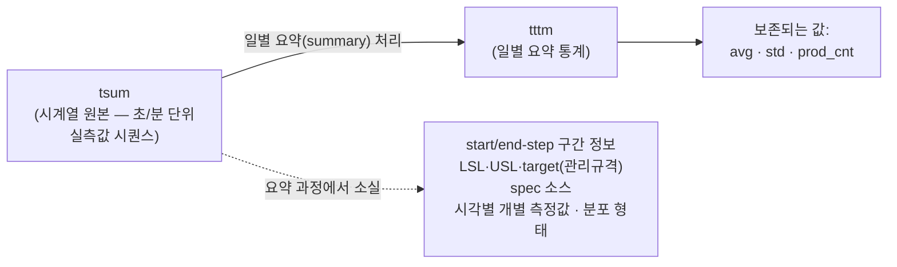
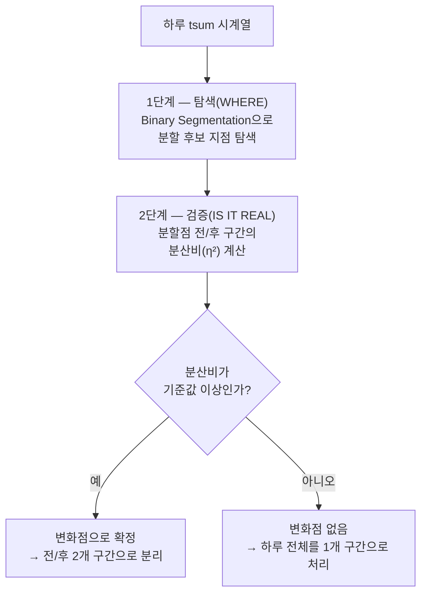
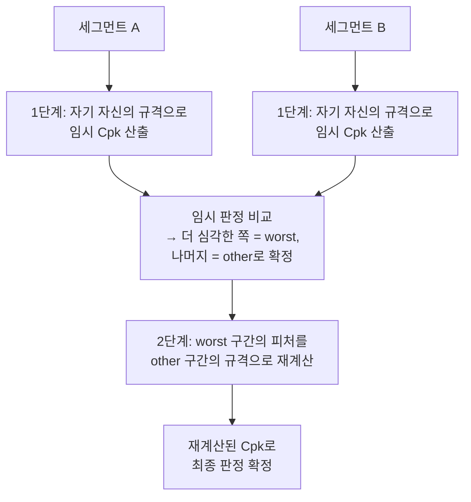
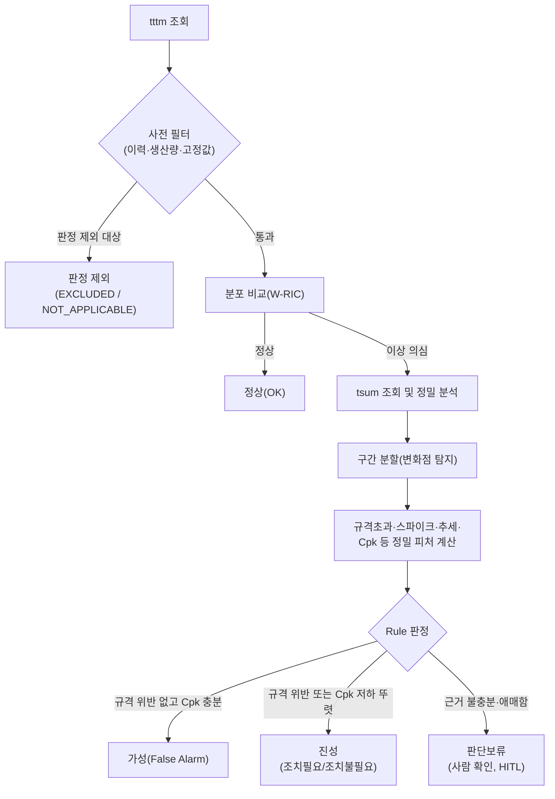
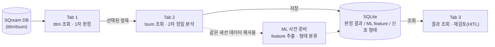
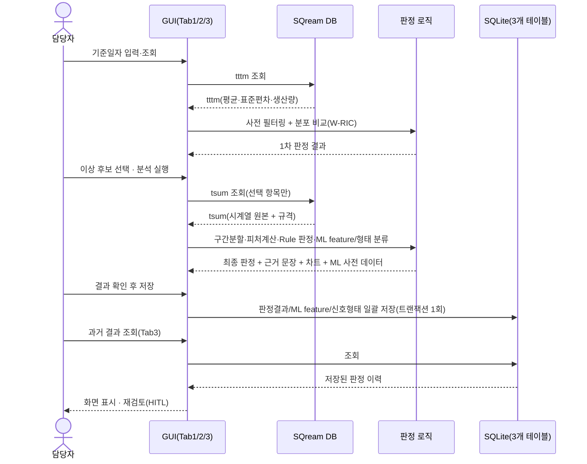

# FDC 이상탐지(Anomaly Detection) 에이전트 프로젝트 보고서

## 1. 개요 (Executive Summary)

본 프로젝트는 반도체 제조 공정에서 수집되는 센서 데이터를 기반으로, 설비/공정 이상(NG)을 자동으로 탐지하고 가성(false alarm)과 진성(true anomaly)을 구분하는 판정 시스템이다. 기존에는 일별 요약 통계(평균/표준편차)만으로 이상을 판정해, 원래 산포가 넓은 정상 설비까지 과탐지되거나 반대로 미세한 이상을 놓치는 문제가 있었다. 이를 해결하기 위해 **일별 요약 통계(1차 판정)와 시계열 원본 데이터(2차 정밀 분석)를 결합한 2단계 자동 판정 파이프라인**을 구축했고, 이를 현업 엔지니어가 직접 조작할 수 있는 **GUI 애플리케이션**으로 구현했다.

> **이 보고서는 프로젝트의 완성이 아니라 시작(Phase 1) 단계를 정리한 것이다.** 지금까지 만든 것은 "결정론적 규칙 기반 자동 판정 + HITL + ML 사전 준비"라는 **기본 골격과 그것이 실제로 동작함을 검증한 최초 버전**이다. 규칙의 세부 기준값은 아직 잠정값 단계이고, 실제 운영 데이터를 기반으로 한 정밀 재검증, ML 모델 자체의 개발, 데이터 원천(tttm 요약 단계) 구조 개선 등 **앞으로 검토·진행해야 할 과제가 이번에 구현한 내용보다 훨씬 많이 남아 있다**(8장 참고).

핵심 성과는 다음과 같다.

- 통계적 분포 비교, 변화점 탐지, 공정능력지수(Cp/Cpk/Cpm) 등 **검증된 통계 이론에 기반한 결정론적 자동 판정 로직**의 1차 버전을 구현해, 사람이 매 건을 수작업으로 검토하지 않아도 대다수의 건이 자동으로 분류되는 것을 확인했다.
- 규칙만으로 판단하기 애매한 소수의 건만 사람에게 넘기는 **Human-in-the-Loop(HITL) 구조**를 마련했다.
- DB 접속 정보와 실제 테이블명을 코드에서 분리해 **설정 파일로 외부화**함으로써 보안성과 운영 편의성을 동시에 확보했다.
- 향후 머신러닝(ML) 도입을 대비해, 센서 데이터의 통계적 특징(feature)과 신호 형태(shape) 분류 결과를 **지금부터 미리 축적**하는 사전 준비 기능을 포함했다(다만 ML 모델 자체는 아직 착수 전이다).
- 사내 SQream DB와 직접 연동해 **실제 운영 데이터로 반복 테스트 및 디버깅을 거쳐 기본 동작을 확인**했다 — 다만 이는 "프로그램이 의도대로 작동하는가"의 확인이며, 판정 기준값 자체의 정밀도를 운영 규모로 검증한 것은 아직 아니다.

---

## 2. 추진 배경 및 목적

### 2.1 데이터 구조 — tttm은 tsum의 일별 요약본이다

FDC 공정에서 다루는 두 데이터는 서로 독립적인 소스가 아니라, **하나의 원본(tsum)을 요약한 것이 tttm**인 계층 관계다.



| 구분 | 내용 |
|---|---|
| **tttm이 보존하는 정보** | 그날의 평균(avg), 표준편차(std), 생산량(prod_cnt) — 3개 통계값뿐 |
| **요약 과정에서 소실되는 정보** | 관리규격(LSL/USL/target), 공정 스텝 구간 정보(start/end-step), 규격 출처(spec source), 시각별 개별 측정값과 실제 분포 형태(치우침·다봉성·주기성 등) |

즉 tttm은 요약값 3개(avg/std/prod_cnt)만 제공하므로, 이것만으로는 **그날 데이터의 원래 산포 형태를 추정하는 데 근본적인 한계**가 있다. 평균과 표준편차가 같아도 실제 분포는 완전히 다를 수 있고(정규분포/치우친 분포/다봉분포 모두 같은 평균·표준편차를 가질 수 있음), 무엇보다 관리규격(LSL/USL/target) 자체가 tttm에는 없어 "규격 대비 여유가 있는지"를 tttm만으로는 판단할 수 없다.

**현재 구조의 설계 근거**: 이런 한계를 알고도 tttm을 1차 필터로 쓰는 이유는 데이터 규모 때문이다. tsum은 tttm 대비 데이터량이 수백~수천 배 많아, 전체를 매번 정밀분석하는 것은 비효율적이다. 따라서 tttm으로 먼저 이상 후보를 추린 뒤, 그 후보에 대해서만 tsum을 조회해 규격·구간 정보를 포함한 정밀 분석을 수행하는 **선별적 2단계 구조**를 택했다.

**향후 고도화 검토 방향**: 다만 이 구조는 "이미 손실된 정보를 후보로 걸러진 일부 건에 대해서만 사후 보완하는" 방식이다. 향후 판정 정확도를 더 높이는 고도화를 검토하게 된다면, tttm을 만드는 **일별 요약(summary) 처리 단계 자체를 개선**해 관리규격·구간 정보 등을 처음부터 tttm에 함께 보존하는 방안도 함께 검토할 필요가 있다.

### 2.2 문제 정의와 목표

기존 방식(tttm만으로 판정)은 다음 두 가지를 구분하지 못했다.

- 원래부터 산포가 넓게 관리되는 **정상 설비** → 오탐(false alarm) 발생
- 실제로 공정 조건이 변해 **문제가 생긴 설비** → 미탐(false negative) 위험

이 프로젝트의 목표는 다음과 같다.

1. tttm으로 1차 이상 후보를 추린 뒤, tsum(raw 시계열)을 추가로 분석해 가성과 진성을 가르는 **2단계 판정 파이프라인**을 구축한다.
2. 이 판정 과정을 사람이 매번 수동으로 하지 않도록 **통계 이론에 근거한 규칙으로 자동화**한다.
3. 규칙만으로 애매한 경우는 **사람에게 넘겨(HITL)** 검토 부담을 감당 가능한 수준으로 유지한다.
4. 향후 ML을 도입할 수 있도록 **라벨·feature 데이터를 지금부터 축적**한다.

---

## 3. 주요 구현 기능

애플리케이션은 3개의 화면(탭)으로 구성되며, 조회 → 분석 → 저장 → 재조회의 흐름으로 사용한다.

| 화면 | 입력 | 처리 | 산출물 |
|---|---|---|---|
| **Tab 1** | 기준 날짜 | tttm 조회 → 사전 필터링 → 분포 비교(1차 판정) | 1차 판정 결과(정상/이상/판정제외) |
| **Tab 2** | Tab 1의 이상 후보 중 선택 항목 | tsum 조회 → 구간 분할 → 정밀 피처 계산 → 규칙 적용(2차 판정) | 최종 판정 4분류 + 판정 근거 + 센서 형태 제안 |
| **Tab 3** | 조회 조건(날짜/라인/품목/판정 결과) | 저장된 판정 이력 조회 | 재검토·수정(HITL), 수정 이력 |

### 3.1 Tab 1 — tttm 조회 및 1차 판정

1. **사전 필터링**: 참고할 과거 이력이 부족한 경우, 당일 생산량이 기준치 미달인 경우, 파라미터 값이 고정값(항상 같은 값)인 경우를 먼저 걸러낸다.
2. **분포 비교 판정**: 사전 필터를 통과한 항목(과거·당일 모두 변동값)에 대해 과거 분포와 당일 분포를 통계적으로 비교해 이상 여부를 자동 산출한다.

### 3.2 Tab 2 — tsum 정밀 분석 및 2차 판정

- **구간 분할(세그멘테이션)**: 하루 동안 공정 조건이 중간에 바뀐 흔적(변화점)이 있는지 탐지하고, 있으면 전/후 구간으로 나눠 각각 평가한다.
- **정밀 피처 계산**: 규격 초과 횟수, 순간 스파이크 횟수, 추세(기울기), 분포 모양, 공정능력지수(Cpk 등)를 계산한다.
- **최종 판정**: 위 수치를 규칙에 대입해 4가지 중 하나로 분류하고, 판정 근거를 실제 수치가 포함된 문장으로 함께 기록한다.
- **센서 형태 자동 제안**(ML 사전 준비): 해당 센서 신호가 어떤 통계적 형태에 가까운지 참고 정보로 함께 제시한다.
- **[저장]** 버튼으로 분석 결과를 데이터베이스에 반영한다.

### 3.3 Tab 3 — 결과 조회 및 재검토 (HITL)

판정이 내려진 모든 항목은 상세 화면에서 담당자가 직접 재검토하여 판정을 수정할 수 있으며, 수정 이력이 함께 기록되어 추후 근거 자료 및 ML 학습 라벨로 활용된다.

### 3.4 그 외 기능

- **저장/이력 관리**: 같은 날짜를 다시 저장하면 그 날짜의 기존 결과를 최신 분석 결과로 갱신하며, 대량 데이터(4만 건 기준 0.5초 내외)도 지연 없이 처리된다.
- **ML 도입 사전 준비**: Rule 판정과는 별개로 센서별 통계 feature와 형태 분류 결과를 매 분석 시점마다 함께 축적해, 추후 라벨이 쌓였을 때 ML 모델 학습에 바로 활용할 수 있도록 한다.
- **사용 편의**: 화면은 읽기 전용이되 내용 복사는 가능하며, 상세 분석 화면은 최대화할 수 있다. DB 접속이 원활하지 않은 경우 자동으로 대체 데이터로 전환되어 화면 흐름을 확인할 수 있다.

---

## 4. 이론적 배경 및 판정 로직

각 판정 단계는 임의의 경험칙이 아니라 통계학·품질관리(SPC)·신호처리 분야의 검증된 이론을 기반으로 설계했다. 이 장에서는 이론적 근거와 실제 적용 방식을 함께 설명한다.

### 4.1 분포 비교 이론 — 가중 겹침 지수 (W-RIC)

**이론적 배경 — Bhattacharyya 계수란?** 두 확률분포가 얼마나 유사한지를 재는 고전적 척도로 **Bhattacharyya 계수(BC)**가 있다. 두 확률밀도함수 f(x), g(x)에 대해 다음과 같이 정의된다.

```
BC(f, g) = ∫ √( f(x) × g(x) )  dx
```

두 분포의 밀도함수가 겹치는 구간에서 그 기하평균을 적분한 값으로, 0(전혀 안 겹침)~1(완전히 동일)의 값을 가지며, 패턴 인식·신호 분류·통계적 거리 측정에 널리 쓰이는 표준 지표다. 두 정규분포 N(μ₁,σ₁²), N(μ₂,σ₂²)에 대해서는 이 적분이 다음과 같은 닫힌 형태(closed-form)로 정리된다.

```
BC = √( 2σ₁σ₂ / (σ₁²+σ₂²) )  ×  exp( −(μ₁−μ₂)² / (4(σ₁²+σ₂²)) )
```

**본 프로젝트의 지표(W-RIC) 도출 과정**: 표준 Bhattacharyya 계수를 그대로 쓰지 않고, 실무적 판정 목적에 맞게 아래 4단계를 거쳐 재정의했다.

| 단계 | 내용 |
|---|---|
| **1단계 — 겹침도 지표 채택** | ref(참조)와 comp(당일) 분포를 각각 정규분포로 보고, 두 분포의 겹침 정도(Distribution Overlap/Difference Index)를 Bhattacharyya 계수로 평가하는 것을 출발점으로 삼는다. |
| **2단계 — ref의 3-시그마 구간 기준으로 재해석** | 표준 Bhattacharyya 계수는 전 구간(−∞,∞)에 대한 대칭적 겹침을 본다. 그러나 관리도(SPC)의 표준 관행은 **참조(ref)의 ±3σ 구간을 "정상 관리범위"**로 보는 것이므로, "두 분포가 대칭적으로 얼마나 겹치는가"가 아니라 **"comp 분포가 ref의 정상 범위 안에 얼마나 들어와 있는가"**로 관점을 재정의한다. |
| **3단계 — ref의 산포를 기준(가중치)으로 사용** | 표준식의 진폭항 √(2σ₁σ₂/(σ₁²+σ₂²))은 ref·comp 두 표준편차의 기하평균을 대칭적으로 사용한다. 그러나 2단계처럼 "ref를 기준으로 comp를 평가"하는 구조에서는 비교의 척도(scale) 자체를 **ref 고유의 산포(ref_std)로 고정**하는 것이 판정 목적에 더 부합한다. 이에 따라 진폭항을 ref_std² 중심으로 다시 정의한다. |
| **4단계 — 적분구간·정규화 보정** | 위 재정의가 "ref와 comp가 완전히 같으면 지표값이 정확히 1이 된다"는 경계조건을 만족하도록 적분구간과 상수항을 보정한다. 그 결과 지수항의 분모가 표준식의 `4(σ₁²+σ₂²)`에서 `2(ref_std²+comp_std²)`로, 진폭항 앞에 `√2` 정규화 계수가 곱해지는 최종형태로 정리된다. |

**최종 정의(W-RIC, Weighted Range Index of Coincidence)**:

```
W-RIC = √2 × ( ref_std / √(ref_std² + comp_std²) ) × exp( −(ref_avg − comp_avg)² / (2 × (ref_std² + comp_std²)) )
```

- `ref_avg`/`ref_std`: 참조(과거) 기간 평균/표준편차
- `comp_avg`/`comp_std`: 당일(비교 대상) 평균/표준편차
- 값의 범위는 0~1이며, **1에 가까울수록 두 분포가 거의 같음(정상)**, **0에 가까울수록 서로 확연히 다름(이상 의심)**을 의미한다.

이 지표의 핵심 장점은 표준 Bhattacharyya 계수의 성질을 그대로 이어받아 **평균의 이동(중심 이탈)**과 **표준편차의 변화(산포 확대/축소)**를 하나의 수식으로 동시에 반영한다는 점이다. 단순히 평균 차이만 비교하면 "평균은 같지만 산포만 갑자기 커진" 이상은 놓치게 되는데, W-RIC은 이를 놓치지 않는다.

**해석 예시**: 평균이 동일하고 산포(표준편차) 비율 `r = comp_std / ref_std`만 변한다고 가정하면 위 식은 `W-RIC(r) = √2 / √(1+r²)`로 단순화된다.

| 산포 비율 (r = comp_std/ref_std) | W-RIC 값 | 해석 |
|---|---|---|
| 1배 (변화 없음) | 1.000 | 완전히 동일 |
| 2배 | 0.632 | 다소 차이 |
| 4배 | 0.343 | 상당한 차이 |
| **8배 (현재 판정 기준선)** | **0.175** | **이상 판정 임계값** |
| 16배 | 0.088 | 매우 큰 차이 |

현재 시스템은 산포가 **약 8배 이상 확대되는 경우부터 이상으로 판정**하도록 기준선을 설정했으며, 이 기준선은 운영 데이터가 축적됨에 따라 조정 가능하다.

### 4.2 변화점 탐지 이론 — Change Point Detection

**이론적 배경**: 시계열 안에서 통계적 특성(평균·분산)이 바뀌는 지점을 찾는 문제는 통계학·신호처리 분야에서 **구조 변화 탐지(Structural Break Detection / Change Point Detection)**라는 이름으로 폭넓게 연구된 주제다. 본 시스템은 검증된 오픈소스 알고리즘인 **Binary Segmentation** 기법을 채택했다.

**처리 절차 (2단계 검증 구조)**:



**검증 지표(분산비, η²)**: 후보 분할점의 전/후 구간이 통계적으로 뚜렷이 구분되는지는 **집단간분산 대비 전체분산의 비율**로 판단한다. 이는 분산분석(ANOVA)의 상관비(correlation ratio)와 동일한 개념이며, 영상처리 분야에서 이진화 임계값을 정할 때 쓰이는 **Otsu 방법**과도 같은 원리다.

```
분산비 = 집단간분산 / 전체분산 = [ (n1×n2 / (n1+n2)²) × (평균1 − 평균2)² ] / 전체분산
```

값이 0에 가까우면 전/후 구간이 사실상 같은 분포(변화 없음), 1에 가까울수록 뚜렷이 분리된 두 구간(명확한 변화)임을 의미한다. 탐색(1단계)과 검증(2단계)을 분리한 이유는, 급격한 계단형 변화뿐 아니라 **서서히 진행되는 완만한 변화(drift)까지 놓치지 않고 탐지**하기 위함이다 — 실측 검증 결과 이 방식은 완만한 변화도 뚜렷한 계단형 변화와 유사한 수준으로 탐지함을 확인했다.

이상치(순간적으로 튀는 값) 1~2개가 섞여 있어도 판단이 왜곡되지 않도록, 분산비 계산 전 **강건 통계 기법(4.4절)**으로 이상치를 먼저 제거한다.

#### 4.2.1 세그먼트 분할 후 — 어느 구간의 규격으로 비교할 것인가

변화점이 확정되어 하루가 두 구간으로 나뉘면, 각 구간을 어떤 기준(관리규격)으로 평가할지가 문제가 된다. tsum의 관리규격(LSL/USL/target)은 하루 중에도 바뀔 수 있어(예: 레시피 변경), 두 구간이 서로 다른 규격을 가질 수 있기 때문이다. 단순히 "이상이 의심되는 구간(worst) 자신의 규격"으로만 평가하면, 그 구간의 규격 자체가 이완되어 있는 경우 실제 이상을 놓칠 수 있다. 그래서 본 시스템은 **worst 구간의 공정능력지수를, 정상으로 판단된 다른(other) 구간의 규격을 기준으로 재계산**한다 — "이 구간이 정상 구간의 잣대로 봐도 여전히 정상인가"를 묻는 방식이다.

다만 여기에는 순환 논리 문제가 있다: "어느 구간이 worst인지" 자체가 규격 비교 결과에 좌우되는데, worst를 가리기도 전에 "다른 구간"의 규격을 먼저 정할 수는 없다. 이를 아래와 같이 **2단계 절차**로 풀었다.



1. **1단계(임시 판정)**: 두 세그먼트 각각을 **자기 자신의 규격**으로 우선 평가해 임시 결과를 낸다.
2. **worst 결정**: 임시 결과 중 더 심각한 쪽을 worst, 나머지를 other로 정한다(사람 검토가 필요한 애매한 판정 > 조치필요 > 조치불필요 > 가성 순으로 심각도를 매겨 가장 심각한 쪽을 채택 — 평균이나 합산을 쓰지 않는 이유는, 하루 중 일부 구간만 문제가 있어도 나머지 정상 구간이 그 문제를 희석시켜서는 안 되기 때문이다).
3. **2단계(재계산)**: worst 세그먼트의 피처(Cp/Cpk/Cpm, 규격초과 횟수 등)를 **other 세그먼트의 규격**으로 다시 계산해, 이 값으로 최종 판정을 확정한다. (other 구간에 규격 자체가 없는 경우에만 예외적으로 worst 자신의 규격을 그대로 사용한다.)

### 4.3 공정능력지수 이론 — Cp/Cpk/Cpm

**이론적 배경**: Cp/Cpk/Cpm은 통계적 공정관리(SPC, Statistical Process Control) 분야에서 **공정이 규격을 얼마나 안정적으로 만족하는지**를 정량화하는 표준 지표로, 제조업 품질관리에서 폭넓게 쓰인다.

```
Cp  = (USL − LSL) / (6σ)                                    — 규격 폭 대비 산포(공정 잠재능력)
Cpk = min( (USL − μ) / (3σ), (μ − LSL) / (3σ) )              — 중심 이탈까지 반영한 실제 능력
Cpm = (USL − LSL) / (6 × √(σ² + (μ − T)²))                   — 목표값(T) 이탈까지 반영(목표값이 있는 경우)
```

(USL/LSL: 관리 상/하한, μ: 평균, σ: 표준편차, T: 목표값)

**일반적인 Cpk 해석 기준**(품질관리 업계 통용 가이드라인):

| Cpk 값 | 해석 |
|---|---|
| ≥ 1.33 | 공정능력 우수 |
| 1.00 ~ 1.33 | 보통(관리 필요) |
| < 1.00 | 공정능력 부족(개선 필요) |

**본 시스템의 적용 방식**: 위 표는 일반적 가이드일 뿐, 본 시스템은 파라미터마다 관리 폭이 다르다는 점을 반영해 **각 파라미터 고유의 참조(reference) 기간 데이터로 산출한 Cpk("참조 Cpk", `ref_cpk`)를 그 파라미터만의 판정 기준선으로 사용**한다 — 업계 공통 고정값이 아니라 "그 설비/파라미터 자신의 참조값 대비 얼마나 이탈했는가"를 보는 것이다. 또한 하루 중 관리규격(LSL/USL/target)이 바뀌는 경우까지 고려해, 이상이 의심되는 구간(worst 구간)의 Cpk는 **정상으로 판단된 다른 구간의 규격을 기준으로 재계산**함으로써 규격 변경 자체가 오탐 요인이 되지 않도록 했다(자세한 절차는 4.2.1절 참고).

#### 4.3.1 참조 Cpk의 이중 기준선 — `ref_cpk`와 `ref_cpk*`

참조(reference) 기간의 "정상 산포"를 하나의 표준편차 값으로만 정의하면 한 가지 딜레마가 생긴다. 참조 기간이 여러 날에 걸쳐 있을 때, **그날그날의 평균 자체가 자연스럽게 조금씩 흔들리는 것**(day-to-day 변동)을 산포에 포함시킬지 말지에 따라 "정상 범위"의 폭이 달라지기 때문이다. 이를 하나로 뭉뚱그리지 않고, 성격이 다른 두 개의 표준편차를 분리해 계산한다.

```
ref_var       = Σ(wᵢ × σᵢ²) / Σwᵢ                                    — 일별 표준편차의 가중평균(=날짜 내부 산포만)
ref_var*      = ref_var + Σ(wᵢ × (μᵢ − ref_avg)²) / Σwᵢ              — 위에 "일별 평균끼리의 흩어짐(날짜 간 산포)"을 더함
ref_std       = √ref_var        ,   ref_std*  = √ref_var*             (wᵢ: i번째 참조일의 생산량, μᵢ/σᵢ: i번째 참조일의 평균/표준편차)

ref_cpk       = Cpk(ref_avg, ref_std,  LSL, USL)     — 날짜 간 평균 흔들림은 반영하지 않은, 더 "느슨한" 기준
ref_cpk*      = Cpk(ref_avg, ref_std*, LSL, USL)     — 날짜 간 평균 흔들림까지 반영한, 더 "엄격한" 기준   (항상 ref_cpk* ≤ ref_cpk)
```

이는 통계학의 **분산의 법칙적 분해(law of total variance)** — 전체 분산은 "각 날짜 내부 분산의 평균"과 "날짜별 평균들 사이의 분산"의 합으로 분해된다는 원리 — 를 그대로 응용한 것이다. `ref_std`는 앞의 항(날짜 내부 산포)만 반영하고, `ref_std*`는 뒤의 항(날짜 간 평균의 흩어짐)까지 더한 것이므로, 정의상 `ref_std* ≥ ref_std`이고 따라서 `ref_cpk* ≤ ref_cpk`가 항상 성립한다.

**두 지수를 함께 쓰는 이유와 활용 방식**: 이 프로젝트는 두 지수 중 하나만 고르지 않고, **둘 사이의 구간을 "판단 가능 여부를 가르는 회색지대"로 명시적으로 활용**한다.

| 당일 Cpk 위치 | 판정 |
|---|---|
| `ref_cpk` 이상 | 참조값의 느슨한 기준선보다도 좋음 → **자동으로 정상 확정** |
| `ref_cpk*` 미만 | 참조값의 엄격한 기준선(날짜 간 자연 변동까지 감안)보다도 나쁨 → **자동으로 이상 확정** |
| `ref_cpk*` 이상 ~ `ref_cpk` 미만 | 두 기준 사이의 회색지대 — 자연스러운 날짜 간 변동인지 실제 이상 징후인지 규칙만으로 단정할 근거가 부족 → **판단보류(사람 확인)** |

즉 `ref_cpk`만 썼다면 원래 날짜마다 평균이 조금씩 흔들리는 파라미터가 그 자연스러운 흔들림만으로도 계속 "이상"으로 잘못 잡힐 위험이 있고, 반대로 `ref_cpk*`만 썼다면 기준이 지나치게 느슨해져 진짜 이상 초기 징후를 놓칠 위험이 있다. 두 지수를 함께 사용해 그 사이 구간만 사람에게 넘김으로써, 자동판정의 오탐/미탐 위험을 모두 낮추면서 사람이 검토해야 할 대상은 "판단이 애매한 사례"로 한정된다. 또한 판단보류 건에는 이 회색지대 안에서 당일 Cpk가 어느 위치에 있는지를 0~1 사이 수치(신뢰도)로 함께 계산해, 여러 판단보류 건을 검토할 때 우선순위(신뢰도가 낮은=이상 쪽에 가까운 건부터)를 매길 수 있게 했다.

### 4.4 강건통계 이론 — MAD 기반 이상치 처리

**이상치(outlier) 처리가 필요한 이유**: 순간적으로 튀는 값(스파이크) 1~2개가 섞여 있으면, 평균·표준편차 같은 일반적인 통계량은 그 값에 쉽게 끌려간다 — 극단값이 표준편차 자체를 부풀려 "이상치가 자기 자신을 숨기는" 순환적 문제가 생긴다. 이를 막으려면 이상치를 먼저 골라내 계산에서 제외한 뒤, 나머지 값으로 통계를 내야 한다.

**통계학에서 통용되는 이상치 탐지 방식들**: 이상치를 가려내는 방법은 여러 가지가 알려져 있다.

| 방식 | 개요 | 한계 |
|---|---|---|
| 3-시그마 규칙 | 평균 ± 3×표준편차를 벗어나면 이상치 | 이상치 자신이 평균·표준편차를 부풀려, 정작 이상치를 놓치는 "자기 은폐" 문제 |
| IQR(사분위범위) 방식 | Q1(25%)−1.5×IQR ~ Q3(75%)+1.5×IQR 범위를 벗어나면 이상치(상자그림에서 흔히 쓰는 방식) | 사분위수 계산 자체는 비교적 안정적이나, 분포가 한쪽으로 치우친 경우 오탐이 늘 수 있음 |
| Grubbs 검정 등 가설검정 기반 | 통계적 유의성 검정으로 단일/소수 이상치 여부 판정 | 이상치가 여러 개 동시에 있으면 검정력이 떨어짐, 정규분포 가정 필요 |
| **MAD(중앙값 절대편차) 기반** | 중앙값과 MAD라는, 극단값에 흔들리지 않는(강건한) 통계량으로 이상치를 판정 | 아래 설명 |

**본 프로젝트가 MAD 방식을 선택한 이유**: 위 방식들 중 **MAD(Median Absolute Deviation) 기반 방식**을 채택했다. 중앙값과 MAD는 전체 데이터의 절반 이상이 극단적으로 바뀌지 않는 한 이상치 자체에 흔들리지 않는 성질이 있어, 3-시그마 규칙의 "자기 은폐" 문제를 근본적으로 피할 수 있다.

```
MAD = median( |xᵢ − median(x)| )
이상치 판정: |xᵢ − median(x)| > k × MAD   (k: 민감도 계수)
```

이 프로젝트에서는 표준 MAD 방식을 실제 센서 데이터에 적용하는 과정에서 아래 두 가지를 추가로 보완했다.

- **MAD가 정확히 0이 되는 경우의 예외 처리**: 계측 분해능이 낮아 다수의 값이 완전히 동일한 센서는 MAD 자체가 0이 되어, 조금이라도 다른 정상적인 값까지 전부 이상치로 잘못 잡히는 현상이 실측으로 확인되었다. 이 경우에 한해 표준편차로 자동 대체하도록 예외 처리를 추가했다.
- **이상치 판정 비율의 상한**: "단발성 스파이크"는 정의상 전체의 소수(수 %)여야 의미가 있는데, 자연히 변동 폭이 넓은 실제 신호에서는 민감도(k)를 아무리 낮춰도 전체의 20~30%가 이상치로 잡히는 현상이 실측으로 확인되었다. 이에 이상치로 판정 가능한 비율에 상한(수 % 이내)을 두어, 상한을 넘는 경우 편차가 큰 순서로만 제한적으로 인정하도록 했다.

### 4.5 신호 형태 분석 이론 (ML 사전 준비용)

기존 tttm은 하루를 **avg/std/prod_cnt 3개 값**으로만 요약했다(2.1절). 본 시스템은 향후 ML 도입을 대비해, tsum 원본 시계열에서 훨씬 더 많은 통계적 특징(feature)을 추출해 둔다. 센서 신호의 통계적 "형태"를 판별하기 위해 각기 검증된 신호처리·통계 기법을 적용하며, 7개 그룹에 걸쳐 총 **31개의 feature 값**을 산출한다.

| # | 그룹 | 이론적 배경 | 산출 feature (개수) | 목적 |
|---|---|---|---|---|
| 1 | 기본 분포 통계 | 기술통계학(descriptive statistics) | 개수·평균·중앙값·표준편차·최소/최대·범위·5/25/75/95백분위수·사분위범위·비대칭도·첨도 (14개) | 분포의 전반적인 모양(중심·산포·꼬리) 요약 |
| 2 | 다봉성 | 커널 밀도 추정(KDE, Kernel Density Estimation) — 비모수 확률밀도 추정 기법 | 최빈값 개수, 최빈값 간 거리 (2개) | 신호가 하나의 값 대역에 몰려있는지, 두 개 이상의 레벨을 오가는지 판별 |
| 3 | 주기성 | FFT(고속 푸리에 변환) — 시간영역 신호를 주파수영역으로 변환 | 주기, 스펙트럼 에너지 집중도 (2개) | 신호가 일정 주기로 반복되는지 판별 |
| 4 | 추세 | 단순 선형회귀(least squares) | 기울기, 결정계수(R²) (2개) | 신호가 한쪽 방향으로 꾸준히 이동하는지 판별 |
| 5 | 이산성 | 고유값 비율 분석 | 고유값 개수·비율, 최빈값 비율, 정수 근사 비율 (4개) | 신호가 몇 개의 정해진 값만 갖는지 판별 |
| 6 | 측정 해상도 | 격자 간격 분석(잠정, 검증 진행 중) | 감지된 해상도, 간격 일관성, 격자 충족률 (3개) | 저해상도 연속형과 진짜 이산형을 구분하는 보조 지표 |
| 7 | 변화점 관련 | 4.2절 변화점 탐지 결과 재사용 | 변화점 유무·위치, 레벨 이동량, 분산 이동량 (4개) | 형태 분류와 별개로 "레짐 자체가 바뀌었는지"를 나타내는 참고 신호 |
| **합계** | **7개 그룹** | | **31개 feature** | |

**활용처**: 이 31개 feature는 4.5절 하단의 8가지 형태 분류(아래)의 입력으로 쓰이며, 분류 결과와 함께 별도 데이터베이스 테이블에 저장된다. 지금 당장의 Rule 판정(4.6절)에는 전혀 관여하지 않고, **향후 ML 모델을 학습할 때 입력 자료로 바로 쓸 수 있도록 미리 축적해 두는 것**이 유일한 목적이다.

> **규모에 대한 유의사항**: 위 31개 feature는 현재 **tttm에서 1차 이상 후보로 걸러진 소수의 항목에 한해, tsum을 조회한 시점에만** 계산한다. 만약 2.1절에서 언급한 것처럼 "일별 요약(summary) 단계 자체"에서 전체 센서·전체 파라미터를 대상으로 이 feature들을 매일 산출하는 방향으로 확장한다면, 계산 대상 건수가 지금과는 차원이 다르게(전수 대상으로) 늘어난다. 이는 현재의 **로컬 PC 1대에서 담당자가 직접 실행하는 GUI 환경으로 처리 가능한 수준이 아니며**, 별도의 배치/서버 인프라를 전제로 한 상세한 타당성 검토가 추후 필요하다.

**종합 분류 체계**: 위 지표들을 종합해 신호를 아래 8가지 형태 중 하나로 분류한다.

| 형태 | 정의 기준(요약) |
|---|---|
| 완전 고정값 | 관측 구간 전체가 하나의 값 |
| 근사 고정값 | 최빈값 비율이 매우 높음(≈95% 이상) |
| 이산형 | 소수의 설정값(2~6개) 사이를 반복 |
| 다단계 | 두 개 이상의 뚜렷한 값 대역을 오가는 연속형 |
| 추세형 | 회귀 결정계수(R²)가 높아 한 방향 이동이 뚜렷 |
| 주기형 | 스펙트럼 에너지가 한 주파수에 강하게 집중 |
| 치우친 단봉 | 비대칭도(skewness)가 뚜렷하고 봉우리 1개 |
| 대칭 단봉 | 위 어느 기준에도 해당하지 않는 평범한 분포(기본값) |

**보수적 판정 원칙**: 이 분류는 ML 학습 준비를 위한 참고 정보이므로, "최대한 많이 자동 분류"하는 것이 아니라 **확실한 경우만 확정하고, 신호가 약하거나 서로 다른 형태의 근거가 동시에 나타나는 경우는 사람 확인 대상(판단보류)으로 넘기는 것**을 원칙으로 삼았다. 또한 구간 중간에 변화점(4.2절)이 감지된 경우는 형태가 뚜렷해 보여도 자동 확정하지 않는다 — 레짐 자체가 바뀐 것이므로 별도 판단이 필요하기 때문이다.

### 4.6 종합 판정 흐름



최종 판정에는 항상 "왜 그렇게 판정했는지"가 실제 계산값을 포함한 문장으로 함께 기록되어, 담당자가 재검토할 때 판단 근거를 그대로 확인할 수 있다.

---

## 5. 구현 방법

### 5.1 아키텍처



- **로컬 실행형 애플리케이션**: 상시 구동되는 서버 없이, 필요할 때 담당자가 직접 실행하는 구조다. 별도 인프라 운영 부담이 없다.
- **매 조회 시 최신 데이터 사용**: 원본 데이터를 임의로 캐시하지 않고 매번 DB에서 다시 조회해, 항상 최신 상태를 기준으로 판정한다.

### 5.2 기술 스택

| 구분 | 사용 기술 | 비고 |
|---|---|---|
| 개발 언어 | Python 3.11+ | |
| 화면(GUI) | PySide6 (Qt 6 프레임워크) | 3탭 구조, 상세 팝업, 인터랙티브 차트 |
| 데이터 처리 | pandas, numpy, scipy | 통계 계산, KDE(scipy.stats), FFT(numpy.fft) 등 |
| 시각화 | matplotlib | 추세 차트, 분포 비교 차트, GUI에 직접 임베드되는 확대/축소 가능한 차트 |
| 변화점 탐지 | ruptures | 검증된 오픈소스 change-point-detection 라이브러리(Binary Segmentation) |
| 결과 저장 | SQLite | 별도 DB 서버 설치·운영 불필요, 파일 하나로 이식 가능 |
| DB 연동 | pysqream | SQream 전용 드라이버(지연 임포트로, 미설치 상태에서도 나머지 기능은 정상 동작) |
| 테스트 | pytest | 단위/통합 테스트 자동화 |

### 5.3 모듈 구성

전체 코드는 **"판정 로직"과 "화면(GUI)"을 물리적으로 분리된 모듈**로 구성했다. 판정 로직 쪽은 Qt(화면 프레임워크)에 전혀 의존하지 않는 순수 Python 함수로만 작성되어 있어, 화면을 띄우지 않고도 함수 단위로 독립 검증이 가능하다.

| 계층 | 모듈 | 역할 |
|---|---|---|
| 판정 로직 | `prefilter` | 1차 판정의 사전 필터링, 참조(ref) 통계 산출 |
| 판정 로직 | `detector_tttm` | W-RIC 기반 분포 비교(1차 판정) |
| 판정 로직 | `segmenter` | 변화점 탐지, 이상치(MAD) 처리, 구간 분할 |
| 판정 로직 | `feature_tsum` | 구간별 정밀 피처(규격초과·스파이크·Cpk 등) 계산 |
| 판정 로직 | `classifier` | 최종 4분류 규칙 적용, 판정 근거 문장 생성 |
| 판정 로직 | `ml_features` | ML 사전 준비용 31개 feature 추출 |
| 판정 로직 | `shape_classifier` | 센서 형태 8분류 결정론적 규칙 |
| 데이터 접근 | `data_loader` | SQream DB 조회(tttm/tsum), 설정 파일 로딩 |
| 저장소 | `result_store` | SQLite 3개 테이블 스키마 관리, 저장/조회 |
| 시각화 | `visualizer` | 추세/분포비교/일간추이 차트 생성 |
| 화면(GUI) | `gui.pipeline` | 위 판정 로직들을 순서대로 실행하는 오케스트레이션(화면과 무관하게 단독 테스트 가능) |
| 화면(GUI) | `gui.tab1/2/3`, `gui.detail_dialog` | 3탭 화면, 상세 팝업 |

### 5.4 핵심 구현 기법

**(1) 두 단계로 나눈 세그먼트 재판정 로직**: 4.2.1절에서 설명한 "worst 세그먼트를 other 세그먼트의 규격으로 재계산"하는 절차는, 어느 세그먼트가 worst인지부터가 비교 결과에 의존하는 순환 구조를 가진다. 이를 해결하기 위해 먼저 각 세그먼트를 자기 규격으로 임시 평가해 worst를 가린 뒤, worst 세그먼트의 피처만 other 규격으로 다시 계산하는 2-패스(2-pass) 구조로 구현했다.

**(2) 저장의 원자성(Atomicity) 보장**: Tab 2 [저장]은 판정 결과·ML feature·신호 형태 분류라는 **성격이 다른 3개의 테이블**을 동시에 갱신해야 한다. 이때 일부만 반영되고 나머지가 반영되지 않는 상황(예: 판정 결과는 최신인데 ML feature는 예전 값으로 남는 등)을 막기 위해, 세 테이블에 대한 갱신을 하나의 데이터베이스 트랜잭션으로 묶어 **커밋을 단 한 번만 수행**하도록 구현했다. 트랜잭션 중간에 오류가 발생하면 전체가 원래 상태로 롤백되어, 세 테이블이 서로 다른 시점의 값으로 어긋나는 상황 자체가 발생하지 않는다.

**(3) 대량 저장 성능 최적화**: 초기 구현에서는 저장 대상 데이터를 한 건씩 반복하며 매번 커밋(commit)했는데, SQLite는 커밋 시마다 디스크 동기화(fsync)를 강제하기 때문에 건수가 늘어날수록 처리 시간이 선형으로 증가했다(실측: 4만 건에 약 184초). 이를 저장 대상 전체를 먼저 메모리에 구성한 뒤 **일괄(batch) 처리 후 커밋을 1회만 수행**하는 방식으로 변경해, 동일한 4만 건을 약 0.5초에 처리하도록 개선했다(약 370배).

**(4) 예외 발생 시에도 중단되지 않는 구조**: 데이터베이스 접속·저장·조회처럼 외부 요인(네트워크, 파일 잠금 등)으로 실패할 수 있는 모든 지점에 예외 처리를 적용했다. 오류 발생 시 프로그램이 강제 종료되지 않고, 실패 사유(오류 종류와 메시지)가 화면 상태줄과 로그 파일에 함께 기록되어 담당자가 원인을 바로 확인할 수 있다. 아울러 한글 환경 콘솔에서 특정 기호가 포함된 로그 메시지 출력 자체가 실패해 프로그램이 죽는 사례가 있어, 콘솔 출력 인코딩 예외 상황도 별도로 방어 처리했다.

**(5) 결정론적 규칙으로의 구현**: 센서 형태 분류(4.5절)는 검토 초기에는 AI(LLM) 프롬프트 형태로 검토되었으나, 본 시스템의 "로컬 실행, 서버 의존 없음, 항상 같은 입력에 같은 결과" 원칙에 맞춰 **숫자 비교만으로 동작하는 결정론적 함수**로 다시 설계해 구현했다. 이를 통해 외부 API 호출에 따른 비용·응답 지연·결과 비일관성 문제 없이, 로컬에서 즉시 일관된 결과를 얻는다.

**(6) 자동화된 테스트 체계**: 합성 데이터 생성기를 자체 구현해, 정상/이상/경계 상황(완만한 추세, 급격한 계단 변화, 단발성 스파이크, 규격 없음 등)을 임의로 재현할 수 있도록 했다. 이를 바탕으로 160개의 자동화 테스트(단위 테스트 + 여러 모듈을 연결한 통합 테스트)를 구성해, 로직을 수정할 때마다 기존 동작이 깨지지 않는지 즉시 검증한다. 화면(GUI) 기능은 실제로 프로그램을 실행해 스크린샷을 남기는 별도의 수동 검증 스크립트로 확인한다.

### 5.5 사용성 개선 세부 구현

- **표 복사**: 조회 화면의 표는 실수로 값이 바뀌지 않도록 읽기 전용으로 고정하되, 선택한 영역을 복사(Ctrl+C)하면 엑셀 등에 그대로 붙여넣을 수 있는 형식(탭/줄바꿈 구분 텍스트)으로 클립보드에 담기도록 별도 구현했다.
- **상세 팝업 확대**: 분석 상세 팝업은 기본적으로 최대화 버튼이 없는 창 형태로 뜨는데, 화면을 넓게 봐야 하는 경우를 위해 최대화·최소화가 가능하도록 창 속성을 변경했다.
- **인터랙티브 라이브 차트**: 정적 이미지(PNG) 차트와 별도로, 마우스로 확대/축소·이동이 가능하고 특정 지점에 마우스를 올리면 정확한 값을 확인할 수 있는 인터랙티브 차트를 추가 구현했다. 데이터가 원래 고정값인지, 아니면 드문드문 보고되어 평평해 보이는 것인지 구분할 수 있도록 실측 지점마다 점을 표시하는 기능도 포함했다.

### 5.6 보안 및 설정 구조 개선 — 하드코딩 제거

DB 접속 계정(호스트/포트/계정/비밀번호)과 실제 테이블명은 코드에 직접 기술하지 않고, **별도의 설정 파일로 분리**했다.

- 설정 파일은 소스 코드 저장소(Git)에서 제외되어, 협업 과정에서 접속 정보가 노출될 위험을 원천 차단한다. 코드 저장소에는 항목만 있고 실제 값이 없는 예시 템플릿만 포함된다.
- 실제 테이블명(스키마.테이블)과 라인별 매핑 정보도 코드가 아닌 설정 파일에서 관리한다. 이에 따라 **운영 중 테이블명이 바뀌거나 라인이 추가되어도 코드 수정·재배포 없이 설정 파일만 갱신**하면 된다.

즉 이 구조 개선은 보안(접속 정보 비노출)과 운영 편의성(환경 변경 시 코드 변경 불필요)을 동시에 만족시키기 위한 것이다.

### 5.7 개발 및 검증 방식

개발·검증은 아래와 같은 단계를 거쳐 진행했다.

1. **사외 — 모사(synthetic) 데이터 기반 개발**: 사외 환경에서는 실제 운영 데이터에 접근할 수 없었으므로, 실제 데이터와 유사한 형태의 모사 데이터를 자체적으로 생성해 반복적으로 평가하는 방식으로 진행했다. 정상/이상/경계 상황(완만한 추세, 급격한 계단 변화, 단발성 스파이크, 규격 없음, 고정값 등) 여러 패턴을 의도적으로 재현해가며, 각 패턴에서 실제로 이상을 검출해 낼 수 있다고 판단되는 feature 항목을 선정하고 판정 로직을 다듬었다.
2. **데이터 입출력 구조의 단계적 전환**: 초기에는 데이터 입출력을 CSV 파일 형태로 단순하게 구성해 로직 검증에 집중했다. 이후 실제 운영 환경에서는 DB 기반으로 입출력해야 한다는 점을 고려해, 가상의 테스트 서버에 DB를 구성하고 이를 조회하는 인터페이스를 갖추도록 **데이터 입력 부분을 별도 모듈로 분리(모듈화)**했다 — 그 결과 CSV/가상 DB/실제 SQream DB 중 어느 소스를 쓰든 나머지 판정 로직은 동일하게 동작하는 구조가 되었다.
3. **사내 — 실제 DB 연동 검증**: 현재는 사내 환경에서 실제 SQream DB에 연결해 사용하고 있으며, 반복적인 테스트와 디버깅을 통해 정상 동작을 확인하는 단계다.

이와 함께, 각 판정 로직에는 다양한 시나리오(정상/이상/경계 상황)를 다루는 자동화된 테스트를 구성해 로직을 수정할 때마다 기존 동작이 깨지지 않는지 즉시 확인할 수 있도록 했고, 화면 기능은 실제로 프로그램을 실행해 스크린샷으로 검증하는 절차도 함께 갖췄다.

---

## 6. 데이터 흐름: 입력 → 처리 → 출력



### 6.1 입력 데이터

| 데이터 | 소스 | 주요 항목 |
|---|---|---|
| tttm | SQream DB | 라인/설비/파라미터별 일자, 평균, 표준편차, 생산량 |
| tsum | SQream DB | 위 파라미터의 시각별 실측값, 관리 규격(상/하한, 목표값) |

DB 접속이 어려운 환경(개발/테스트 단계 등)에서는 자동으로 합성 데이터로 대체되어 화면 동작을 확인할 수 있다.

### 6.2 처리 절차

1. 기준일자 입력 → tttm 조회 → 사전 필터링 → 분포 비교 → 1차 판정.
2. 1차 이상 후보 선택 → tsum 조회 → 구간 분할 → 정밀 피처 계산 → 규칙 적용 → 2차 최종 판정 및 판정 근거 문장 생성.
3. 결과를 화면에 표시(차트 포함)하고, 담당자 확인 후 저장.

### 6.3 출력 결과물

| 출력 | 형태 | 설명 |
|---|---|---|
| 판정 결과 | SQLite 테이블 | 라인/설비/파라미터 키, 판정 결과, 근거 수치, 판정 사유 문장 |
| ML 사전 준비 데이터 | SQLite 테이블(별도) | 센서별 통계 feature, 신호 형태 분류 결과 |
| 추세 차트 | PNG 이미지 | 이상/판단보류 건에 한해 자동 생성, 상세 화면에서 조회 |
| 화면 표시 | GUI | 조회/분석/재검토 화면 |

판정 결과와 ML 사전 준비 데이터는 **하나의 저장 동작에서 함께 반영**되어, 서로 다른 시점의 값이 섞이지 않도록 했다.

---

## 7. 품질 및 규모 지표

| 항목 | 현황 |
|---|---|
| 소스 코드 | 약 3,800줄 |
| 자동화 테스트 코드 | 약 2,000줄 |
| 자동화 테스트 항목 | 160개 (전부 통과) |
| 결과 저장 테이블 | 3개(판정 결과 / ML feature / 신호 형태) |
| 화면(탭) | 3개 |

---

## 8. 향후 계획

**이 프로젝트는 이제 막 첫 걸음을 뗀 단계다.** 지금까지 구현한 것은 "① 판정 로직의 기본 골격이 이론적으로 타당하게 설계되었는가, ② 실제 SQream DB와 연동해 프로그램이 오류 없이 동작하는가"를 확인한 수준이며, 아래와 같이 향후 검토·진행해야 할 과제가 이번 구현 범위보다 훨씬 크다.

| 구분 | 과제 | 현재 상태 |
|---|---|---|
| **판정 기준값 검증** | W-RIC 임계값(8배), MAD 민감도(k), 변화점 분리도 임계값, Cpk 관련 세부 기준 등 주요 판정 기준값 다수가 아직 **실제 운영 데이터 대량 검증 전의 잠정값**이다. | 착수 전 — 실 데이터 축적 후 통계적 재검증 필요 |
| **미확정 항목** | 최소 세그먼트 개수, 캘리브레이션 백분위수, drift 판정 임계치 등 일부 기준값은 값 자체가 아직 정해지지 않았다. | 미정 — 실측 데이터 확보 후 확정 필요 |
| **일별 요약(tttm 생성) 단계 고도화** | tttm이 avg/std/prod_cnt 3개 값만 보존하는 구조적 한계(2.1절)를 근본적으로 개선하려면 요약 단계 자체의 재설계가 필요하나, 전체 센서 대상으로 확장 시 계산 규모가 차원이 달라 로컬 환경으로는 처리 불가 — 인프라 요건을 포함한 별도의 타당성 검토가 선행되어야 한다. | 검토 착수 전 |
| **ML 모델 개발** | 지금은 ML 학습에 쓸 feature·라벨을 축적하는 "사전 준비" 단계일 뿐, 모델 설계·학습·검증·운영 반영은 **아직 전혀 시작하지 않았다**. 담당자의 최종 확인 라벨이 충분히 쌓인 뒤에야 착수 여부 자체를 검토할 수 있다. | 미착수 |
| **판정 정확도의 정량적 검증** | 현재는 기능이 의도대로 동작하는지 확인했을 뿐, 오탐률/미탐률 같은 판정 성능 지표를 대량의 실 데이터로 측정한 적은 없다. | 미착수 |

즉 현재 시점은 "자동 판정이라는 아이디어가 기술적으로 구현 가능함을 확인한 단계"이며, 이 판정이 실제로 얼마나 정확한지, 어떤 파라미터에서 어떤 기준값이 최적인지는 앞으로 상당한 기간의 운영·검증을 거쳐야 알 수 있다.

이 외에도, 아직 구체적으로 검토하지는 않았고 방향성만 제시하는 수준이지만, 운영 데이터가 어느 정도 쌓인 뒤에는 **CLS(Closed-Loop) 관리 기능**(이상 발생 탐지에서 끝나는 현재 범위를, "조치필요"로 분류된 건이 실제로 현장에서 조치되고 종결되었는지까지 추적하는 폐루프 관리로 확장하는 방향)과 **ref(참조) 데이터 재설정(reset) 기능**(참조 기간 안에서도 레시피 변경·설비 정비 등으로 중심치가 정당하게 이동한 경우, tsum에 이미 적용 중인 변화점 탐지 로직(4.2절)과 유사한 방식으로 그 시점을 찾아내 이전 데이터를 참조 계산에서 자동 제외하는 방향)도 함께 검토 대상에 올려둘 만하다.
